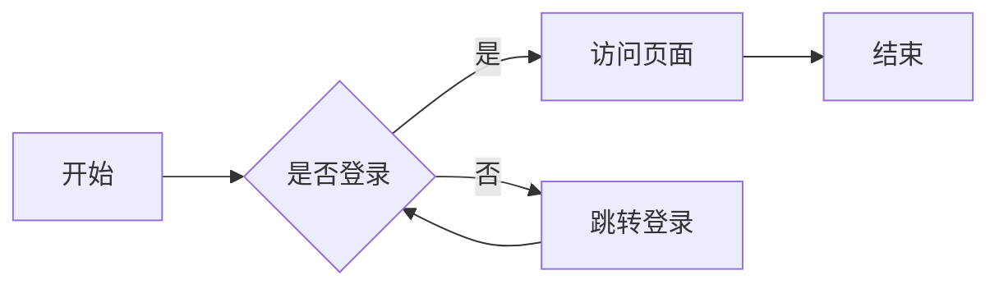

# 主题特性展示

VuePress Hope 主题提供了丰富的功能和优秀的用户体验。

## 🎨 主题切换

点击导航栏右上角的 🌙/☀️ 图标可以切换深色/浅色模式。

::: tip 自动适配
主题会根据系统设置自动切换，也支持手动选择。
:::

## 📱 响应式设计

本站采用响应式设计，在不同设备上都有良好的显示效果：

- 🖥️ **桌面端**：完整的导航栏和侧边栏
- 💻 **平板**：自适应布局
- 📱 **移动端**：侧边栏折叠，优化触摸操作

## 🔗 导航功能

### 侧边栏

- 自动生成文章大纲
- 支持多级嵌套
- 可折叠的分组
- 活动链接高亮

### 面包屑导航

页面顶部显示当前位置的路径导航，方便快速定位。

### 页面导航

页面底部提供上一篇/下一篇导航链接。

## 📊 内容增强

### 1. 代码块增强

```typescript
// 支持行号、行高亮、代码复制
const greeting = "Hello, VuePress!";
console.log(greeting);
```

特性：
- ✅ 语法高亮
- ✅ 行号显示
- ✅ 代码复制按钮
- ✅ 代码组支持

### 2. Markdown 增强

支持的 Markdown 扩展功能：

| 功能 | 说明 | 状态 |
|-----|------|-----|
| GFM | GitHub 风格 Markdown | ✅ |
| 任务列表 | 待办事项清单 | ✅ |
| 脚注 | 文档引用 | ✅ |
| 上下标 | 数学公式 | ✅ |
| 标记 | 文本高亮 | ✅ |
| 自定义对齐 | 居中/右对齐 | ✅ |
| 自定义容器 | 提示、警告等 | ✅ |
| 代码演示 | 在线运行代码 | ✅ |
| 图表 | 多种图表支持 | ✅ |

### 3. 图表支持

- **Mermaid**：流程图、时序图、甘特图
- **Flowchart**：传统流程图
- **ECharts**：专业数据可视化
- **Chart.js**：简单图表
- **Markmap**：思维导图
- **PlantUML**：UML 图示

示例：



## 🎯 内容功能

### 图片增强

- **图片懒加载**：提升页面加载速度
- **图片标记**：支持图片尺寸设置
- **图片预览**：点击放大查看

### 页面信息

每个页面显示：
- 📅 创建时间
- ✏️ 最后更新时间
- ⏱️ 阅读时长预估
- 🏷️ 文章标签
- 📂 文章分类

## 💬 评论系统

本站集成了评论系统：

- 支持 Markdown
- 支持表情
- 支持图片
- 邮件通知
- 评论管理

滚动到页面底部即可看到评论区。

## 🔍 搜索功能

强大的全文搜索：
- 快捷键：`Ctrl + K` 或 `/`
- 支持中英文
- 搜索建议
- 搜索历史

详细说明请查看[搜索功能演示](/demos/search-demo.html)。

## 🌐 多语言支持

本站支持中英文双语：
- 🇨🇳 简体中文
- 🇺🇸 English

语言切换在导航栏右上角。

## ♿ 无障碍支持

- 完整的键盘导航支持
- 屏幕阅读器友好
- 合理的 ARIA 标签
- 高对比度模式

## 📈 SEO 优化

- 自动生成 sitemap
- 结构化数据标记
- Open Graph 支持
- 搜索引擎友好的 URL

## ⚡ 性能优化

- PWA 支持
- 预加载优化
- 图片懒加载
- 代码分割
- 资源压缩

## 🎪 代码演示

### Vue 组件演示

::: vue-playground Vue 演示

@file App.vue

```vue
<template>
  <div class="demo">
    <h1>{{ message }}</h1>
    <button @click="count++">点击次数: {{ count }}</button>
  </div>
</template>

<script setup>
import { ref } from 'vue'

const message = ref('Hello VuePress!')
const count = ref(0)
</script>

<style>
.demo {
  text-align: center;
  padding: 20px;
}
button {
  margin-top: 10px;
  padding: 8px 16px;
  font-size: 16px;
  cursor: pointer;
}
</style>
```

:::

## 📚 更多功能

查看更多演示页面：

<div class="vp-card-group">
  <VPCard
    title="搜索演示"
    desc="搜索功能展示"
    logo="🔍"
    link="/demos/search-demo.html"
  />
  <VPCard
    title="组件展示"
    desc="内置组件功能"
    logo="🧩"
    link="/demos/components-demo.html"
  />
  <VPCard
    title="代码演示"
    desc="在线运行代码"
    logo="💻"
    link="/demos/code-demo.html"
  />
</div>

## 🎉 总结

VuePress Hope 主题提供了：

1. **丰富的功能**：开箱即用的各种增强功能
2. **优秀的体验**：响应式设计和流畅的交互
3. **强大的扩展**：支持各种图表和代码演示
4. **完善的文档**：详细的使用说明和示例

::: tip 了解更多
访问 [VuePress Hope 主题官网](https://theme-hope.vuejs.press/zh/) 了解更多特性。
:::