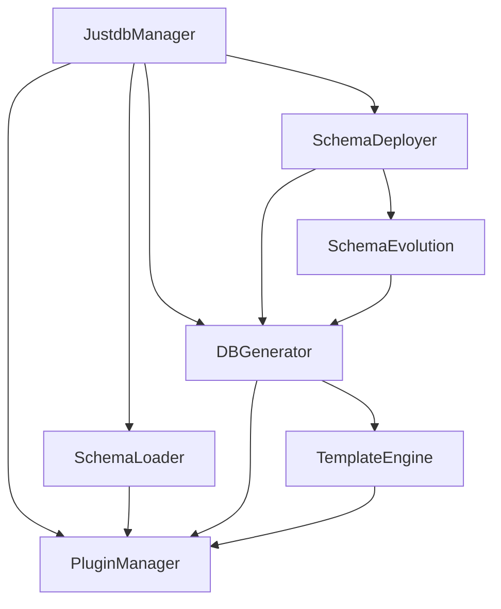
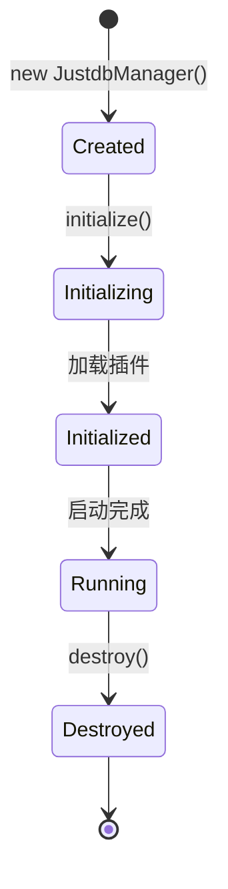
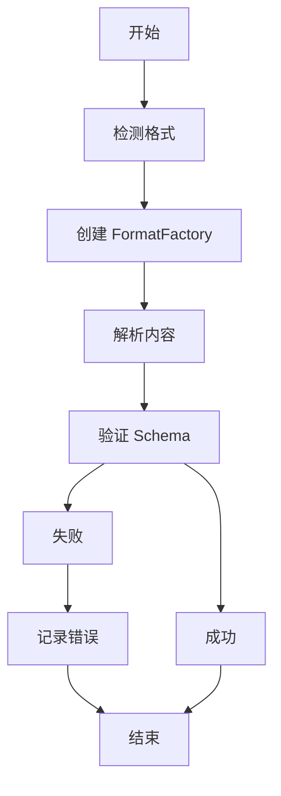

# 核心组件

JustDB 由多个核心组件组成，每个组件都有明确的职责和协作方式。

## 组件概览



## 1. JustdbManager

### 职责

JustDB 的中心管理器，负责协调所有组件的生命周期和交互。

### 核心功能

```java
public class JustdbManager {
    // 插件管理器
    private final PluginManager pluginManager;

    // 模板执行器
    private final TemplateExecutor templateExecutor;

    // 类型注册表
    private final TypeRegistry typeRegistry;

    // 扩展点注册表
    private final ExtensionPointRegistry extensionPointRegistry;
}
```

### 使用方式

```java
// 获取单例实例
JustdbManager justdbManager = JustdbManager.getInstance();

// 或创建新实例（高级用法）
JustdbManager justdbManager = new JustdbManager();
justdbManager.initialize();
```

### 生命周期



### 关键方法

```java
// 初始化
void initialize() throws JustdbException

// 获取插件管理器
PluginManager getPluginManager()

// 获取模板执行器
TemplateExecutor getTemplateExecutor()

// 获取类型注册表
TypeRegistry getTypeRegistry()

// 销毁
void destroy()
```

## 2. SchemaLoader

### 职责

负责从各种来源加载 Schema 定义。

### 支持的来源

```java
// 文件系统
Loaded&lt;Justdb&gt; loadFromFile(String path)

// 输入流
Loaded&lt;Justdb&gt; loadFromStream(InputStream stream, Format format)

// URL
Loaded&lt;Justdb&gt; loadFromUrl(String url)

// 类路径
Loaded&lt;Justdb&gt; loadFromClasspath(String resource)

// 数据库
Loaded&lt;Justdb&gt; loadFromDatabase(Connection connection)

// 多个来源
List<Loaded&gt;<Justdb>> loadFromLocations(List&lt;String&gt; locations)
```

### 自动格式检测

```java
public class FormatDetector {
    public static Format detect(String filename) {
        if (filename.endsWith(".yaml") || filename.endsWith(".yml")) {
            return Format.YAML;
        } else if (filename.endsWith(".json")) {
            return Format.JSON;
        } else if (filename.endsWith(".xml")) {
            return Format.XML;
        }
        // ...
    }
}
```

### 使用示例

```java
// 单个文件
SchemaLoader loader = new SchemaLoader(justdbManager);
Loaded&lt;Justdb&gt; loaded = loader.loadFromFile("schema.yaml");
Justdb schema = loaded.getMainSchema();

// 多个文件（合并）
List&lt;String&gt; locations = Arrays.asList(
    "base-schema.yaml",
    "users-schema.yaml",
    "orders-schema.yaml"
);
List<Loaded&gt;<Justdb>> results = loader.loadFromLocations(locations);
Justdb merged = SchemaMerger.merge(results);
```

### 加载流程



## 3. SchemaDeployer

### 职责

负责将 Schema 部署到目标数据库。

### 核心功能

```java
public class SchemaDeployer {
    // 部署 Schema
    public DeployResult deploy(Justdb schema, Connection connection)

    // 部署单个对象
    public void deployTable(Table table, Connection connection)
    public void deployView(View view, Connection connection)
    public void deploySequence(Sequence sequence, Connection connection)

    // 安全模式
    public void safeDrop(Table table, Connection connection)
}
```

### 部署模式

```java
public enum DeployMode {
    // 直接执行
    DIRECT,

    // 幂等模式（IF NOT EXISTS）
    IDEMPOTENT,

    // 安全模式（重命名而非删除）
    SAFE,

    // 干运行（只生成 SQL，不执行）
    DRY_RUN
}
```

### 使用示例

```java
// 创建部署器
SchemaDeployer deployer = new SchemaDeployer(justdbManager);

// 配置选项
DeployOptions options = DeployOptions.builder()
    .mode(DeployMode.IDEMPOTENT)
    .safeDrop(true)
    .beforeExecute((sql) -> {
        System.out.println("Executing: " + sql);
    })
    .build();

// 部署
DeployResult result = deployer.deploy(schema, connection, options);

// 检查结果
if (result.isSuccess()) {
    System.out.println("Deployed " + result.getExecutedCount() + " statements");
} else {
    System.out.println("Failed: " + result.getError());
}
```

### 生命周期钩子

```java
// Schema 定义中的钩子
@Table(name = "users")
public class UsersTable extends QueryAble {

    @JsonProperty("beforeCreates")
    private List<ConditionalSqlScript&gt;> beforeCreates;

    @JsonProperty("afterCreates")
    private List<ConditionalSqlScript&gt;> afterCreates;

    // ...
}

// 钩子执行顺序
// beforeCreates → CREATE TABLE → afterCreates
```

## 4. DBGenerator

### 职责

基于模板生成数据库特定的 SQL。

### 核心功能

```java
public class DBGenerator {
    // 生成创建表 SQL
    public List&lt;String&gt; generateCreateTable(Table table)

    // 生成修改表 SQL
    public List&lt;String&gt; generateAlterTable(TableDiff diff)

    // 生成删除表 SQL
    public List&lt;String&gt; generateDropTable(Table table)

    // 生成索引 SQL
    public List&lt;String&gt; generateCreateIndex(Index index)

    // 生成约束 SQL
    public List&lt;String&gt; generateCreateConstraint(Constraint constraint)
}
```

### 模板查找

```java
// 模板优先级
// 1. name + category + type + dialect (最精确)
// 2. name + category + type
// 3. name + category
// 4. name (最通用)

// 示例：create-table 模板查找顺序
// 1. create-table-db-mysql
// 2. create-table-db
// 3. create-table
```

### 使用示例

```java
// 创建生成器
DBGenerator generator = new DBGenerator(
    justdbManager.getPluginManager(),
    "mysql" // 数据库类型
);

// 上下文
TemplateRootContext context = TemplateRootContext.builder()
    .justdbManager(justdbManager)
    .dbType("mysql")
    .idempotent(true)
    .safeDrop(false)
    .put("table", table)
    .build();

// 生成 SQL
List&lt;String&gt; sql = generator.generateCreateTable(table, context);

// 输出
for (String statement : sql) {
    System.out.println(statement);
}
```

### 方言支持

```java
// 支持的数据库方言
String[] dialects = {
    "mysql",      // MySQL / MariaDB / TiDB
    "postgresql", // PostgreSQL / Redshift
    "oracle",     // Oracle
    "sqlserver",  // SQL Server
    "sqlite",     // SQLite
    "h2",         // H2
    "db2",        // DB2
    "derby",      // Derby
    "hsqldb",     // HSQLDB
    // ... 更多方言
};
```

## 5. TemplateEngine

### 职责

基于 Handlebars 的模板引擎，支持灵活的 SQL 和代码生成。

### 核心功能

```java
public class TemplateEngine {
    // 编译模板
    public Template compile(String templateContent)

    // 执行模板
    public String execute(Template template, Map&lt;String, , Object> context)

    // 注册辅助函数
    public void registerHelper(String name, Helper helper)
}
```

### 模板语法

```handlebars
{{! 注释 }}
{{#if condition}}
  {{! 条件渲染 }}
  CREATE TABLE {{name}}
{{/if}}

{{#each items}}
  {{! 循环 }}
  {{this.name}}
{{/each}}

{{! 引用其他模板 }}
{{> partial-name}}

{{! 访问根上下文 }}
{{@root.dbType}}
{{@root.idempotent}}
```

### 内置辅助函数

```java
// 表名引号
{{#quote}}{{name}}{{/quote}}
// mysql: `users`
// postgresql: "users"
// oracle: "users"

// 条件渲染
{{#if @root.idempotent}}IF NOT EXISTS {{/if}}

// 类型映射
{{#mapType type}}
// VARCHAR -> VARCHAR(255)
// INT -> INTEGER

// 列表连接
{{#join columns ", "}}
```

### 使用示例

```java
// 创建引擎
TemplateEngine engine = new TemplateEngine(justdbManager);

// 注册辅助函数
engine.registerHelper("toUpperCase", (options) -> {
    return options.get(0).toString().toUpperCase();
});

// 编译模板
Template template = engine.compile("CREATE TABLE {{name}} (");

// 执行
Map&lt;String, , Object> context = new HashMap<>();
context.put("name", "users");
String result = engine.execute(template, context);
// 输出: CREATE TABLE users (
```

## 6. PluginManager

### 职责

管理插件的加载、注册和生命周期。

### 插件类型

```java
public interface JustdbPlugin {
    // 数据库适配器
    DatabaseAdapter[] getDatabaseAdapters();

    // SQL 生成模板
    GenericTemplate[] getTemplates();

    // 扩展点定义
    ExtensionPoint[] getExtensionPoints();

    // 模板辅助函数
    TemplateHelper[] getTemplateHelpers();

    // Schema 格式化器
    SchemaFormat[] getSchemaFormats();
}
```

### 插件发现

```java
// 1. 内置插件
META-INF/default-plugins.xml

// 2. 外部插件
META-INF/services/ai.justdb.justdb.plugin.JustdbPlugin

// 3. 用户插件
justdb.plugins=/path/to/plugins
```

### 插件注册

```java
// 注册插件
PluginManager manager = justdbManager.getPluginManager();
manager.registerPlugin(new MySqlPlugin());
manager.registerPlugin(new PostgreSQLPlugin());

// 获取插件
List<JustdbPlugin&gt;> plugins = manager.getPlugins();

// 按类型获取
DatabaseAdapter[] adapters = manager.getDatabaseAdapters();
```

### 使用示例

```java
// 创建自定义插件
public class MyDatabasePlugin implements JustdbPlugin {

    @Override
    public DatabaseAdapter[] getDatabaseAdapters() {
        return new DatabaseAdapter[] {
            DatabaseAdapter.builder()
                .dbType("mydb")
                .driverClassName("com.mydb.Driver")
                .urlPattern("jdbc:mydb://*")
                .build()
        };
    }

    @Override
    public GenericTemplate[] getTemplates() {
        return new GenericTemplate[] {
            GenericTemplate.builder()
                .id("create-table")
                .name("create-table")
                .type(TemplateType.SQL)
                .category("db")
                .dialect("mydb")
                .content("CREATE TABLE {{#if @root.idempotent}}IF NOT EXISTS {{/if}}{{name}} (")
                .build()
        };
    }
}

// 注册
manager.registerPlugin(new MyDatabasePlugin());
```

## 7. SchemaEvolutionManager

### 职责

管理 Schema 的演进和迁移。

### 核心功能

```java
public class SchemaEvolutionManager {
    // 计算差异
    public List<CanonicalSchemaDiff&gt;> calculateDiff(
        Justdb oldSchema,
        Justdb newSchema
    )

    // 生成迁移 SQL
    public List&lt;String&gt; generateMigrationSql(
        List<CanonicalSchemaDiff&gt;> diffs
    )

    // 执行迁移
    public MigrationResult executeMigration(
        List&lt;String&gt; sql,
        Connection connection
    )
}
```

### 差异类型

```java
public enum ChangeType {
    ADDED,      // 新增对象
    REMOVED,    // 删除对象
    MODIFIED,   // 修改对象
    RENAMED     // 重命名对象（通过 formerNames）
}
```

### 使用示例

```java
// 创建管理器
SchemaEvolutionManager manager = new SchemaEvolutionManager(
    justdbManager,
    "mysql"
);

// 加载 Schema
Justdb oldSchema = loadFromFile("old-schema.yaml");
Justdb newSchema = loadFromFile("new-schema.yaml");

// 计算差异
List<CanonicalSchemaDiff&gt;> diffs = manager.calculateDiff(
    oldSchema,
    newSchema
);

// 生成迁移 SQL
List&lt;String&gt; sql = manager.generateMigrationSql(diffs);

// 执行迁移
MigrationResult result = manager.executeMigration(sql, connection);
```

### 智能重命名检测

```java
// 通过 formerNames 追踪重命名
@Table(name = "users")
public class UsersTable {
    @JsonProperty("formerNames")
    private List&lt;String&gt; formerNames = Arrays.asList("user");
}

// 自动检测重命名
// user -> users
// 生成: ALTER TABLE user RENAME TO users;
```

## 组件协作

### Schema 加载协作

```mermaid
sequenceDiagram
    participant User
    participant JM
    participant SL
    participant PM
    participant Format

    User->>JM: loadSchema()
    JM->>SL: new SchemaLoader()
    SL->>PM: getFormat("yaml")
    PM-->>SL: SchemaFormat
    SL->>Format: load()
    Format-->>SL: Justdb
    SL-->>JM: Loaded&lt;Justdb&gt;
    JM-->>User: Justdb
```

### SQL 生成协作

```mermaid
sequenceDiagram
    participant User
    participant DG
    participant TE
    participant PM
    participant Plugin

    User->>DG: generateCreateTable()
    DG->>PM: getTemplate("create-table", "mysql")
    PM->>Plugin: getTemplates()
    Plugin-->>PM: templates
    PM-->>DG: GenericTemplate
    DG->>TE: execute(template, context)
    TE-->>DG: SQL
    DG-->>User: List&lt;String&gt;
```

### 部署协作

```mermaid
sequenceDiagram
    participant User
    participant SD
    participant SE
    participant DG
    participant DB

    User->>SD: deploy(newSchema)
    SD->>SE: calculateDiff(oldSchema, newSchema)
    SE-->>SD: List<SchemaDiff&gt;>
    SD->>DG: generateSql(diffs)
    DG-->>SD: List&lt;String&gt;
    SD->>DB: execute(sql)
    DB-->>SD: result
    SD-->>User: DeployResult
```

## 设计模式

### 1. 单例模式

```java
// JustdbManager 使用单例模式
JustdbManager manager = JustdbManager.getInstance();
```

### 2. 工厂模式

```java
// FormatFactory 根据格式创建序列化器
SchemaFormat format = FormatFactory.getFormat(Format.YAML);
```

### 3. 策略模式

```java
// DBGenerator 根据方言选择不同的生成策略
DBGenerator generator = new DBGenerator(pluginManager, dialect);
```

### 4. 模板方法模式

```java
// SchemaDeployer 定义部署流程，子类实现具体步骤
public abstract class AbstractSchemaDeployer {
    public final void deploy(Justdb schema) {
        validate(schema);
        beforeDeploy();
        doDeploy(schema);
        afterDeploy();
    }

    protected abstract void doDeploy(Justdb schema);
}
```

### 5. 观察者模式

```java
// 生命周期钩子
table.getBeforeCreates().forEach(script -> {
    if (script.shouldExecute()) {
        script.execute();
    }
});
```

## 相关文档

- [分层架构](./layers.md)
- [数据流设计](./data-flow.md)
- [插件系统](./plugins.md)
- [架构概览](./overview.md)
