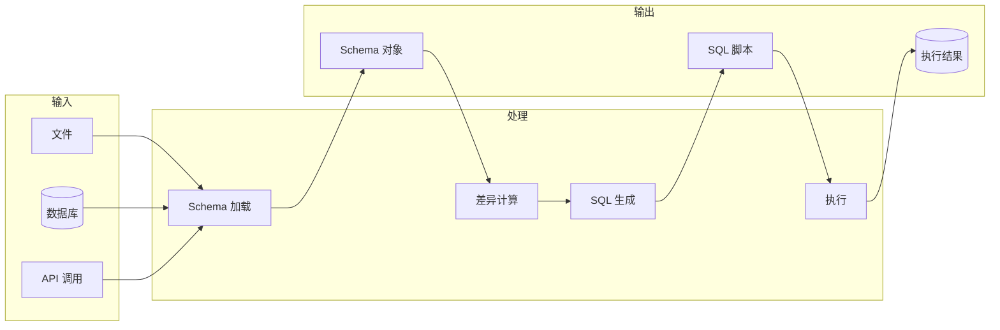
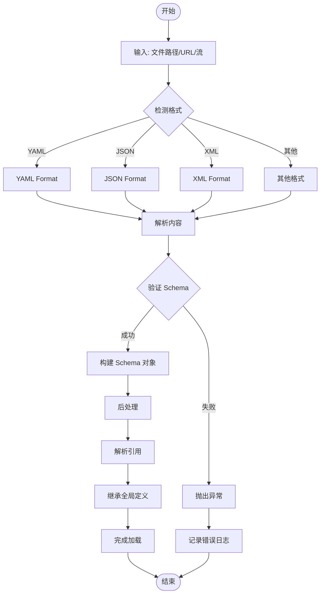
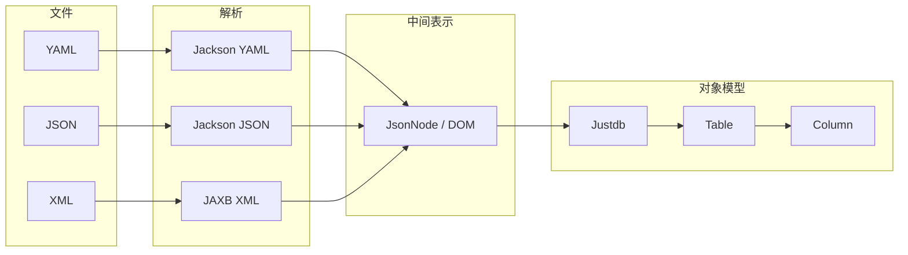
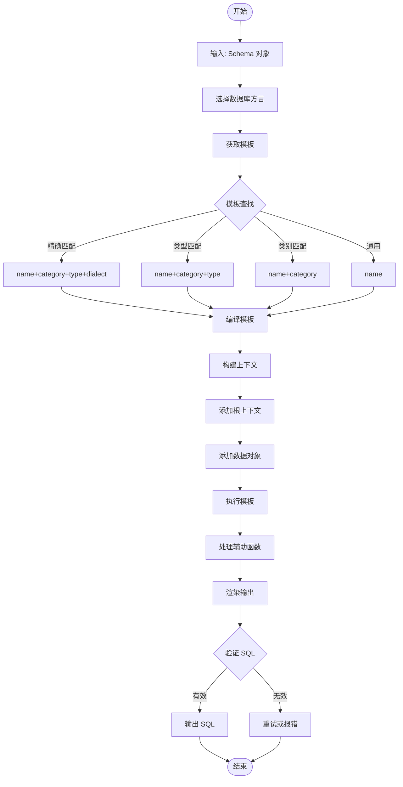
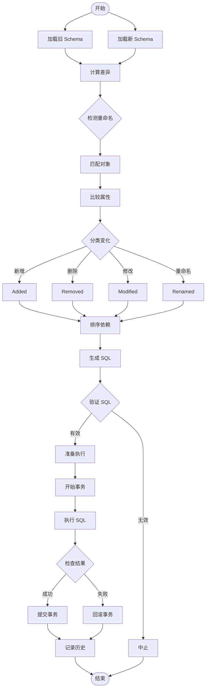
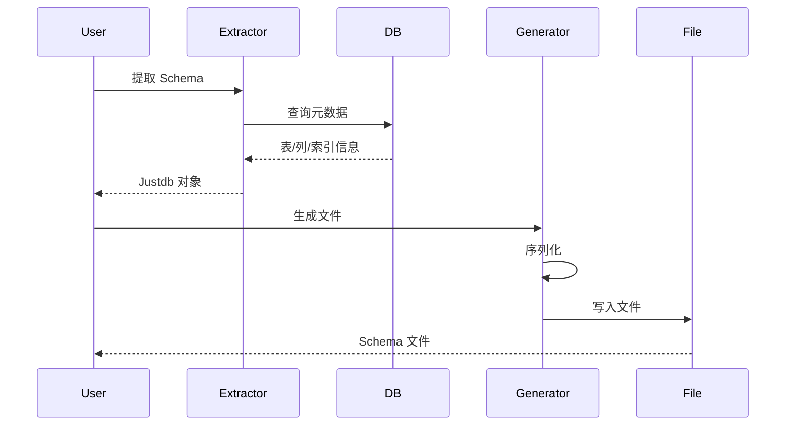

# 数据流设计

JustDB 的核心数据流包括 Schema 加载、SQL 生成和迁移执行三个主要流程。

## 数据流概览



## 1. Schema 加载流程

### 完整流程图



### 详细步骤

#### 1.1 格式检测

```java
public class FormatDetector {
    public static Format detect(String source) {
        // 根据文件扩展名
        if (source.endsWith(".yaml") || source.endsWith(".yml")) {
            return Format.YAML;
        } else if (source.endsWith(".json")) {
            return Format.JSON;
        } else if (source.endsWith(".xml")) {
            return Format.XML;
        } else if (source.endsWith(".toml")) {
            return Format.TOML;
        } else if (source.endsWith(".xlsx") || source.endsWith(".xls")) {
            return Format.EXCEL;
        }

        // 根据内容特征
        String content = readFile(source);
        if (content.trim().startsWith("{")) {
            return Format.JSON;
        } else if (content.trim().startsWith("<")) {
            return Format.XML;
        }

        throw new UnknownFormatException(source);
    }
}
```

#### 1.2 内容解析

```java
public class SchemaLoader {
    public Loaded&lt;Justdb&gt; loadFromFile(String path) {
        // 1. 检测格式
        Format format = FormatDetector.detect(path);

        // 2. 获取格式化器
        SchemaFormat formatter = FormatFactory.getFormat(format);

        // 3. 读取文件
        InputStream input = new FileInputStream(path);

        // 4. 解析内容
        Justdb schema = formatter.load(input);

        // 5. 创建加载结果
        return Loaded.<Justdb>builder()
            .mainSchema(schema)
            .source(path)
            .format(format)
            .build();
    }
}
```

#### 1.3 Schema 验证

```java
public class SchemaValidator {
    public ValidationResult validate(Justdb schema) {
        ValidationResult result = new ValidationResult();

        // 验证必需字段
        if (schema.getId() == null) {
            result.addError("Schema id is required");
        }

        // 验证表定义
        for (Table table : schema.getTables()) {
            if (table.getName() == null) {
                result.addError("Table name is required");
            }

            // 验证列定义
            for (Column column : table.getColumns()) {
                if (column.getName() == null) {
                    result.addError("Column name is required");
                }
                if (column.getType() == null) {
                    result.addError("Column type is required: " + table.getName());
                }
            }
        }

        return result;
    }
}
```

#### 1.4 后处理

```java
public class SchemaPostProcessor {
    public void process(Justdb schema) {
        // 1. 解析引用
        resolveReferences(schema);

        // 2. 继承全局定义
        inheritGlobals(schema);

        // 3. 设置默认值
        setDefaults(schema);

        // 4. 验证引用完整性
        validateReferences(schema);
    }

    private void resolveReferences(Justdb schema) {
        // 解析 referenceId
        for (Table table : schema.getTables()) {
            for (Column column : table.getColumns()) {
                if (column.getReferenceId() != null) {
                    Column globalColumn = findGlobalColumn(schema, column.getReferenceId());
                    if (globalColumn != null) {
                        // 继承全局列的属性
                        inheritColumn(column, globalColumn);
                    }
                }
            }
        }
    }
}
```

### 数据转换



## 2. SQL 生成流程

### 完整流程图



### 详细步骤

#### 2.1 模板查找

```java
public class TemplateRegistry {
    public GenericTemplate getTemplate(String name, String dialect) {
        // 按优先级查找
        String[] keys = {
            name + "-db-" + dialect,        // create-table-db-mysql
            name + "-db",                    // create-table-db
            name                             // create-table
        };

        for (String key : keys) {
            GenericTemplate template = templates.get(key);
            if (template != null) {
                return template;
            }
        }

        throw new TemplateNotFoundException(name, dialect);
    }
}
```

#### 2.2 上下文构建

```java
public class TemplateRootContext {
    private final JustdbManager justdbManager;
    private final String dbType;
    private final boolean idempotent;
    private final boolean safeDrop;
    private final Map&lt;String, , Object> data;

    public static Builder builder() {
        return new Builder();
    }

    public static class Builder {
        private JustdbManager justdbManager;
        private String dbType;
        private boolean idempotent = false;
        private boolean safeDrop = false;
        private Map&lt;String, , Object> data = new HashMap<>();

        public Builder justdbManager(JustdbManager justdbManager) {
            this.justdbManager = justdbManager;
            return this;
        }

        public Builder dbType(String dbType) {
            this.dbType = dbType;
            return this;
        }

        public Builder idempotent(boolean idempotent) {
            this.idempotent = idempotent;
            return this;
        }

        public Builder put(String key, Object value) {
            this.data.put(key, value);
            return this;
        }

        public TemplateRootContext build() {
            return new TemplateRootContext(this);
        }
    }
}
```

#### 2.3 模板执行

```java
public class TemplateExecutor {
    public String execute(String templateId, TemplateRootContext context) {
        // 1. 获取模板
        GenericTemplate template = templateRegistry.getTemplate(
            templateId,
            context.getDbType()
        );

        // 2. 编译模板
        Handlebars handlebars = createHandlebars(context);
        Template compiledTemplate = handlebars.compileInline(template.getContent());

        // 3. 执行模板
        try {
            return compiledTemplate.apply(context.getData());
        } catch (IOException e) {
            throw new TemplateExecutionException(templateId, e);
        }
    }

    private Handlebars createHandlebars(TemplateRootContext context) {
        Handlebars handlebars = new Handlebars();

        // 注册辅助函数
        for (TemplateHelper helper : pluginManager.getTemplateHelpers()) {
            handlebars.registerHelper(helper.getName(), helper.getHelper());
        }

        return handlebars;
    }
}
```

### SQL 生成示例

```java
// 生成 CREATE TABLE 语句
public List&lt;String&gt; generateCreateTable(Table table) {
    TemplateRootContext context = TemplateRootContext.builder()
        .justdbManager(justdbManager)
        .dbType("mysql")
        .idempotent(true)
        .safeDrop(false)
        .put("table", table)
        .build();

    String sql = templateExecutor.execute("create-table", context);

    return Arrays.asList(sql.split(";"));
}
```

### 模板示例

```handlebars
{{! create-table-mysql-lineage }}
CREATE TABLE {{#if @root.idempotent}}IF NOT EXISTS {{/if}}{{> table-name}} (
{{#each table.columns}}
  {{> column-spec}}{{#unless @last}},{{/unless}}
{{/each}}
{{#if table.primaryKey}}
  ,PRIMARY KEY ({{#each table.primaryKey.columns}}{{this}}{{#unless @last}}, {{/unless}}{{/each}})
{{/if}}
);
```

## 3. 迁移执行流程

### 完整流程图



### 详细步骤

#### 3.1 差异计算

```java
public class SchemaDiff {
    public List<CanonicalSchemaDiff&gt;> calculate(Justdb oldSchema, Justdb newSchema) {
        List<CanonicalSchemaDiff&gt;> diffs = new ArrayList<>();

        // 1. 检测新增对象
        for (Table newTable : newSchema.getTables()) {
            Table oldTable = findTable(oldSchema, newTable.getName());
            if (oldTable == null) {
                // 检查是否是重命名
                Table renamedFrom = findRenamedTable(oldSchema, newTable);
                if (renamedFrom != null) {
                    diffs.add(createRenameDiff(renamedFrom, newTable));
                } else {
                    diffs.add(createAddDiff(newTable));
                }
            }
        }

        // 2. 检测删除对象
        for (Table oldTable : oldSchema.getTables()) {
            Table newTable = findTable(newSchema, oldTable.getName());
            if (newTable == null) {
                diffs.add(createRemoveDiff(oldTable));
            }
        }

        // 3. 检测修改对象
        for (Table newTable : newSchema.getTables()) {
            Table oldTable = findTable(oldSchema, newTable.getName());
            if (oldTable != null && !isSame(oldTable, newTable)) {
                diffs.add(createModifyDiff(oldTable, newTable));
            }
        }

        return diffs;
    }

    private Table findRenamedTable(Justdb schema, Table newTable) {
        // 检查 formerNames
        for (Table oldTable : schema.getTables()) {
            if (oldTable.getFormerNames() != null) {
                for (String formerName : oldTable.getFormerNames()) {
                    if (formerName.equals(newTable.getName())) {
                        return oldTable;
                    }
                }
            }
        }
        return null;
    }
}
```

#### 3.2 SQL 生成

```java
public class SchemaEvolutionManager {
    public List&lt;String&gt; generateMigrationSql(List<CanonicalSchemaDiff&gt;> diffs) {
        List&lt;String&gt; sql = new ArrayList<>();

        // 按类型排序
        List<CanonicalSchemaDiff&gt;> sorted = sortDiffs(diffs);

        for (CanonicalSchemaDiff diff : sorted) {
            switch (diff.getChangeType()) {
                case ADDED:
                    sql.addAll(generateAddSql(diff));
                    break;
                case REMOVED:
                    sql.addAll(generateRemoveSql(diff));
                    break;
                case MODIFIED:
                    sql.addAll(generateModifySql(diff));
                    break;
                case RENAMED:
                    sql.addAll(generateRenameSql(diff));
                    break;
            }
        }

        return sql;
    }

    private List<CanonicalSchemaDiff&gt;> sortDiffs(List<CanonicalSchemaDiff&gt;> diffs) {
        // 拓扑排序，确保依赖顺序
        // 1. 先删除外键
        // 2. 再删除表
        // 3. 创建表
        // 4. 创建外键
        return TopologicalSort.sort(diffs);
    }
}
```

#### 3.3 执行迁移

```java
public class MigrationExecutor {
    public MigrationResult execute(List&lt;String&gt; sql, Connection connection) {
        MigrationResult result = new MigrationResult();

        try {
            // 开始事务
            connection.setAutoCommit(false);

            // 执行 SQL
            for (String statement : sql) {
                try (Statement stmt = connection.createStatement()) {
                    int count = stmt.executeUpdate(statement);
                    result.addExecuted(statement, count);
                } catch (SQLException e) {
                    // 回滚事务
                    connection.rollback();
                    result.setError(statement, e);
                    return result;
                }
            }

            // 提交事务
            connection.commit();
            result.setSuccess(true);

        } catch (SQLException e) {
            try {
                connection.rollback();
            } catch (SQLException ex) {
                // 忽略回滚异常
            }
            result.setError("Transaction failed", e);
        }

        return result;
    }
}
```

## 4. 完整工作流

### Schema 到数据库

```mermaid
sequenceDiagram
    participant User
    participant Loader
    participant Diff
    participant Generator
    participant Executor
    participant DB

    User->>Loader: 加载 Schema 文件
    Loader-->>User: Justdb 对象

    User->>Diff: 计算差异
    Diff->>Diff: 比较 Schema
    Diff-->>User: List<SchemaDiff&gt;>

    User->>Generator: 生成 SQL
    Generator->>Generator: 选择模板
    Generator->>Generator: 执行模板
    Generator-->>User: List&lt;String&gt;

    User->>Executor: 执行迁移
    Executor->>DB: 开始事务
    Executor->>DB: 执行 SQL
    DB-->>Executor: 结果
    Executor->>DB: 提交/回滚
    Executor-->>User: MigrationResult
```

### 数据库到 Schema



## 数据流特性

### 1. 幂等性

```java
// 幂等模式：重复执行结果相同
TemplateRootContext context = TemplateRootContext.builder()
    .idempotent(true)  // IF NOT EXISTS
    .build();

// 生成: CREATE TABLE IF NOT EXISTS users (
```

### 2. 事务性

```java
// 迁移在事务中执行
connection.setAutoCommit(false);
try {
    execute(sql);
    connection.commit();
} catch (Exception e) {
    connection.rollback();
    throw e;
}
```

### 3. 可追溯性

```java
// 记录迁移历史
MigrationHistory history = new MigrationHistory();
history.setSchemaId(schema.getId());
history.setVersion(version);
history.setSql(sql);
history.setTimestamp(System.currentTimeMillis());
history.save(connection);
```

### 4. 安全性

```java
// 安全模式：重命名而非删除
if (safeDrop) {
    // DROP TABLE users
    // 改为: ALTER TABLE users RENAME TO users_backup_20250209
}
```

## 性能优化

### 1. 批量操作

```java
// 批量执行 SQL
public void executeBatch(List&lt;String&gt; sql, Connection connection) {
    try (Statement stmt = connection.createStatement()) {
        for (String statement : sql) {
            stmt.addBatch(statement);
        }
        stmt.executeBatch();
    }
}
```

### 2. 并行加载

```java
// 并行加载多个 Schema 文件
List<Loaded&gt;<Justdb>> results = paths.parallelStream()
    .map(path -> loader.loadFromFile(path))
    .collect(Collectors.toList());
```

### 3. 缓存

```java
// 缓存编译后的模板
private final Map&lt;String, , Template> templateCache = new ConcurrentHashMap<>();

public Template getTemplate(String key) {
    return templateCache.computeIfAbsent(key, k -> compileTemplate(k));
}
```

## 错误处理

### 1. 验证错误

```java
try {
    Justdb schema = loader.loadFromFile("schema.yaml");
} catch (ValidationException e) {
    // Schema 验证失败
    System.err.println("Validation errors:");
    e.getErrors().forEach(error -> System.err.println("  - " + error));
}
```

### 2. 执行错误

```java
MigrationResult result = executor.execute(sql, connection);
if (!result.isSuccess()) {
    // 迁移失败，已回滚
    System.err.println("Migration failed: " + result.getError());
}
```

### 3. 恢复策略

```java
// 从备份恢复
public void rollback(Connection connection) {
    // 1. 获取最新备份
    MigrationHistory backup = getLatestBackup(connection);

    // 2. 恢复 Schema
    Justdb schema = backup.getSchema();
    deployer.deploy(schema, connection);
}
```

## 相关文档

- [核心组件](./components.md)
- [分层架构](./layers.md)
- [插件系统](./plugins.md)
- [架构概览](./overview.md)
