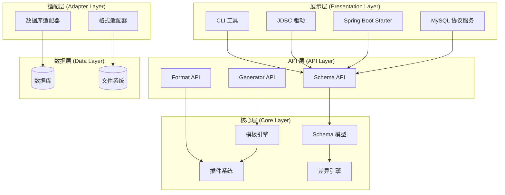
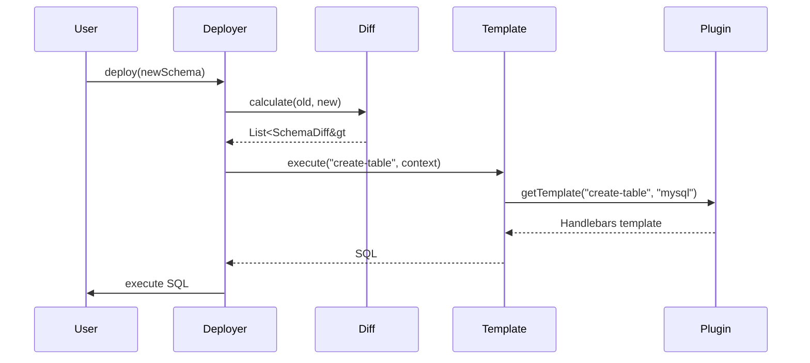
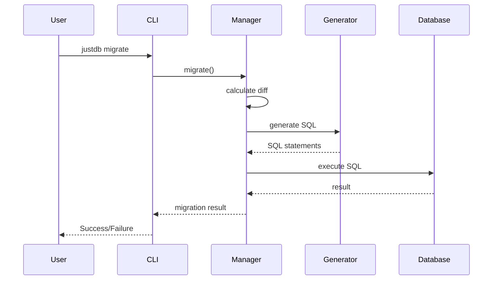

# 分层架构

JustDB 采用清晰的分层架构设计，每一层都有明确的职责和边界。

## 架构概览



## 层次详解

### 1. 展示层 (Presentation Layer)

展示层提供用户交互界面，是用户与 JustDB 交互的入口点。

#### 1.1 CLI 工具

**职责**：提供命令行界面

**核心组件**：
- `JustDBCli` - CLI 主入口
- `CommandFactory` - 命令工厂
- `CliContext` - CLI 上下文

**支持的命令**：
```bash
# 格式转换
justdb convert [options] <input>

# 数据库迁移
justdb migrate [options]

# 从数据库提取 Schema
justdb db2schema [options]

# 交互式终端
justdb interactive

# AI 助手
justdb ai <prompt>
```

**代码示例**：
```java
public static void main(String[] args) {
    JustdbManager justdbManager = JustdbManager.getInstance();
    JustDBCli cli = new JustDBCli(justdbManager);
    cli.run(args);
}
```

#### 1.2 JDBC 驱动

**职责**：提供标准 JDBC 接口实现

**核心组件**：
- `JustdbDriver` - JDBC 驱动实现
- `JustdbDataSource` - 数据源实现
- `JustdbConnection` - 连接实现
- `JustdbPreparedStatement` - 语句实现
- `JustdbResultSet` - 结果集实现

**支持的 JDBC 功能**：
- 标准 SQL 查询（SELECT、INSERT、UPDATE、DELETE）
- JOIN 查询
- 聚合函数（COUNT、SUM、AVG、MIN、MAX）
- 事务管理（ACID）
- 批量操作
- 元数据查询

**连接 URL 格式**：
```java
// 内存数据库
jdbc:justdb:memory:/schema.yaml

// 文件数据库
jdbc:justdb:file:/path/to/schema.yaml

// 类路径资源
jdbc:justdb:classpath:/schema.yaml

// 带配置
jdbc:justdb:memory:/schema.yaml?dbtype=mysql&dryrun=false
```

**使用示例**：
```java
// 加载驱动
Class.forName("org.verydb.justdb.jdbc.JustdbDriver");

// 创建连接
Connection conn = DriverManager.getConnection(
    "jdbc:justdb:classpath:/schema.yaml"
);

// 执行查询
Statement stmt = conn.createStatement();
ResultSet rs = stmt.executeQuery("SELECT * FROM users");

while (rs.next()) {
    System.out.println(rs.getString("username"));
}
```

#### 1.3 Spring Boot Starter

**职责**：提供 Spring Boot 自动配置

**核心组件**：
- `JustdbAutoConfiguration` - 自动配置类
- `JustdbProperties` - 配置属性
- `JustdbInitializer` - 初始化器

**配置示例**：
```yaml
justdb:
  enabled: true
  locations:
    - classpath:justdb
    - file:./schemas
  dbtype: mysql
  dry-run: false
  auto-migrate: true
```

**自动功能**：
- 应用启动时自动加载 Schema
- 自动执行数据库迁移
- 注册 JDBC DataSource
- 集成 Spring 事务管理

#### 1.4 MySQL 协议服务

**职责**：提供标准 MySQL 协议接口，支持任何 MySQL 客户端连接

**核心组件**：
- `MySQLProtocolServer` - MySQL 协议服务器
- `MySQLConnectionHandler` - 连接处理器
- `MySQLCommandProcessor` - 命令处理器
- `MySQLResultSetSender` - 结果集发送器

**支持的 MySQL 协议功能**：
- 标准 SQL 查询（SELECT、INSERT、UPDATE、DELETE）
- 预编译语句（PreparedStatement）
- 存储过程调用
- 事务管理（BEGIN、COMMIT、ROLLBACK）
- 元数据查询（SHOW、DESCRIBE）
- 多结果集处理

**连接方式**：
```bash
# 命令行启动
justdb mysql-server --port 3307 --schema /path/to/schema.yaml

# MySQL 客户端连接
mysql -h 127.0.0.1 -P 3307 -u root -p

# 使用 MySQL Workbench
# Host: 127.0.0.1
# Port: 3307
# Username: root
# Password: (任意)
```

**支持的客户端工具**：
- MySQL 命令行客户端
- MySQL Workbench
- DBeaver
- Navicat
- HeidiSQL
- 任何标准 MySQL 客户端

**使用示例**：
```java
// 启动 MySQL 协议服务
MySQLProtocolServer server = MySQLProtocolServer.builder()
    .port(3307)
    .schemaPath("/path/to/schema.yaml")
    .build();

server.start();

// 客户端可以用任何 MySQL 客户端连接
// mysql -h 127.0.0.1 -P 3307
```

### 2. API 层 (API Layer)

API 层提供编程接口，封装核心层的功能。

#### 2.1 Schema API

**职责**：提供 Schema 操作接口

**核心接口**：
- `SchemaLoader` - Schema 加载器
- `SchemaDeployer` - Schema 部署器
- `SchemaDiff` - Schema 差异计算

**使用示例**：
```java
// 加载 Schema
SchemaLoader loader = new SchemaLoader();
Justdb schema = loader.loadFromFile("schema.yaml");

// 部署 Schema
SchemaDeployer deployer = new SchemaDeployer(justdbManager);
deployer.deploy(schema, connection);

// 计算差异
SchemaDiff diff = new SchemaDiff();
List<CanonicalSchemaDiff&gt;> changes = diff.calculate(oldSchema, newSchema);
```

#### 2.2 Format API

**职责**：提供格式转换接口

**核心接口**：
- `FormatFactory` - 格式工厂
- `SchemaFormat` - 格式化器接口

**支持的格式**：
- YAML
- JSON
- XML
- TOML
- Properties
- SQL
- Markdown
- Excel

**使用示例**：
```java
// 加载 YAML
Justdb schema = FormatFactory.loadFromFile("schema.yaml");

// 保存为 JSON
FormatFactory.saveToFile(schema, "schema.json", Format.JSON);

// 保存为 XML
FormatFactory.saveToFile(schema, "schema.xml", Format.XML);
```

#### 2.3 Generator API

**职责**：提供 SQL 生成接口

**核心接口**：
- `DBGenerator` - 数据库生成器
- `SqlGenerator` - SQL 生成器

**使用示例**：
```java
// 创建生成器
DBGenerator generator = new DBGenerator(
    justdbManager.getPluginManager(),
    "mysql"
);

// 生成 SQL
List&lt;String&gt; sql = generator.generateCreateTable(table);

// 执行 SQL
for (String statement : sql) {
    statement.execute(connection);
}
```

### 3. 核心层 (Core Layer)

核心层包含 JustDB 的核心业务逻辑和模型定义。

#### 3.1 Schema 模型

**职责**：定义 Schema 数据模型

**核心类**：
- `Justdb` - 根容器
- `Table` - 表定义
- `Column` - 列定义
- `Index` - 索引定义
- `Constraint` - 约束定义
- `View` - 视图定义
- `Sequence` - 序列定义

**模型层次**：
```
Item (基类)
├── UnknownValues (动态扩展)
├── SchemaSense (上下文)
├── QueryAble (生命周期钩子)
│   ├── Table
│   ├── View
│   └── Query
├── Column
├── Index
├── Constraint
├── Trigger
├── Sequence
└── Procedure

Justdb (根容器)
└── SchemaSense
```

**设计特性**：
- **双向序列化**：支持 JAXB (XML) 和 Jackson (JSON/YAML)
- **别名系统**：通过 `@JsonAlias` 支持多种命名格式
- **引用系统**：通过 `referenceId` 实现组件复用
- **演进追踪**：通过 `formerNames` 追踪重命名历史

#### 3.2 插件系统

**职责**：提供可扩展的插件架构

**核心组件**：
- `PluginManager` - 插件管理器
- `JustdbPlugin` - 插件接口
- `ExtensionPointRegistry` - 扩展点注册表
- `TemplateRegistry` - 模板注册表

**插件类型**：
```java
public interface JustdbPlugin {
    // 数据库适配器
    DatabaseAdapter[] getDatabaseAdapters();

    // SQL 生成模板
    GenericTemplate[] getTemplates();

    // 扩展点定义
    ExtensionPoint[] getExtensionPoints();

    // 模板辅助函数
    TemplateHelper[] getTemplateHelpers();

    // Schema 格式化器
    SchemaFormat[] getSchemaFormats();
}
```

**插件发现**：
1. 内置插件：`default-plugins.xml`
2. 外部插件：JAR 包的 `META-INF/services/`
3. 用户插件：配置文件指定

#### 3.3 模板引擎

**职责**：基于模板生成 SQL 和代码

**核心组件**：
- `TemplateEngine` - 模板引擎（基于 Handlebars）
- `TemplateExecutor` - 模板执行器
- `TemplateRootContext` - 根上下文

**模板特性**：
- **方言继承**：数据库方言族（MySQL-lineage、PostgreSQL-lineage）
- **模板优先级**：name + category + type + dialect > name + category + type > name + category > name
- **模板引用**：`{{> template-name}}` 语法复用模板片段
- **条件渲染**：`{{#if @root.idempotent}}`、`{{@root.dbType}}` 等根上下文变量

**使用示例**：
```java
// 创建上下文
TemplateRootContext context = TemplateRootContext.builder()
    .justdbManager(justdbManager)
    .dbType("mysql")
    .idempotent(true)
    .put("table", table)
    .build();

// 执行模板
String sql = templateExecutor.execute("create-table", context);
```

#### 3.4 差异引擎

**职责**：计算 Schema 之间的差异

**核心组件**：
- `CanonicalSchemaDiff` - 规范化 Schema 差异
- `SchemaEvolutionManager` - Schema 演进管理器

**差异类型**：
```java
public enum ChangeType {
    ADDED,      // 新增对象
    REMOVED,    // 删除对象
    MODIFIED,   // 修改对象
    RENAMED     // 重命名对象（通过 formerNames）
}
```

**使用示例**：
```java
// 计算差异
SchemaDiff differ = new SchemaDiff();
List<CanonicalSchemaDiff&gt;> diffs = differ.calculate(oldSchema, newSchema);

// 生成迁移 SQL
SchemaEvolutionManager manager = new SchemaEvolutionManager(
    justdbManager,
    dialect
);
List&lt;String&gt; sql = manager.generateMigrationSql(diffs);
```

### 4. 适配层 (Adapter Layer)

适配层提供与外部系统的适配功能。

#### 4.1 数据库适配器

**职责**：适配不同数据库的特性

**核心接口**：
```java
public interface DatabaseAdapter {
    // 数据库类型
    String getDbType();

    // JDBC 驱动
    String getDriverClassName();

    // URL 模式
    String getUrlPattern();

    // 类型映射
    TypeMapping[] getTypeMappings();
}
```

**支持的数据库**：
- MySQL / MariaDB / TiDB
- PostgreSQL / Redshift / TimescaleDB
- Oracle
- SQL Server
- H2 / HSQLDB / Derby
- SQLite
- 达梦 / 人大金仓 / GBase / OceanBase

#### 4.2 格式适配器

**职责**：适配不同的序列化格式

**核心接口**：
```java
public interface SchemaFormat {
    // 格式名称
    String getName();

    // 文件扩展名
    String[] getFileExtensions();

    // 加载 Schema
    Justdb load(InputStream input) throws IOException;

    // 保存 Schema
    void save(Justdb schema, OutputStream output) throws IOException;
}
```

### 5. 数据层 (Data Layer)

数据层负责与外部数据源的交互。

#### 5.1 数据库

**职责**：存储和管理数据

**交互方式**：
- JDBC 连接
- 连接池
- 事务管理

#### 5.2 文件系统

**职责**：存储 Schema 定义文件

**支持的加载位置**：
- 文件系统路径
- 类路径资源
- URL 资源
- InputStream

## 层次交互

### Schema 加载流程

```mermaid
sequenceDiagram
    participant User
    participant CLI
    participant Loader
    participant Format
    participant Model

    User->>CLI: justdb convert schema.yaml
    CLI->>Loader: loadFromFile()
    Loader->>Format: detectFormat()
    Format-->>Loader: YAML
    Loader->>Format: load()
    Format->>Model: deserialize
    Model-->>Format: Justdb
    Format-->>Loader: Justdb
    Loader-->>CLI: Loaded&lt;Justdb&gt;
    CLI-->>User: Success
```

### SQL 生成流程



### 迁移执行流程



## 设计原则

### 1. 单向依赖

上层依赖下层，下层不依赖上层：

```
展示层 → API 层 → 核心层 → 适配层 → 数据层
```

### 2. 接口隔离

每层通过接口与外部交互：

```java
// API 层接口
public interface SchemaLoader {
    Loaded&lt;Justdb&gt; loadFromFile(String path);
}

// 核心层实现
public class SchemaLoaderImpl implements SchemaLoader {
    // 实现...
}
```

### 3. 依赖注入

通过构造函数或工厂注入依赖：

```java
public class SchemaDeployer {
    private final JustdbManager justdbManager;

    public SchemaDeployer(JustdbManager justdbManager) {
        this.justdbManager = justdbManager;
    }
}
```

### 4. 插件化

通过插件系统扩展功能：

```java
// 注册插件
PluginManager manager = justdbManager.getPluginManager();
manager.registerPlugin(new MyDatabasePlugin());
```

## 相关文档

- [核心组件](./components.md)
- [数据流设计](./data-flow.md)
- [插件系统](./plugins.md)
- [架构概览](./overview.md)
