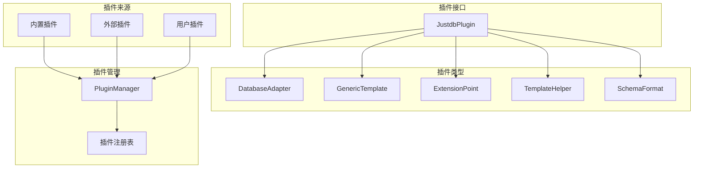
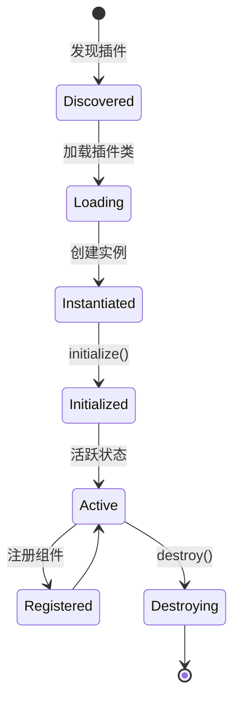

# 插件系统

JustDB 的插件系统提供了强大的扩展能力，允许用户自定义数据库适配器、SQL 模板、辅助函数等。

## 插件系统概览



## JustdbPlugin 接口

### 接口定义

```java
public interface JustdbPlugin {
    /**
     * 获取插件 ID
     */
    String getId();

    /**
     * 获取插件名称
     */
    String getName();

    /**
     * 获取插件版本
     */
    String getVersion();

    /**
     * 获取数据库适配器
     */
    default DatabaseAdapter[] getDatabaseAdapters() {
        return new DatabaseAdapter[0];
    }

    /**
     * 获取 SQL 生成模板
     */
    default GenericTemplate[] getTemplates() {
        return new GenericTemplate[0];
    }

    /**
     * 获取扩展点定义
     */
    default ExtensionPoint[] getExtensionPoints() {
        return new ExtensionPoint[0];
    }

    /**
     * 获取模板辅助函数
     */
    default TemplateHelper[] getTemplateHelpers() {
        return new TemplateHelper[0];
    }

    /**
     * 获取 Schema 格式化器
     */
    default SchemaFormat[] getSchemaFormats() {
        return new SchemaFormat[0];
    }

    /**
     * 插件初始化
     */
    default void initialize(JustdbManager justdbManager) {
    }

    /**
     * 插件销毁
     */
    default void destroy() {
    }
}
```

### 插件示例

```java
public class MySqlPlugin implements JustdbPlugin {

    @Override
    public String getId() {
        return "mysql";
    }

    @Override
    public String getName() {
        return "MySQL Plugin";
    }

    @Override
    public String getVersion() {
        return "1.0.0";
    }

    @Override
    public DatabaseAdapter[] getDatabaseAdapters() {
        return new DatabaseAdapter[] {
            DatabaseAdapter.builder()
                .dbType("mysql")
                .driverClassName("com.mysql.cj.jdbc.Driver")
                .urlPattern("jdbc:mysql://*")
                .build()
        };
    }

    @Override
    public GenericTemplate[] getTemplates() {
        return new GenericTemplate[] {
            createTableTemplate(),
            alterTableTemplate(),
            dropTableTemplate()
        };
    }

    private GenericTemplate createTableTemplate() {
        return GenericTemplate.builder()
            .id("create-table")
            .name("create-table")
            .type(TemplateType.SQL)
            .category("db")
            .dialect("mysql")
            .content("CREATE TABLE {{#if @root.idempotent}}IF NOT EXISTS {{/if}}{{> table-name}} (\n{{> columns}}\n);")
            .build();
    }
}
```

## 插件发现机制

### 1. 内置插件

**位置**：`META-INF/default-plugins.xml`

**加载**：自动加载

```xml
<plugins>
  <plugin id="mysql" name="MySQL Plugin" version="1.0.0">
    <adapters>
      <adapter dbType="mysql" driverClassName="com.mysql.cj.jdbc.Driver">
        <urlPattern>jdbc:mysql://*</urlPattern>
      </adapter>
    </adapters>
    <templates>
      <template id="create-table" name="create-table" type="SQL" category="db" dialect="mysql">
        <content>CREATE TABLE {{#if @root.idempotent}}IF NOT EXISTS {{/if}}{{name}} (</content>
      </template>
    </templates>
  </plugin>
</plugins>
```

### 2. 外部插件

**位置**：JAR 包的 `META-INF/services/`

**配置文件**：`META-INF/services/org.verydb.justdb.plugin.JustdbPlugin`

**内容**：
```
com.example.MyCustomPlugin
org.example.AnotherPlugin
```

**加载**：通过 ServiceLoader 自动发现

```java
ServiceLoader<JustdbPlugin> loader = ServiceLoader.load(JustdbPlugin.class);
for (JustdbPlugin plugin : loader) {
    pluginManager.registerPlugin(plugin);
}
```

### 3. 用户插件

**位置**：用户指定的路径

**配置**：
```yaml
# justdb-config.yaml
plugins:
  - /path/to/plugins/my-plugin.jar
  - classpath:plugins/another-plugin.jar
```

**加载**：
```java
List&lt;String&gt; pluginPaths = config.getPluginPaths();
for (String path : pluginPaths) {
    JustdbPlugin plugin = loadPluginFromPath(path);
    pluginManager.registerPlugin(plugin);
}
```

### 4. 编程注册

```java
// 直接注册插件实例
MyCustomPlugin plugin = new MyCustomPlugin();
pluginManager.registerPlugin(plugin);

// 或通过配置
pluginManager.registerPlugin("com.example.MyCustomPlugin");
```

## 插件生命周期



### 生命周期方法

```java
public class MyPlugin implements JustdbPlugin {

    @Override
    public void initialize(JustdbManager justdbManager) {
        // 1. 初始化插件
        // 2. 注册扩展点
        // 3. 准备资源
    }

    @Override
    public DatabaseAdapter[] getDatabaseAdapters() {
        // 返回数据库适配器
    }

    @Override
    public GenericTemplate[] getTemplates() {
        // 返回 SQL 模板
    }

    @Override
    public void destroy() {
        // 1. 释放资源
        // 2. 清理缓存
        // 3. 注销组件
    }
}
```

## 核心插件类型

### 1. DatabaseAdapter - 数据库适配器

**职责**：定义数据库连接和类型映射

**接口定义**：
```java
public interface DatabaseAdapter {
    // 数据库类型
    String getDbType();

    // JDBC 驱动类名
    String getDriverClassName();

    // URL 模式
    String getUrlPattern();

    // 类型映射
    TypeMapping[] getTypeMappings();

    // 是否支持序列
    boolean supportsSequence();

    // 是否支持外键
    boolean supportsForeignKey();
}
```

**示例**：
```java
public class MySqlAdapter implements DatabaseAdapter {
    @Override
    public String getDbType() {
        return "mysql";
    }

    @Override
    public String getDriverClassName() {
        return "com.mysql.cj.jdbc.Driver";
    }

    @Override
    public String getUrlPattern() {
        return "jdbc:mysql://*";
    }

    @Override
    public TypeMapping[] getTypeMappings() {
        return new TypeMapping[] {
            TypeMapping.of("VARCHAR", "VARCHAR", "VARCHAR($l)"),
            TypeMapping.of("INTEGER", "INT", "INT"),
            TypeMapping.of("BIGINT", "BIGINT", "BIGINT"),
            TypeMapping.of("TIMESTAMP", "TIMESTAMP", "TIMESTAMP")
        };
    }

    @Override
    public boolean supportsSequence() {
        return false; // MySQL 使用 AUTO_INCREMENT
    }

    @Override
    public boolean supportsForeignKey() {
        return true;
    }
}
```

### 2. GenericTemplate - SQL 生成模板

**职责**：定义 SQL 和代码生成模板

**模板属性**：
```java
public class GenericTemplate {
    private String id;              // 模板 ID
    private String name;            // 模板名称
    private TemplateType type;      // 模板类型 (SQL, JAVA, XML)
    private String category;        // 模板类别 (db, java, xml)
    private String dialect;         // 数据库方言
    private String content;         // 模板内容
    private String injectBefore;    // 在哪个模板前注入
    private String injectAfter;     // 在哪个模板后注入
    private String injectReplace;   // 替换哪个模板
}
```

**模板优先级**：
```
name + category + type + dialect  (最精确)
    ↓
name + category + type
    ↓
name + category
    ↓
name  (最通用)
```

**示例**：
```java
GenericTemplate template = GenericTemplate.builder()
    .id("create-table")
    .name("create-table")
    .type(TemplateType.SQL)
    .category("db")
    .dialect("mysql")
    .content("" +
        "CREATE TABLE {{#if @root.idempotent}}IF NOT EXISTS {{/if}}{{name}} (\n" +
        "{{#each columns}}\n" +
        "  {{> column-spec}}{{#unless @last}},{{/unless}}\n" +
        "{{/each}}\n" +
        ");")
    .build();
```

### 3. ExtensionPoint - 扩展点定义

**职责**：定义 Schema 对象的扩展属性

**接口定义**：
```java
public class ExtensionPoint {
    private String id;              // 扩展点 ID
    private String targetType;      // 目标类型 (Table, Column 等)
    private ExtensionAttribute[] attributes;  // 属性定义
}

public class ExtensionAttribute {
    private String name;            // 属性名
    private Class<?> type;          // 属性类型
    private Object defaultValue;    // 默认值
    private boolean required;       // 是否必需
    private String validator;       // 验证规则
}
```

**示例**：
```java
ExtensionPoint engineExtension = ExtensionPoint.builder()
    .id("mysql-table-engine")
    .targetType("Table")
    .attributes(new ExtensionAttribute[] {
        ExtensionAttribute.builder()
            .name("engine")
            .type(String.class)
            .defaultValue("InnoDB")
            .build(),
        ExtensionAttribute.builder()
            .name("rowFormat")
            .type(String.class)
            .defaultValue("DYNAMIC")
            .build()
    })
    .build();
```

**使用**：
```yaml
Table:
  - name: users
    engine: InnoDB
    rowFormat: COMPRESSED
    Column:
      - name: id
        type: BIGINT
```

### 4. TemplateHelper - 模板辅助函数

**职责**：在模板中使用的辅助函数

**接口定义**：
```java
public interface TemplateHelper {
    String getName();

    Helper<?> getHelper();
}
```

**示例**：
```java
public class QuoteHelper implements TemplateHelper {
    @Override
    public String getName() {
        return "quote";
    }

    @Override
    public Helper<?> getHelper() {
        return new Helper<String>() {
            @Override
            public Object apply(String context, Options options) {
                String dbType = (String) options.context.get("@root.dbType");
                if ("mysql".equals(dbType)) {
                    return "`" + context + "`";
                } else if ("postgresql".equals(dbType)) {
                    return "\"" + context + "\"";
                }
                return context;
            }
        };
    }
}
```

**在模板中使用**：
```handlebars
CREATE TABLE {{#quote}}{{name}}{{/quote}} (
```

### 5. SchemaFormat - Schema 格式化器

**职责**：支持自定义的 Schema 序列化格式

**接口定义**：
```java
public interface SchemaFormat {
    String getName();

    String[] getFileExtensions();

    Justdb load(InputStream input) throws IOException;

    void save(Justdb schema, OutputStream output) throws IOException;
}
```

**示例**：
```java
public class YamlFormat implements SchemaFormat {
    @Override
    public String getName() {
        return "YAML";
    }

    @Override
    public String[] getFileExtensions() {
        return new String[] {".yaml", ".yml"};
    }

    @Override
    public Justdb load(InputStream input) throws IOException {
        ObjectMapper mapper = new ObjectMapper(new YAMLFactory());
        return mapper.readValue(input, Justdb.class);
    }

    @Override
    public void save(Justdb schema, OutputStream output) throws IOException {
        ObjectMapper mapper = new ObjectMapper(new YAMLFactory());
        mapper.writeValue(output, schema);
    }
}
```

## PluginManager - 插件管理器

### 核心功能

```java
public class PluginManager {
    // 注册插件
    public void registerPlugin(JustdbPlugin plugin)

    // 获取所有插件
    public List<JustdbPlugin&gt;> getPlugins()

    // 获取数据库适配器
    public DatabaseAdapter[] getDatabaseAdapters()

    // 获取模板
    public GenericTemplate getTemplate(String id, String dialect)

    // 获取扩展点
    public ExtensionPoint getExtensionPoint(String id, String targetType)

    // 获取辅助函数
    public TemplateHelper[] getTemplateHelpers()

    // 获取格式化器
    public SchemaFormat getFormat(String name)
}
```

### 使用示例

```java
// 获取插件管理器
PluginManager manager = justdbManager.getPluginManager();

// 注册插件
manager.registerPlugin(new MyCustomPlugin());

// 获取数据库适配器
DatabaseAdapter[] adapters = manager.getDatabaseAdapters();
for (DatabaseAdapter adapter : adapters) {
    System.out.println("Database: " + adapter.getDbType());
}

// 获取模板
GenericTemplate template = manager.getTemplate("create-table", "mysql");

// 按类型获取组件
List<DatabaseAdapter&gt;> mysqlAdapters = manager.getComponents(
    DatabaseAdapter.class,
    adapter -> "mysql".equals(adapter.getDbType())
);
```

## 插件开发指南

### 创建自定义插件

**步骤 1**：创建插件类

```java
package com.example.justdb;

public class MyDatabasePlugin implements JustdbPlugin {

    @Override
    public String getId() {
        return "mydb";
    }

    @Override
    public String getName() {
        return "My Custom Database Plugin";
    }

    @Override
    public String getVersion() {
        return "1.0.0";
    }

    @Override
    public DatabaseAdapter[] getDatabaseAdapters() {
        return new DatabaseAdapter[] {
            createAdapter()
        };
    }

    @Override
    public GenericTemplate[] getTemplates() {
        return new GenericTemplate[] {
            createCreateTableTemplate(),
            createAlterTableTemplate(),
            createDropTableTemplate()
        };
    }

    private DatabaseAdapter createAdapter() {
        return DatabaseAdapter.builder()
            .dbType("mydb")
            .driverClassName("com.mydb.Driver")
            .urlPattern("jdbc:mydb://*")
            .typeMappings(new TypeMapping[] {
                TypeMapping.of("VARCHAR", "VARCHAR", "VARCHAR($l)"),
                TypeMapping.of("INTEGER", "INTEGER", "INTEGER")
            })
            .supportsSequence(false)
            .supportsForeignKey(true)
            .build();
    }

    private GenericTemplate createCreateTableTemplate() {
        return GenericTemplate.builder()
            .id("create-table")
            .name("create-table")
            .type(TemplateType.SQL)
            .category("db")
            .dialect("mydb")
            .content("CREATE TABLE {{name}} (\n{{#each columns}}{{name}} {{type}}{{#unless @last}}, {{/unless}}{{/each}}\n);")
            .build();
    }
}
```

**步骤 2**：打包插件

```xml
<!-- pom.xml -->
<project>
    <dependencies>
        <dependency>
            <groupId>org.verydb</groupId>
            <artifactId>justdb-core</artifactId>
            <version>1.0-SNAPSHOT</version>
        </dependency>
    </dependencies>

    <build>
        <plugins>
            <plugin>
                <groupId>org.apache.maven.plugins</groupId>
                <artifactId>maven-jar-plugin</artifactId>
                <configuration>
                    <archive>
                        <manifestEntries>
                            <Justdb-Plugin>com.example.justdb.MyDatabasePlugin</Justdb-Plugin>
                        </manifestEntries>
                    </archive>
                </configuration>
            </plugin>
        </plugins>
    </build>
</project>
```

**步骤 3**：注册插件

创建文件：`META-INF/services/org.verydb.justdb.plugin.JustdbPlugin`

```
com.example.justdb.MyDatabasePlugin
```

**步骤 4**：使用插件

```bash
# 将插件 JAR 放入 classpath
justdb convert schema.yaml  # 自动发现并加载插件
```

## 高级特性

### 1. 模板继承

```java
// 父模板
GenericTemplate parent = GenericTemplate.builder()
    .id("create-table-base")
    .name("create-table-base")
    .content("CREATE TABLE {{name}} ({{> columns}});")
    .build();

// 子模板（引用父模板）
GenericTemplate child = GenericTemplate.builder()
    .id("create-table")
    .name("create-table")
    .dialect("mysql")
    .content("{{> create-table-base}}")
    .build();
```

### 2. 模板注入

```java
// 在现有模板后注入
GenericTemplate inject = GenericTemplate.builder()
    .id("custom-drop")
    .name("custom-drop")
    .injectAfter("drop-table")
    .content("DROP TABLE IF EXISTS {{name}} CASCADE;")
    .build();
```

### 3. 条件辅助函数

```java
public class ConditionalHelper implements TemplateHelper {
    @Override
    public String getName() {
        return "ifDbType";
    }

    @Override
    public Helper<?> getHelper() {
        return new Helper<Object>() {
            @Override
            public Object apply(Object context, Options options) {
                String dbType = (String) options.context.get("@root.dbType");
                String expected = options.param(0).toString();
                if (dbType.equals(expected)) {
                    return options.fn(context);
                }
                return null;
            }
        };
    }
}
```

**在模板中使用**：
```handlebars
{{#ifDbType "mysql"}}
  -- MySQL specific code
{{/ifDbType}}
```

### 4. 扩展点验证

```java
public class EngineValidator implements AttributeValidator {
    @Override
    public boolean validate(Object value) {
        String engine = (String) value;
        return Arrays.asList("InnoDB", "MyISAM", "Memory").contains(engine);
    }

    @Override
    public String getErrorMessage() {
        return "Engine must be one of: InnoDB, MyISAM, Memory";
    }
}

// 注册验证器
ExtensionAttribute attribute = ExtensionAttribute.builder()
    .name("engine")
    .type(String.class)
    .validator("engineValidator")
    .build();
```

## 最佳实践

### 1. 插件隔离

```java
// 每个插件应该独立工作
public class MyPlugin implements JustdbPlugin {
    @Override
    public void initialize(JustdbManager justdbManager) {
        // 不要依赖其他插件
        // 使用依赖注入而非直接查找
    }
}
```

### 2. 版本管理

```java
public class MyPlugin implements JustdbPlugin {
    @Override
    public String getVersion() {
        // 使用语义化版本
        return "1.0.0";
    }

    // 提供 API 兼容性检查
    public boolean isCompatibleWith(String coreVersion) {
        return coreVersion.startsWith("1.0");
    }
}
```

### 3. 错误处理

```java
public class MyPlugin implements JustdbPlugin {
    @Override
    public void initialize(JustdbManager justdbManager) {
        try {
            // 初始化逻辑
        } catch (Exception e) {
            // 记录错误但不中断系统
            Logger.getLogger(MyPlugin.class.getName())
                .log(Level.WARNING, "Plugin initialization failed", e);
        }
    }
}
```

### 4. 资源清理

```java
public class MyPlugin implements JustdbPlugin {
    private Connection connection;

    @Override
    public void initialize(JustdbManager justdbManager) {
        connection = DriverManager.getConnection(...);
    }

    @Override
    public void destroy() {
        // 清理资源
        if (connection != null) {
            try {
                connection.close();
            } catch (SQLException e) {
                // 记录错误
            }
        }
    }
}
```

## 相关文档

- [核心组件](./components.md)
- [分层架构](./layers.md)
- [数据流设计](./data-flow.md)
- [模板系统设计](../template-system/overview.md)
- [插件开发指南](../../development/plugin-development/README.md)
