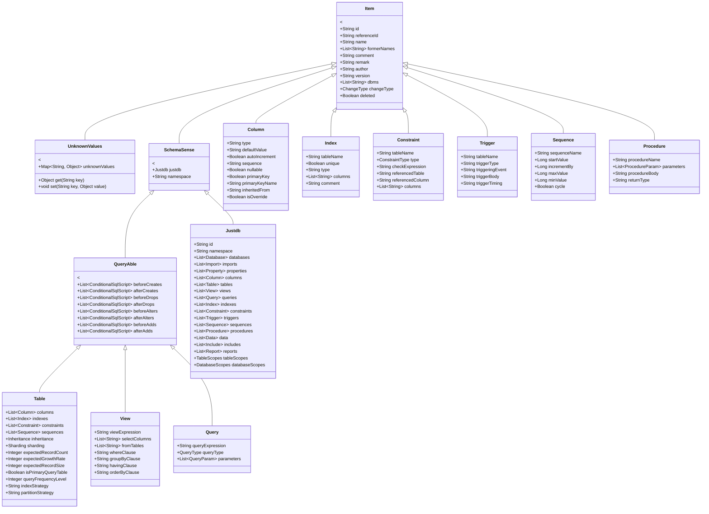

# 类型层次结构

## 概述

JustDB Schema 采用清晰的继承层次结构，所有 Schema 对象都继承自 `Item` 基类，通过组合和继承实现灵活的 Schema 定义。

## 继承层次图



## 核心基类

### Item (基础项)

所有 Schema 对象的基类，提供通用属性。

| 字段 | 类型 | 说明 | 示例 |
|------|------|------|------|
| `id` | String | 唯一标识符 | `"col_users_id"` |
| `referenceId` | String | 引用其他 item 的 id（复用） | `"global_id"` |
| `name` | String | 显示名称 | `"users"` |
| `formerNames` | List\&lt;String\&gt; | 曾用名列表（变更追踪） | `["user"]` |
| `comment` | String | 数据库注释（会写入数据库） | `"User table"` |
| `remark` | String | JustDB 备注（不写入数据库） | `"Internal use"` |
| `author` | String | 作者 | `"wind"` |
| `version` | String | 版本信息 | `"1.0"` |
| `dbms` | List\&lt;String\&gt; | 适用数据库列表 | `["mysql", "postgresql"]` |
| `changeType` | ChangeType | Schema diff 变更类型 | `ADDED`, `REMOVED` |
| `deleted` | Boolean | 是否已删除 | `false` |

### UnknownValues (动态扩展)

通过 `UnknownValues` 基类，所有 Schema 对象都可以支持动态属性，实现数据库特定的扩展。

```java
public class UnknownValues {
    private Map&lt;String, Object&gt; unknownValues = new HashMap&lt;&gt;();

    public Object get(String key) {
        return unknownValues.get(key);
    }

    public void set(String key, Object value) {
        unknownValues.put(key, value);
    }
}
```

**使用示例**：

```xml
&lt;!-- MySQL 表使用 engine 属性（存储在 UnknownValues） --&gt;
&lt;Table name="users" engine="InnoDB" row_format="COMPRESSED"&gt;
    &lt;columns&gt;...&lt;/columns&gt;
&lt;/Table&gt;
```

### SchemaSense (上下文持有者)

持有对根 `Justdb` 对象的引用，提供全局上下文访问。

### QueryAble (可查询对象)

为表、视图、查询等对象提供生命周期钩子支持。

## 主要对象类型

### Table (表)

表结构继承自 `QueryAble`，包含列、索引、约束等子对象。

```
Table extends QueryAble
├── columns: Column[]          - 列定义
├── indexes: Index[]           - 索引定义
├── constraints: Constraint[]   - 约束定义
├── sequences: Sequence[]       - 关联序列
├── inheritance: Inheritance     - 继承配置
├── sharding: Sharding          - 分片配置
├── 生命周期钩子
└── 性能优化属性:
    ├── expectedRecordCount     - 预期记录数
    ├── expectedGrowthRate      - 预期增长率（条/月）
    ├── expectedRecordSize      - 预期记录大小（字节）
    ├── isPrimaryQueryTable     - 是否主查询表
    ├── queryFrequencyLevel     - 查询频率级别 (1-5)
    ├── indexStrategy           - 推荐索引策略
    └── partitionStrategy       - 推荐分片策略
```

### Column (列)

列定义，包含数据类型、约束、默认值等信息。

```
Column extends Item
├── type: String               - 数据类型
├── defaultValue: String       - 默认值（含函数如 CURRENT_TIMESTAMP）
├── autoIncrement: Boolean     - 是否自增
├── sequence: String           - 关联序列名
├── nullable: Boolean          - 是否可空
├── primaryKey: Boolean        - 是否主键
├── primaryKeyName: String     - 主键名称
├── inheritedFrom: String      - 继承来源列
├── isOverride: Boolean        - 是否覆盖父定义
└── 生命周期钩子
```

### Index (索引)

索引定义。

```
Index extends Item
├── tableName: String          - 所属表名
├── unique: Boolean            - 是否唯一索引
├── type: String               - 索引类型 (BTREE, HASH, FULLTEXT, SPATIAL)
├── columns: String[]          - 索引列
└── comment: String            - 索引注释
```

### Constraint (约束)

约束定义。

```
Constraint extends Item
├── tableName: String          - 所属表名
├── type: ConstraintType       - 约束类型
│   ├── PRIMARY_KEY
│   ├── FOREIGN_KEY
│   ├── UNIQUE
│   ├── CHECK
│   └── NOT_NULL
├── checkExpression: String    - CHECK 约束表达式
├── referencedTable: String     - 外键引用表
├── referencedColumn: String    - 外键引用列
└── columns: String[]          - 约束列
```

## 组合模式

对于集合类型（如 `columns`、`indexes`），使用组合而非继承，保持类型系统的简洁性。

```java
public class Table extends QueryAble {
    @XmlElementWrapper(name = "columns")
    @XmlElement(name = "Column")
    private Columns columns = new Columns();
}

public class Columns {
    @XmlElement(name = "Column")
    private List&lt;Column&gt; list = new ArrayList&lt;&gt;();
}
```

这种设计是由于 Jackson/JAXB `@XmlElementWrapper` 在继承体系中的限制。

## 相关文档

- [Schema 系统概述](./overview.md)
- [别名系统](./alias-system.md)
- [Schema 演进](./schema-evolution.md)
- [扩展点系统](./extension-points.md)
