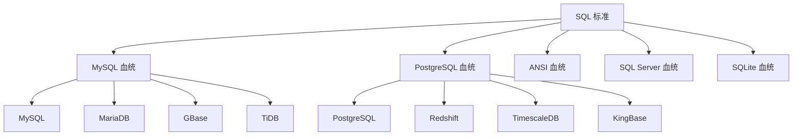

# 血统模板系统

## 概述

血统（Lineage）模板系统是 JustDB 模板系统的核心特性，它将数据库按 SQL 语法相似性分组，定义共享的血统模板，实现模板复用和简化维护。

## 血统分类

### 血统类型

| 血统后缀 | 包含数据库 | 语法特征 |
|---------|-----------|----------|
| `-mysql-lineage` | MySQL, MariaDB, GBase, TiDB | 反引号、AUTO_INCREMENT |
| `-postgres-lineage` | PostgreSQL, Redshift, TimescaleDB, KingBase | 双引号、无内联自增 |
| `-ansi-lineage` | Oracle, DB2, Derby, HSQLDB, Dameng | ANSI SQL 标准 |
| `-sqlserver-lineage` | SQL Server | 方括号、IDENTITY |
| `-sqlite-lineage` | SQLite | 轻量级、AUTOINCREMENT |

### 血统关系图



## 血统模板命名规范

### 命名格式

```
{operation}-{object}-{lineage}-lineage
```

### 示例

| 模板名称 | 血统 | 说明 |
|---------|------|------|
| `create-table-mysql-lineage` | MySQL 血统 | MySQL 系列数据库的 CREATE TABLE 模板 |
| `create-table-postgres-lineage` | PostgreSQL 血统 | PostgreSQL 系列数据库的 CREATE TABLE 模板 |
| `drop-table-ansi-lineage` | ANSI 血统 | ANSI SQL 标准的 DROP TABLE 模板 |

## 血统模板定义

### 在 sql-standard-root 中定义

```xml
&lt;plugin id="sql-standard-root"&gt;
    &lt;templates&gt;
        &lt;!-- MySQL 血统：CREATE TABLE --&gt;
        &lt;template id="create-table-mysql-lineage" type="SQL" category="db"&gt;
            &lt;content&gt;
                CREATE TABLE {{#if @root.idempotent}}IF NOT EXISTS {{/if}}{{> table-name}} (
                    {{> columns}}
                ){{#if this.engine}} ENGINE={{this.engine}}{{/if}};
            &lt;/content&gt;
        &lt;/template&gt;

        &lt;!-- PostgreSQL 血统：CREATE TABLE --&gt;
        &lt;template id="create-table-postgres-lineage" type="SQL" category="db"&gt;
            &lt;content&gt;
                CREATE TABLE{{#if @root.idempotent}} IF NOT EXISTS{{/if}} {{> table-name}} (
                    {{> columns}}
                );
            &lt;/content&gt;
        &lt;/template&gt;

        &lt;!-- ANSI 血统：CREATE TABLE --&gt;
        &lt;template id="create-table-ansi-lineage" type="SQL" category="db"&gt;
            &lt;content&gt;
                CREATE TABLE {{> table-name}} (
                    {{> columns}}
                );
            &lt;/content&gt;
        &lt;/template&gt;
    &lt;/templates&gt;
&lt;/plugin&gt;
```

## 血统模板引用

### 在方言插件中引用

```xml
&lt;!-- MySQL plugin --&gt;
&lt;plugin id="mysql" dialect="mysql" ref-id="sql-standard-root"&gt;
    &lt;templates&gt;
        &lt;!-- 引用 MySQL 血统模板 --&gt;
        &lt;template id="create-table" type="SQL" category="db"&gt;
            &lt;content&gt;{{> create-table-mysql-lineage}}&lt;/content&gt;
        &lt;/template&gt;
    &lt;/templates&gt;
&lt;/plugin&gt;

&lt;!-- PostgreSQL plugin --&gt;
&lt;plugin id="postgresql" dialect="postgresql" ref-id="sql-standard-root"&gt;
    &lt;templates&gt;
        &lt;!-- 引用 PostgreSQL 血统模板 --&gt;
        &lt;template id="create-table" type="SQL" category="db"&gt;
            &lt;content&gt;{{> create-table-postgres-lineage}}&lt;/content&gt;
        &lt;/template&gt;
    &lt;/templates&gt;
&lt;/plugin&gt;
```

### 多数据库共享

```xml
&lt;!-- MariaDB plugin --&gt;
&lt;plugin id="mariadb" dialect="mariadb" ref-id="sql-standard-root"&gt;
    &lt;templates&gt;
        &lt;!-- 也使用 MySQL 血统 --&gt;
        &lt;template id="create-table" type="SQL" category="db"&gt;
            &lt;content&gt;{{> create-table-mysql-lineage}}&lt;/content&gt;
        &lt;/template&gt;
    &lt;/templates&gt;
&lt;/plugin&gt;

&lt;!-- TiDB plugin --&gt;
&lt;plugin id="tidb" dialect="tidb" ref-id="sql-standard-root"&gt;
    &lt;templates&gt;
        &lt;!-- 也使用 MySQL 血统 --&gt;
        &lt;template id="create-table" type="SQL" category="db"&gt;
            &lt;content&gt;{{> create-table-mysql-lineage}}&lt;/content&gt;
        &lt;/template&gt;
    &lt;/templates&gt;
&lt;/plugin&gt;
```

## 血统模板差异

### 标识符引用

| 血统 | 标识符引用 | 示例 |
|------|-----------|------|
| `-mysql-lineage` | 反引号 | `` `table` `` |
| `-postgres-lineage` | 双引号 | `"table"` |
| `-ansi-lineage` | 大写或无引号 | `TABLE` 或 `table` |
| `-sqlserver-lineage` | 方括号 | `[table]` |
| `-sqlite-lineage` | 无引号或双引号 | `table` 或 `"table"` |

### 自增列

| 血统 | 自增语法 | 示例 |
|------|---------|------|
| `-mysql-lineage` | `AUTO_INCREMENT` | `id BIGINT AUTO_INCREMENT` |
| `-postgres-lineage` | 使用 SEQUENCE | `id BIGINT DEFAULT nextval('seq')` |
| `-ansi-lineage` | 无内联自增 | 使用 SEQUENCE 或触发器 |
| `-sqlserver-lineage` | `IDENTITY` | `id BIGINT IDENTITY(1,1)` |
| `-sqlite-lineage` | `AUTOINCREMENT` | `id INTEGER AUTOINCREMENT` |

### 索引创建

```handlebars
&lt;!-- MySQL 血统 --&gt;
CREATE INDEX {{> index-name}} ON {{> table-name}}({{> columns}});

&lt;!-- PostgreSQL 血统 --&gt;
CREATE INDEX{{#if @root.concurrent}} CONCURRENTLY{{/if}} {{> index-name}} ON {{> table-name}}({{> columns}});

&lt;!-- ANSI 血统 --&gt;
CREATE INDEX {{> index-name}} ON {{> table-name}}({{> columns}});
```

## 血统模板扩展

### 添加新血统

```xml
&lt;!-- 1. 定义新血统模板 --&gt;
&lt;template id="create-table-newdb-lineage" type="SQL" category="db"&gt;
    &lt;content&gt;
        -- 新数据库的 CREATE TABLE 语法
        CREATE TABLE {{> table-name}} (
            {{> columns}}
        );
    &lt;/content&gt;
&lt;/template&gt;

&lt;!-- 2. 在新插件中引用 --&gt;
&lt;plugin id="newdb" dialect="newdb" ref-id="sql-standard-root"&gt;
    &lt;templates&gt;
        &lt;template id="create-table" type="SQL" category="db"&gt;
            &lt;content&gt;{{> create-table-newdb-lineage}}&lt;/content&gt;
        &lt;/template&gt;
    &lt;/templates&gt;
&lt;/plugin&gt;
```

### 血统变体

```xml
&lt;!-- MySQL 血统变体 --&gt;
&lt;template id="create-table-mysql-8.0-lineage" type="SQL" category="db"&gt;
    &lt;content&gt;
        CREATE TABLE {{#if @root.idempotent}}IF NOT EXISTS {{/if}}{{> table-name}} (
            {{> columns}}
        ) ENGINE=InnoDB;
    &lt;/content&gt;
&lt;/template&gt;

&lt;!-- MySQL 8.0 plugin --&gt;
&lt;plugin id="mysql-8.0" dialect="mysql" ref-id="sql-standard-root"&gt;
    &lt;templates&gt;
        &lt;template id="create-table" type="SQL" category="db"&gt;
            &lt;content&gt;{{> create-table-mysql-8.0-lineage}}&lt;/content&gt;
        &lt;/template&gt;
    &lt;/templates&gt;
&lt;/plugin&gt;
```

## 血统映射

### 自动检测

```java
public class LineageDetector {
    private static final Map&lt;String, String&gt; DIALECT_TO_LINEAGE = Map.of(
        "mysql", "mysql-lineage",
        "mariadb", "mysql-lineage",
        "tidb", "mysql-lineage",
        "gbase", "mysql-lineage",
        "postgresql", "postgres-lineage",
        "redshift", "postgres-lineage",
        "timescaledb", "postgres-lineage",
        "kingbase", "postgres-lineage",
        "oracle", "ansi-lineage",
        "db2", "ansi-lineage",
        "derby", "ansi-lineage",
        "hsqldb", "ansi-lineage",
        "dameng", "ansi-lineage",
        "sqlserver", "sqlserver-lineage",
        "sqlite", "sqlite-lineage"
    );

    public static String getLineage(String dialect) {
        return DIALECT_TO_LINEAGE.getOrDefault(dialect, "ansi-lineage");
    }
}
```

## 最佳实践

### 1. 优先使用血统模板

```xml
&lt;!-- 好的做法：定义血统模板 --&gt;
&lt;template id="create-table-mysql-lineage"&gt;...&lt;/template&gt;
&lt;template id="create-table-postgres-lineage"&gt;...&lt;/template&gt;

&lt;!-- 在插件中引用 --&gt;
&lt;template id="create-table"&gt;{{> create-table-mysql-lineage}}&lt;/template&gt;
```

### 2. 保持血统独立性

```xml
&lt;!-- 好的做法：每个血统独立定义 --&gt;
&lt;template id="drop-table-mysql-lineage"&gt;DROP TABLE `table`;&lt;/template&gt;
&lt;template id="drop-table-postgres-lineage"&gt;DROP TABLE "table";&lt;/template&gt;

&lt;!-- 避免：在一个模板中处理多种方言 --&gt;
&lt;template id="drop-table"&gt;
    {{#if (eq @root.dbType 'mysql')}}DROP TABLE `table`;{{/if}}
    {{#if (eq @root.dbType 'postgresql')}}DROP TABLE "table";{{/if}}
&lt;/template&gt;
```

### 3. 合理分类

```xml
&lt;!-- 好的做法：按 SQL 语法相似性分类 --&gt;
-mysql-lineage: MySQL, MariaDB, TiDB
-postgres-lineage: PostgreSQL, Redshift, TimescaleDB

&lt;!-- 避免：按品牌分类 --&gt;
```

### 4. 文档说明

```xml
&lt;!-- 好的做法：添加注释说明血统特征 --&gt;
<!--
  MySQL 血统特征：
  - 标识符使用反引号
  - 支持 AUTO_INCREMENT
  - 支持 ENGINE 子句
  - 支持 IF NOT EXISTS
-->
&lt;template id="create-table-mysql-lineage"&gt;...&lt;/template&gt;
```

## 相关文档

- [模板系统概述](./overview.md)
- [模板继承机制](./template-inheritance.md)
- [安全删除模板](./safe-drop-templates.md)
