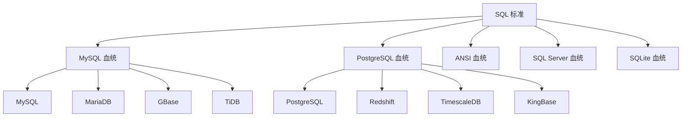

# 血统模板系统

## 概述

血统（Lineage）模板系统是 JustDB 模板系统的核心特性，它将数据库按 SQL 语法相似性分组，定义共享的血统模板，实现模板复用和简化维护。

## 血统分类

### 血统类型

| 血统后缀 | 包含数据库 | 语法特征 |
|---------|-----------|----------|
| `-mysql-lineage` | MySQL, MariaDB, GBase, TiDB | 反引号、AUTO_INCREMENT |
| `-postgres-lineage` | PostgreSQL, Redshift, TimescaleDB, KingBase | 双引号、无内联自增 |
| `-ansi-lineage` | Oracle, DB2, Derby, HSQLDB, Dameng | ANSI SQL 标准 |
| `-sqlserver-lineage` | SQL Server | 方括号、IDENTITY |
| `-sqlite-lineage` | SQLite | 轻量级、AUTOINCREMENT |

### 血统关系图



## 血统模板命名规范

### 命名格式

```
{operation}-{object}-{lineage}-lineage
```

### 动词在前原则（Verb-First）

模板名称遵循 SQL 语句的自然顺序，操作动词在前，对象在后：

| 类型 | 命名格式 | 示例 | 说明 |
|------|---------|------|------|
| 主入口模板 | `{operation}-{object}` | `drop-table`, `drop-column` | 操作+对象 |
| 原始操作模板 | `{operation}-{object}-raw` | `drop-table-raw`, `drop-column-raw` | 原始直接操作 |
| 血统模板 | `{operation}-{object}-{lineage}-lineage` | `drop-table-mysql-lineage` | 血统特定实现 |
| Plugin 特定模板 | `{operation}-{object}-{plugin}` | `drop-table-mysql`, `drop-column-mysql` | Plugin 路由 |
| 辅助模板 | `{operation}-{object}` | `rename-table`, `copy-table` | 辅助操作 |
| 子句模板 | `{operation}-{object}-clause` | `drop-column-clause`, `rename-column-clause` | SQL 子句 |

### 操作动词（operation）

| 动词 | 说明 | 示例模板 |
|------|------|---------|
| `drop` | 删除对象 | `drop-table`, `drop-column`, `drop-index` |
| `create` | 创建对象 | `create-table`, `create-index`, `create-sequence` |
| `alter` | 修改对象 | `alter-table`, `alter-column` |
| `rename` | 重命名对象 | `rename-table`, `rename-column` |
| `add` | 添加（ALTER 的子操作） | `add-column`, `add-constraint` |
| `modify` | 修改（ALTER 的子操作） | `modify-column`, `modify-table` |
| `copy` | 复制对象 | `copy-table` |

### 示例

| 模板名称 | 血统 | 说明 |
|---------|------|------|
| `create-table-mysql-lineage` | MySQL 血统 | MySQL 系列数据库的 CREATE TABLE 模板 |
| `create-table-postgres-lineage` | PostgreSQL 血统 | PostgreSQL 系列数据库的 CREATE TABLE 模板 |
| `drop-table-ansi-lineage` | ANSI 血统 | ANSI SQL 标准的 DROP TABLE 模板 |
| `drop-table-raw-mysql-lineage` | MySQL 血统 | MySQL DROP TABLE 原始实现 |
| `rename-table-mysql-lineage` | MySQL 血统 | MySQL RENAME TABLE 实现 |

## 模板查找优先级

`mergeTemplates()` 方法按以下优先级查找模板（从高到低）：

```
1. (name + category + type + dialect)     - 最精确匹配
2. (name + category + type)               - 类型级模板
3. (name + category, type='')             - 分类通用模板
4. (name, type='' + category='')          - 全局通用模板
```

**匹配规则**：

- 指定 `dialect` 时，方言特定模板优先于通用模板
- 未指定 `dialect` 时，通用模板优先于方言模板
- 后加载的同名模板会覆盖先加载的

### 查找示例

```xml
<!-- 场景：MySQL 插件中查找 create-table 模板 -->

<!-- 优先级 1: name + category + type + dialect -->
<template id="create-table" name="create-table" type="SQL" category="db" dialect="mysql">

<!-- 优先级 2: name + category + type -->
<template id="create-table" name="create-table" type="SQL" category="db">

<!-- 优先级 3: name + category (通用) -->
<template id="create-table" name="create-table" category="db">

<!-- 优先级 4: name only (全局) -->
<template id="create-table" name="create-table">
```

## 血统模板定义

### 在 sql-standard-root 中定义

```xml
<plugin id="sql-standard-root">
    <templates>
        <!-- MySQL 血统：CREATE TABLE -->
        <template id="create-table-mysql-lineage" type="SQL" category="db">
            <content>
                CREATE TABLE {{#if @root.idempotent}}IF NOT EXISTS {{/if}}{{> table-name-spec}} (
                    {{> columns}}
                ){{#if this.engine}} ENGINE={{this.engine}}{{/if}};
            </content>
        </template>

        <!-- PostgreSQL 血统：CREATE TABLE -->
        <template id="create-table-postgres-lineage" type="SQL" category="db">
            <content>
                CREATE TABLE{{#if @root.idempotent}} IF NOT EXISTS{{/if}} {{> table-name-spec}} (
                    {{> columns}}
                );
            </content>
        </template>

        <!-- ANSI 血统：CREATE TABLE -->
        <template id="create-table-ansi-lineage" type="SQL" category="db">
            <content>
                CREATE TABLE {{> table-name-spec}} (
                    {{> columns}}
                );
            </content>
        </template>
    </templates>
</plugin>
```

## 血统模板引用

### 在方言插件中引用

```xml
<!-- MySQL plugin -->
<plugin id="mysql" dialect="mysql" ref-id="sql-standard-root">
    <templates>
        <!-- 引用 MySQL 血统模板 -->
        <template id="create-table" type="SQL" category="db">
            <content>{{> create-table-mysql-lineage}}</content>
        </template>
    </templates>
</plugin>

<!-- PostgreSQL plugin -->
<plugin id="postgresql" dialect="postgresql" ref-id="sql-standard-root">
    <templates>
        <!-- 引用 PostgreSQL 血统模板 -->
        <template id="create-table" type="SQL" category="db">
            <content>{{> create-table-postgres-lineage}}</content>
        </template>
    </templates>
</plugin>
```

### 多数据库共享

```xml
<!-- MariaDB plugin -->
<plugin id="mariadb" dialect="mariadb" ref-id="sql-standard-root">
    <templates>
        <!-- 也使用 MySQL 血统 -->
        <template id="create-table" type="SQL" category="db">
            <content>{{> create-table-mysql-lineage}}</content>
        </template>
    </templates>
</plugin>

<!-- TiDB plugin -->
<plugin id="tidb" dialect="tidb" ref-id="sql-standard-root">
    <templates>
        <!-- 也使用 MySQL 血统 -->
        <template id="create-table" type="SQL" category="db">
            <content>{{> create-table-mysql-lineage}}</content>
        </template>
    </templates>
</plugin>
```

## 血统模板差异

### 标识符引用

| 血统 | 标识符引用 | 示例 |
|------|-----------|------|
| `-mysql-lineage` | 反引号 | `` `table` `` |
| `-postgres-lineage` | 双引号 | `"table"` |
| `-ansi-lineage` | 大写或无引号 | `TABLE` 或 `table` |
| `-sqlserver-lineage` | 方括号 | `[table]` |
| `-sqlite-lineage` | 无引号或双引号 | `table` 或 `"table"` |

### 自增列

| 血统 | 自增语法 | 示例 |
|------|---------|------|
| `-mysql-lineage` | `AUTO_INCREMENT` | `id BIGINT AUTO_INCREMENT` |
| `-postgres-lineage` | 使用 SEQUENCE | `id BIGINT DEFAULT nextval('seq')` |
| `-ansi-lineage` | 无内联自增 | 使用 SEQUENCE 或触发器 |
| `-sqlserver-lineage` | `IDENTITY` | `id BIGINT IDENTITY(1,1)` |
| `-sqlite-lineage` | `AUTOINCREMENT` | `id INTEGER AUTOINCREMENT` |

### 索引创建

```handlebars
<!-- MySQL 血统 -->
CREATE INDEX {{> index-name}} ON {{> table-name-spec}}({{> columns}});

<!-- PostgreSQL 血统 -->
CREATE INDEX{{#if @root.concurrent}} CONCURRENTLY{{/if}} {{> index-name}} ON {{> table-name-spec}}({{> columns}});

<!-- ANSI 血统 -->
CREATE INDEX {{> index-name}} ON {{> table-name-spec}}({{> columns}});
```

## 血统模板扩展

### 添加新血统

```xml
<!-- 1. 定义新血统模板 -->
<template id="create-table-newdb-lineage" type="SQL" category="db">
    <content>
        -- 新数据库的 CREATE TABLE 语法
        CREATE TABLE {{> table-name-spec}} (
            {{> columns}}
        );
    </content>
</template>

<!-- 2. 在新插件中引用 -->
<plugin id="newdb" dialect="newdb" ref-id="sql-standard-root">
    <templates>
        <template id="create-table" type="SQL" category="db">
            <content>{{> create-table-newdb-lineage}}</content>
        </template>
    </templates>
</plugin>
```

### 血统变体

```xml
<!-- MySQL 血统变体 -->
<template id="create-table-mysql-8.0-lineage" type="SQL" category="db">
    <content>
        CREATE TABLE {{#if @root.idempotent}}IF NOT EXISTS {{/if}}{{> table-name-spec}} (
            {{> columns}}
        ) ENGINE=InnoDB;
    </content>
</template>

<!-- MySQL 8.0 plugin -->
<plugin id="mysql-8.0" dialect="mysql" ref-id="sql-standard-root">
    <templates>
        <template id="create-table" type="SQL" category="db">
            <content>{{> create-table-mysql-8.0-lineage}}</content>
        </template>
    </templates>
</plugin>
```

## 血统映射

### 自动检测

```java
public class LineageDetector {
    private static final Map&lt;String, String&gt; DIALECT_TO_LINEAGE = Map.of(
        "mysql", "mysql-lineage",
        "mariadb", "mysql-lineage",
        "tidb", "mysql-lineage",
        "gbase", "mysql-lineage",
        "postgresql", "postgres-lineage",
        "redshift", "postgres-lineage",
        "timescaledb", "postgres-lineage",
        "kingbase", "postgres-lineage",
        "oracle", "ansi-lineage",
        "db2", "ansi-lineage",
        "derby", "ansi-lineage",
        "hsqldb", "ansi-lineage",
        "dameng", "ansi-lineage",
        "sqlserver", "sqlserver-lineage",
        "sqlite", "sqlite-lineage"
    );

    public static String getLineage(String dialect) {
        return DIALECT_TO_LINEAGE.getOrDefault(dialect, "ansi-lineage");
    }
}
```

## 最佳实践

### 1. 优先使用血统模板

```xml
<!-- 好的做法：定义血统模板 -->
<template id="create-table-mysql-lineage">...</template>
<template id="create-table-postgres-lineage">...</template>

<!-- 在插件中引用 -->
<template id="create-table">{{> create-table-mysql-lineage}}</template>
```

### 2. 保持血统独立性

```xml
<!-- 好的做法：每个血统独立定义 -->
<template id="drop-table-mysql-lineage">DROP TABLE `table`;</template>
<template id="drop-table-postgres-lineage">DROP TABLE "table";</template>

<!-- 避免：在一个模板中处理多种方言 -->
<template id="drop-table">
    {{#if (eq @root.dbType 'mysql')}}DROP TABLE `table`;{{/if}}
    {{#if (eq @root.dbType 'postgresql')}}DROP TABLE "table";{{/if}}
</template>
```

### 3. 合理分类

```xml
<!-- 好的做法：按 SQL 语法相似性分类 -->
-mysql-lineage: MySQL, MariaDB, TiDB
-postgres-lineage: PostgreSQL, Redshift, TimescaleDB

<!-- 避免：按品牌分类 -->
```

### 4. 文档说明

```xml
<!-- 好的做法：添加注释说明血统特征 -->
<!--
  MySQL 血统特征：
  - 标识符使用反引号
  - 支持 AUTO_INCREMENT
  - 支持 ENGINE 子句
  - 支持 IF NOT EXISTS
-->
<template id="create-table-mysql-lineage">...</template>
```

## 相关文档

- [模板系统概述](./overview.md)
- [模板继承机制](./template-inheritance.md)
- [安全删除模板](./safe-drop-templates.md)
