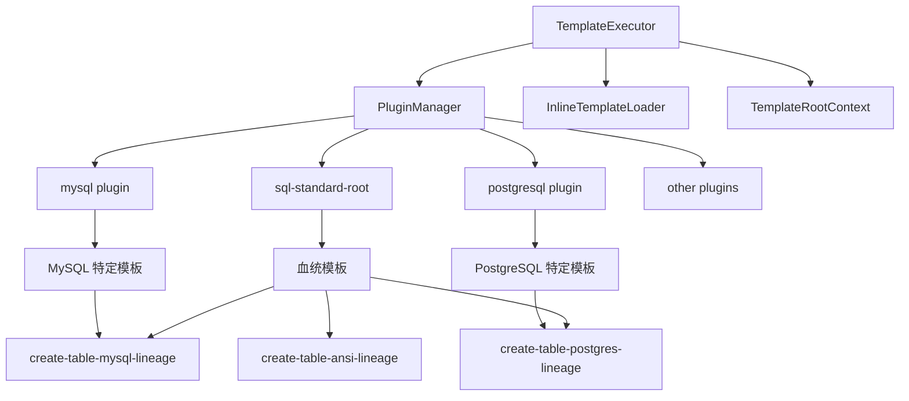

# 模板系统概述

## 文档概述

JustDB Template 系统是一个基于 Handlebars 的多层级模板继承和覆盖机制，支持基于名字的模板引用、特定 plugin 下的模板覆盖，以及最精准匹配优先的查找策略。

**版本**: 1.0
**最后更新**: 2026-02-09
**维护者**: Wind Li

## 核心特性

- **基于 Handlebars**: 使用成熟的 Handlebars 模板引擎
- **多层级继承**: 支持模板继承和覆盖
- **血统模板**: 数据库方言族共享模板
- **动态引用**: 通过名字引用其他模板
- **优先级查找**: 最精准匹配优先

## 系统架构



## 核心组件

### TemplateExecutor

模板执行器，负责模板的加载、编译和执行。

| 方法 | 说明 |
|------|------|
| `execute(String name, TemplateRootContext context)` | 执行指定模板 |
| `mergeTemplates(String name, String category, String type, String dialect)` | 合并模板（按优先级） |

### InlineTemplateLoader

内联模板加载器，支持在代码中直接定义模板。

### PluginManager

插件管理器，管理所有插件及其模板定义。

### TemplateRootContext

模板根上下文，提供全局变量和配置。

## 模板结构

### default-plugins.xml 结构

```
default-plugins.xml
├── <plugin id="sql-standard-root">
│   └── <templates>
│       ├── 通用基础模板（如 name-spec, table-name）
│       └── 血统共享模板（如 create-table-mysql-lineage）
│
├── <plugin id="mysql" dialect="mysql" ref-id="sql-standard-root">
│   └── <templates>
│       └── 引用血统模板（如 create-table = {{> create-table-mysql-lineage}}）
│
├── <plugin id="postgresql" dialect="postgresql" ref-id="sql-standard-root">
│   └── <templates>
│       └── 引用血统模板
│
└── ...
```

### GenericTemplate 结构

每个模板（`GenericTemplate`）包含以下属性：

| 属性 | 说明 | 示例 |
|------|------|------|
| `id` | 模板唯一标识符 | `drop-table` |
| `name` | 模板名称（入口标识） | `drop-table` |
| `type` | 模板类型（可选） | `MYBATIS_BEAN`, `JPA_ENTITY` |
| `category` | 模板分类 | `db`, `java` |
| `description` | 模板描述 | `DROP TABLE statement` |
| `content` | 模板内容（Handlebars） | `DROP TABLE {{> table-name}}` |
| `pluginId` | 所属插件 ID | `mysql`, `postgresql` |
| `ref-id` | 父插件引用 | `sql-standard-root` |
| `dialect` | 数据库方言 | `mysql`, `postgresql` |

## 模板查找优先级

`mergeTemplates()` 方法按以下优先级查找模板（从高到低）：

```
1. (name + category + type + dialect)     - 最精确匹配
2. (name + category + type)               - 类型级模板
3. (name + category, type='')             - 分类通用模板
4. (name, type='' + category='')          - 全局通用模板
```

### 匹配规则

- 指定 `dialect` 时，方言特定模板优先于通用模板
- 未指定 `dialect` 时，通用模板优先于方言模板
- 后加载的同名模板会覆盖先加载的

### 查找示例

```java
// 查找 create-table 模板（MySQL 方言）
// 优先级：
// 1. create-table + db + SQL + mysql
// 2. create-table + db + SQL
// 3. create-table + db
// 4. create-table

String sql = templateExecutor.execute(
    "create-table",
    TemplateRootContext.builder()
        .dbType("mysql")
        .put("table", table)
        .build()
);
```

## 模板引用机制

模板可以通过 `{{> template-name}}` 语法引用其他模板。

### 引用语法

```handlebars
<!-- 引用基础模板 -->
<template id="drop-table" name="drop-table" type="SQL" category="db">
  <content>DROP TABLE {{> table-name}}</content>
</template>

<!-- 引用带父上下文的模板 -->
<template id="drop-column" name="drop-column" type="SQL" category="db">
  <content>ALTER TABLE {{> table-name ..}} {{> drop-column-clause}};</content>
</template>
```

- `{{> table-name}}` - 使用当前上下文
- `{{> table-name ..}}` - 使用父上下文（`..` 表示向上一级）

### 上下文传递

```handlebars
{{!-- 当前上下文：table --}}
{{> table-name}}        {{!-- 使用 table 上下文 --}}

{{!-- 传递指定对象 --}}
{{> table-name @root.newtable}}

{{!-- 使用父上下文 --}}
{{> table-name ..}}
```

## TemplateRootContext

### 标准上下文变量

| 变量 | 类型 | 说明 |
|------|------|------|
| `@root.justdbManager` | JustdbManager | JustDB 管理器实例 |
| `@root.dbType` | String | 数据库类型（如 `mysql`, `postgresql`） |
| `@root.idempotent` | Boolean | 是否幂等模式 |
| `@root.idempotentType` | String | 幂等类型（`ignore`, `replace`, `merge`） |
| `@root.safeDrop` | Boolean | 是否启用安全删除 |
| `@root.newtable` | Table | 新表对象（用于安全删除） |

### 扩展变量

可以通过 `put()` 方法添加自定义变量：

```java
TemplateRootContext context = TemplateRootContext.builder()
    .dbType("mysql")
    .idempotent(true)
    .put("customVar", customValue)
    .build();
```

## 血统模板系统

### 血统（Lineage）概念

血统模板定义共享 SQL 语法的一组数据库：

| 血统后缀 | 包含数据库 | 说明 |
|---------|-----------|------|
| `-mysql-lineage` | MySQL, MariaDB, GBase, TiDB | 使用反引号、AUTO_INCREMENT |
| `-postgres-lineage` | PostgreSQL, Redshift, TimescaleDB, KingBase | 使用双引号、无内联自增 |
| `-ansi-lineage` | Oracle, DB2, Derby, HSQLDB, Dameng | ANSI SQL 标准 |
| `-sqlserver-lineage` | SQL Server | 使用方括号、IDENTITY |
| `-sqlite-lineage` | SQLite | 轻量级、AUTOINCREMENT |

### 血统模板定义

```xml
<!-- sql-standard-root 中定义 -->
<template id="create-table-mysql-lineage" name="create-table-mysql-lineage" type="SQL" category="db">
  <content>CREATE TABLE {{#if @root.idempotent}}IF NOT EXISTS {{/if}}{{> table-name}} ({{> columns}});</content>
</template>

<!-- mysql plugin 中引用 -->
<template id="create-table" name="create-table" type="SQL" category="db">
  <content>{{> create-table-mysql-lineage}}</content>
</template>
```

## 模板覆盖规则

Plugin 可以在任意层级覆盖模板：

```xml
<!-- sql-standard-root 定义基础模板 -->
<template id="modify-column" name="modify-column" type="SQL" category="db">
  <content>ALTER TABLE {{> table-name ..}} ALTER COLUMN ...;</content>
</template>

<!-- mysql plugin 覆盖 -->
<template id="modify-column" name="modify-column" type="SQL" category="db">
  <content>ALTER TABLE {{> table-name ..}} MODIFY COLUMN ...;</content>
</template>
```

## 命名规范

### 动词在前（Verb-First）

模板名称遵循 SQL 语句的自然顺序，操作动词在前，对象在后。

| 类型 | 命名格式 | 示例 |
|------|---------|------|
| 主入口模板 | `{operation}-{object}` | `drop-table`, `drop-column` |
| 原始操作模板 | `{operation}-{object}-raw` | `drop-table-raw` |
| 血统模板 | `{operation}-{object}-{lineage}-lineage` | `drop-table-mysql-lineage` |
| Plugin 特定模板 | `{operation}-{object}-{plugin}` | `drop-table-mysql` |

### 操作动词

| 动词 | 说明 | 示例模板 |
|------|------|---------|
| `drop` | 删除对象 | `drop-table`, `drop-column` |
| `create` | 创建对象 | `create-table`, `create-index` |
| `alter` | 修改对象 | `alter-table`, `alter-column` |
| `rename` | 重命名对象 | `rename-table`, `rename-column` |
| `add` | 添加 | `add-column`, `add-constraint` |
| `modify` | 修改 | `modify-column` |

## 相关文档

- [Handlebars 模板语法](./handlebars-templates.md)
- [模板继承机制](./template-inheritance.md)
- [血统模板系统](./lineage-templates.md)
- [安全删除模板](./safe-drop-templates.md)
