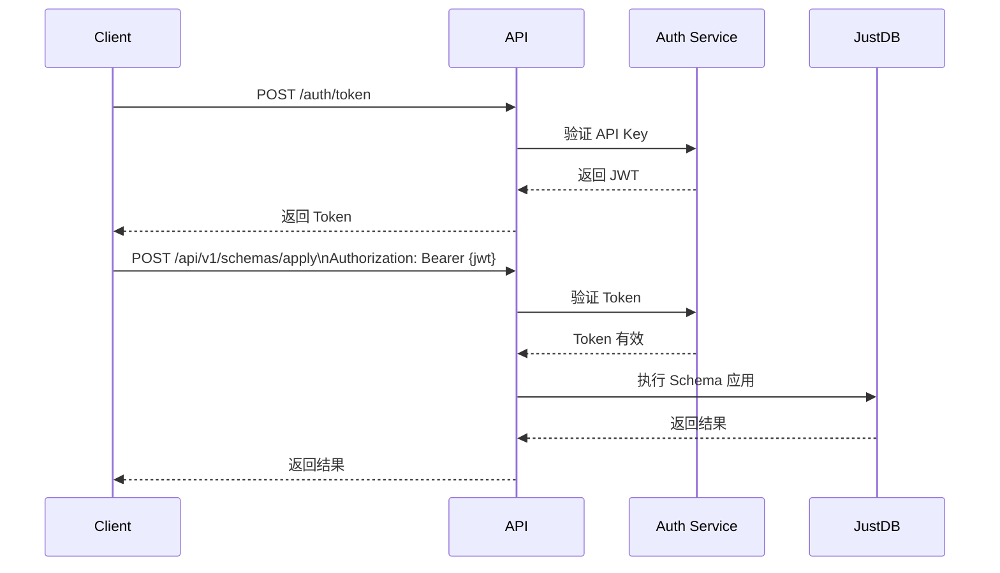

# JustDB Cloud API 设计

本文档详细说明 JustDB Cloud Service 的 REST API 设计。

## 概述

### API 设计原则

- **RESTful**：遵循 REST 架构风格
- **版本化**：API 版本通过 URL 路径管理（如 `/api/v1/`）
- **无状态**：每个请求包含所有必要信息
- **幂等性**：相同请求多次执行结果一致
- **安全性**：JWT 认证 + API Key

### 技术栈

| 组件 | 技术 | 说明 |
|:---|:---|:---|
| **语言** | Java 21 | LTS 版本 |
| **框架** | Spring Boot 3.2 | Web 框架 |
| | | Spring MVC | REST API |
| | | Spring Security | 认证授权 |
| | | Spring HATEOAS | HATEOOS 支持 |
| **文档** | SpringDoc/OpenAPI | API 文档 |
| **测试** | JUnit 5 + Testcontainers | 单元/集成测试 |
| **部署** | Docker + Kubernetes | 容器化部署 |

---

## API 端点

### 1. Schema 管理

#### 1.1 应用 Schema

```http
POST /api/v1/schemas/apply HTTP/1.1
Host: api.justdb.io
Content-Type: application/json
Authorization: Bearer {jwt_token}

{
  "schema_url": "s3://my-bucket/schemas/schema.yaml",
  "schema_content": null,
  "database_url": "jdbc:mysql://db.example.com:3306/mydb",
  "dialect": "mysql",
  "idempotent": true,
  "dry_run": false
}
```

**请求参数**：

| 参数 | 类型 | 必填 | 说明 |
|:---|:---::---|:---|
| `schema_url` | string | 条件必填 | Schema 文件 URL，支持 s3://、https://git://、file:// |
| `schema_content` | string/object | 条件必填 | Schema 内容（与 schema_url 二选一） |
| `database_url` | string | 是 | JDBC 连接字符串 |
| `dialect` | string | 是 | 数据库类型 |
| `idempotent` | boolean | 否 | 是否幂等模式（IF NOT EXISTS），默认 true |
| `dry_run` | boolean | 否 | 是否只生成不执行，默认 false |

**响应**：

```http
HTTP/1.1 200 OK
Content-Type: application/json

{
  "success": true,
  "schema_version": "v1.2.3",
  "changes": [
    {
      "type": "add_table",
      "table": "users",
      "columns": ["id", "username", "email"]
    },
    {
      "type": "add_column",
      "table": "users",
      "column": "avatar"
    }
  ],
  "sql": [
    "CREATE TABLE IF NOT EXISTS users (id BIGINT PRIMARY KEY, username VARCHAR(50) NOT NULL, email VARCHAR(100));",
    "ALTER TABLE users ADD COLUMN avatar VARCHAR(500);"
  ],
  "warnings": []
}
```

**错误响应**：

```http
HTTP/1.1 400 Bad Request
Content-Type: application/json

{
  "error": {
    "code": "INVALID_SCHEMA",
    "message": "Schema validation failed",
    "details": "Table 'users' is missing primary key",
    "suggestion": "Add a primary key to the 'users' table"
  }
}
```

#### 1.2 计算 Diff

```http
POST /api/v1/schemas/diff HTTP/1.1
Host: api.justdb.io
Authorization: Bearer {jwt_token}

{
  "target_schema": {
    "url": "s3://my-bucket/schemas/schema.yaml",
    "content": null
  },
  "database_url": "jdbc:mysql://db.example.com:3306/mydb",
  "dialect": "mysql",
  "current_schema": {
    "read_from_database": true
  }
}
```

**响应**：

```json
{
  "added": [
    {
      "type": "table",
      "name": "posts",
      "properties": {
        "columns": ["id", "title", "user_id"]
      }
    }
  ],
  "removed": [
    {
      "type": "column",
      "table": "users",
      "name": "old_column"
    }
  ],
  "modified": [
    {
      "type": "column",
      "table": "users",
      "name": "username",
      "old_type": "VARCHAR(30)",
      "new_type": "VARCHAR(50)"
    }
  ],
  "summary": {
    "total_changes": 3,
    "create_tables": 1,
    "drop_tables": 0,
    "add_columns": 1,
    "drop_columns": 1,
    "modify_columns": 1
  }
}
```

#### 1.3 验证 Schema

```http
POST /api/v1/schemas/validate HTTP/1.1
Host: api.justdb.io
Authorization: Bearer {jwt_token}

{
  "schema": {
    "url": "s3://my-bucket/schemas/schema.yaml",
    "content": null
  },
  "dialect": "mysql"
}
```

---

### 2. Schema 读取

#### 2.1 从数据库读取

```http
GET /api/v1/schemas/from-database HTTP/1.1
Host: api.justdb.io
Authorization: Bearer {jwt_token}

?database_url=jdbc:mysql://db.example.com:3306/mydb
&dialect=mysql
```

**响应**：

```json
{
  "schema": {
    "tables": [
      {
        "name": "users",
        "columns": [
          {"name": "id", "type": "BIGINT", "primaryKey": true},
          {"name": "username", "type": "VARCHAR(50)", "nullable": false}
        ]
      }
    ],
    "views": [],
    "indexes": []
  }
}
```

---

## 数据模型

### Request 模型

```java
// 统一请求包装
@Data
public class ApiRequest<T> {
    private T data;
    private Map<String, String> metadata;
}

// Schema 应用请求
@Data
public class ApplySchemaRequest {
    private SchemaSource schema;
    private String databaseUrl;
    private String dialect;
    private boolean idempotent = true;
    private boolean dryRun = false;
}

@Data
public class SchemaSource {
    private String url;        // s3://, https://, file://
    private String content;     // 直接内容
}
```

### Response 模型

```java
// 统一响应包装
@Data
@AllArgsConstructor
public class ApiResponse<T> {
    private boolean success;
    private T data;
    private Error error;
}

@Data
@AllArgsConstructor
public class Error {
    private String code;
    private String message;
    private String details;
    private String suggestion;
}

// ApplyResult
@Data
public class ApplyResult {
    private boolean success;
    private String schemaVersion;
    private List<SchemaChange> changes;
    private List<String> sql;
    private List<Warning> warnings;
}

@Data
public class SchemaChange {
    private ChangeType type;      // ADD_TABLE, DROP_TABLE, ADD_COLUMN, etc.
    private String table;
    private String column;
    private String fromType;
    private String toType;
    private Map<String, Object> properties;
}

public enum ChangeType {
    ADD_TABLE, DROP_TABLE, MODIFY_TABLE,
    ADD_COLUMN, DROP_COLUMN, MODIFY_COLUMN, RENAME_COLUMN,
    ADD_INDEX, DROP_INDEX,
    ADD_CONSTRAINT, DROP_CONSTRAINT,
    ADD_VIEW, DROP_VIEW
}
```

---

## 架构选择

### 两种执行模式

#### 模式 A：云端生成 SQL，Provider 执行（推荐）

```
POST /api/v1/schemas/generate-sql
→ 返回 SQL 列表
→ Provider 使用本地 JDBC 执行
```

**优势**：
- ✅ 凭证在 Provider 端管理，更安全
- ✅ 云端无状态，只负责 Schema 解析
- ✅ 复用 Terraform database provider 连接配置

#### 模式 B：云端执行（企业级）

```
POST /api/v1/schemas/apply
→ 云端连接数据库并执行 SQL
```

**优势**：
- ✅ Provider 无需 JDBC 驱动
- ✅ 统一审计和权限管理
- ✅ 支持预注册数据库

**劣势**：
- ❌ 需要解决数据库凭证传递问题

### SQL 生成端点

```http
POST /api/v1/schemas/generate-sql HTTP/1.1
Host: api.justdb.io
Content-Type: application/json
Authorization: Bearer {jwt_token}

{
  "schema_url": "s3://my-bucket/schemas/schema.yaml",
  "dialect": "mysql",
  "idempotent": true
}
```

**响应**：

```http
HTTP/1.1 200 OK
Content-Type: application/json

{
  "sql": [
    "CREATE TABLE IF NOT EXISTS users (id BIGINT PRIMARY KEY, username VARCHAR(50) NOT NULL);",
    "ALTER TABLE users ADD COLUMN avatar VARCHAR(500);"
  ],
  "changes": [
    {
      "type": "add_table",
      "table": "users",
      "columns": ["id", "username", "email"]
    },
    {
      "type": "add_column",
      "table": "users",
      "column": "avatar"
    }
  ],
  "checksum": "sha256:abc123...",
  "schema_version": "v1.2.3"
}
```

---

## 安全设计

### 1. 认证流程



### 2. JWT Token 结构

```json
{
  "sub": "user_123",
  "name": "John Doe",
  "email": "john@example.com",
  "org": "acme",
  "permissions": ["schema:apply", "schema:diff"],
  "allowed_databases": ["jdbc:mysql://prod-db/*"],
  "iat": 1234567890,
  "exp": 1234567890
}
```

### 3. API Key 权限模型

```java
@Entity
@Table(name = "api_keys")
public class ApiKey {
    @Id
    @GeneratedValue(strategy = GenerationType.IDENTITY)
    private Long id;

    @Column(unique = true, length = 64)
    private String key;

    @Column(length = 100)
    private String name;

    @ManyToMany
    @JoinTable(
        name = "api_key_permissions",
        joinColumns = @JoinColumn(name = "api_key_id"),
        inverseJoinColumns = @JoinColumn(name = "permission_id")
    )
    private Set<Permission> permissions;

    @ElementCollection
    @Column(name = "allowed_databases")
    private Set<String> allowedDatabases;

    @Column(name = "expires_at")
    private LocalDateTime expiresAt;

    @Column(name = "created_at")
    private LocalDateTime createdAt;

    @Column(name = "revoked_at")
    private LocalDateTime revokedAt;
}

enum Permission {
    SCHEMA_APPLY,
    SCHEMA_DIFF,
    SCHEMA_VALIDATE,
    SCHEMA_READ
}
```

---

## Source 读取

### 支持的 Source 类型

#### S3

```java
@Service
public class S3SchemaReader {
    @Autowired
    private AmazonS3 s3Client;

    public String readSchema(String s3Url) {
        // 解析 s3://bucket/path/to/schema.yaml
        Pattern pattern = Pattern.compile("s3://([^/]+)/(.+)");

        Matcher matcher = pattern.matcher(s3Url);
        if (matcher.matches()) {
            String bucket = matcher.group(1);
            String key = matcher.group(2);

            S3Object obj = s3Client.getObject(bucket, key);
            return IOUtils.toString(obj.getObjectContent());
        }

        throw new IllegalArgumentException("Invalid S3 URL: " + s3Url);
    }
}
```

#### Git

```java
@Service
public class GitSchemaReader {
    public String readSchema(String gitUrl) {
        // 解析 https://github.com/user/repo/blob/main/schema.yaml
        // 使用 GitHub API 或 git clone
    }
}
```

#### HTTP

```java
@Service
public class HttpSchemaReader {
    public String readSchema(String httpUrl) {
        RestTemplate restTemplate = new RestTemplate();
        return restTemplate.getForObject(httpUrl, String.class);
    }
}
```

#### 本地文件

```java
@Service
public class LocalSchemaReader {
    public String readSchema(String filePath) {
        // file:///path/to/schema.yaml
        try {
            return new String(Files.readAll(Paths.get(filePath)));
        } catch (IOException e) {
            throw new RuntimeException("Failed to read file: " + filePath, e);
        }
    }
}
```

---

## 异步处理

### 异步执行

```java
@RestController
@RequestMapping("/api/v1")
public class AsyncSchemaController {

    @Autowired
    private SchemaExecutionService executionService;

    @PostMapping("/schemas/apply-async")
    public CompletableFuture<ApplyResult> applyAsync(@RequestBody ApplyRequest request) {
        // 提交异步任务
        CompletableFuture<ApplyResult> future = executionService.submitAsync(request);

        return future.thenApply(result -> {
            // 可以在这里添加回调逻辑
            auditLogService.logAsync(result);
            return result;
        });
    }

    @GetMapping("/tasks/{taskId}")
    public TaskStatus getTaskStatus(@PathVariable String taskId) {
        return executionService.getTaskStatus(taskId);
    }
}
```

### 任务状态

```java
@Data
@AllArgsConstructor
public class TaskStatus {
    private String taskId;
    private TaskState state;      // PENDING, RUNNING, COMPLETED, FAILED
    private String progress;      // 百分比
    private String result;       // 完成后的结果
    private String error;        // 失败时的错误信息

    public enum TaskState {
        PENDING,
        RUNNING,
        COMPLETED,
        FAILED,
        CANCELLED
    }
}
```

---

## 监控和指标

### 1. 指标端点

```java
@RestController
@RequestMapping("/metrics")
public class MetricsController {

    @GetMapping("/schema/apply")
    public MetricResponse getApplyMetrics(
        @RequestParam String apiKey,
        @RequestParam String startTime,
        @RequestParam String endTime
    ) {
        return metricsService.getApplyMetrics(apiKey, startTime, endTime);
    }
}
```

### 2. 指标收集

```java
@Component
public class MetricsCollector {

    private final MeterRegistry meterRegistry;

    public void recordApply(String apiKey, String status, long duration) {
        Timer.Sample sample = Timer.start(meterRegistry);

        try {
            Timer.builder("justdb.apply")
                .tag("status", status)
                .tag("api_key", maskApiKey(apiKey))
                .register(meterRegistry)
                .record(duration, TimeUnit.MILLISECONDS);
        } finally {
            sample.stop();
        }
    }

    private String maskApiKey(String apiKey) {
        if (apiKey == null || apiKey.length() < 8) {
            return "***";
        }
        return apiKey.substring(0, 4) + "****" + apiKey.substring(apiKey.length() - 4);
    }
}
```

---

## 配置

### application.yml

```yaml
justdb:
  api:
    title: JustDB Cloud API
    version: 1.0.0

  security:
    jwt:
      secret: ${JWT_SECRET:default-secret-key-for-dev}
      expiration: 86400  # 24小时

    api-key:
      min-length: 32
      default-expiry: 90  # 天

  cors:
    allowed-origins:
      - https://*.justdb.io
      - http://localhost:3000
    allowed-methods:
      - GET
      - POST
      - PUT
      - DELETE
    allowed-headers:
      - Authorization
      - Content-Type

  schema:
    sources:
      s3:
        enabled: true
        buckets:
          - name: my-bucket
            region: us-east-1
      git:
        enabled: false
      http:
        enabled: true
        max-size: 10MB

  database:
    pool:
      max-size: 20
      min-idle: 5
      connection-timeout: 30000
    query-timeout: 10000

  execution:
    async:
      enabled: true
      thread-pool-size: 10
      queue-capacity: 100
```

---

## 相关文档

- [Provider 实现细节](provider-implementation.md)
- [部署指南](deployment.md)
- [Terraform 集成指南](../../guide/terraform-integration.md)
