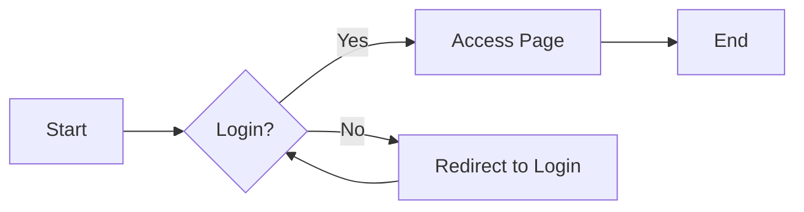

# Theme Features Showcase

VuePress Hope theme provides rich functionality and excellent user experience.

## 🎨 Theme Toggle

Click the 🌙/☀️ icon in the top right corner of the navigation bar to toggle dark/light mode.

::: tip Auto Adaptation
The theme automatically adapts to system settings and also supports manual selection.
:::

## 📱 Responsive Design

This site uses responsive design and displays well on different devices:

- 🖥️ **Desktop**: Complete navigation bar and sidebar
- 💻 **Tablet**: Adaptive layout
- 📱 **Mobile**: Collapsible sidebar, optimized for touch operations

## 🔗 Navigation Features

### Sidebar

- Automatically generates article outline
- Supports multi-level nesting
- Foldable groups
- Active link highlighting

### Breadcrumb Navigation

Displays the current location path navigation at the top of the page, making it easy to locate quickly.

### Page Navigation

Provides previous/next page navigation links at the bottom of the page.

## 📊 Content Enhancement

### 1. Code Block Enhancement

```typescript
// Supports line numbers, line highlighting, code copying
const greeting = "Hello, VuePress!";
console.log(greeting);
```

Features:
- ✅ Syntax highlighting
- ✅ Line numbers display
- ✅ Code copy button
- ✅ Code group support

### 2. Markdown Enhancement

Supported Markdown extension features:

| Feature | Description | Status |
|---------|-------------|--------|
| GFM | GitHub Flavored Markdown | ✅ |
| Task Lists | To-do list items | ✅ |
| Footnotes | Document references | ✅ |
| Superscript/Subscript | Mathematical formulas | ✅ |
| Mark | Text highlighting | ✅ |
| Custom Alignment | Center/right alignment | ✅ |
| Custom Containers | Tips, warnings, etc. | ✅ |
| Code Demo | Online code execution | ✅ |
| Charts | Various chart support | ✅ |

### 3. Chart Support

- **Mermaid**: Flowcharts, sequence diagrams, Gantt charts
- **Flowchart**: Traditional flowcharts
- **ECharts**: Professional data visualization
- **Chart.js**: Simple charts
- **Markmap**: Mind maps
- **PlantUML**: UML diagrams

Example:



## 🎯 Content Features

### Image Enhancement

- **Image Lazy Loading**: Improves page loading speed
- **Image Marking**: Supports image size settings
- **Image Preview**: Click to enlarge view

### Page Information

Each page displays:
- 📅 Creation time
- ✏️ Last update time
- ⏱️ Estimated reading time
- 🏷️ Article tags
- 📂 Article categories

## 💬 Comment System

This site integrates a comment system:

- Supports Markdown
- Supports emojis
- Supports images
- Email notifications
- Comment management

Scroll to the bottom of the page to see the comment area.

## 🔍 Search Function

Powerful full-text search:
- Shortcuts: `Ctrl + K` or `/`
- Supports Chinese and English
- Search suggestions
- Search history

For details, see [Search Feature Demo](/en/demos/search-demo.html).

## 🌐 Multi-Language Support

This site supports bilingual Chinese and English:
- 🇨🇳 Simplified Chinese
- 🇺🇸 English

Language toggle is in the top right corner of the navigation bar.

## ♿ Accessibility Support

- Complete keyboard navigation support
- Screen reader friendly
- Reasonable ARIA labels
- High contrast mode

## 📈 SEO Optimization

- Automatic sitemap generation
- Structured data marking
- Open Graph support
- Search engine friendly URLs

## ⚡ Performance Optimization

- PWA support
- Preload optimization
- Image lazy loading
- Code splitting
- Resource compression

## 🎪 Code Demonstration

### Vue Component Demo

::: vue-playground Vue Demo

@file App.vue

```vue
<template>
  <div class="demo">
    <h1>{{ message }}</h1>
    <button @click="count++">Click Count: {{ count }}</button>
  </div>
</template>

<script setup>
import { ref } from 'vue'

const message = ref('Hello VuePress!')
const count = ref(0)
</script>

<style>
.demo {
  text-align: center;
  padding: 20px;
}
button {
  margin-top: 10px;
  padding: 8px 16px;
  font-size: 16px;
  cursor: pointer;
}
</style>
```

:::

## 📚 More Features

View more demo pages:

<div class="vp-card-group">
  <VPCard
    title="Search Demo"
    desc="Search functionality showcase"
    logo="🔍"
    link="/en/demos/search-demo.html"
  />
  <VPCard
    title="Component Demo"
    desc="Built-in component features"
    logo="🧩"
    link="/en/demos/components-demo.html"
  />
  <VPCard
    title="Code Demo"
    desc="Online code execution"
    logo="💻"
    link="/en/demos/code-demo.html"
  />
</div>

## 🎉 Summary

VuePress Hope theme provides:

1. **Rich Features**: Ready-to-use enhanced features out of the box
2. **Excellent Experience**: Responsive design and smooth interactions
3. **Powerful Extensions**: Supports various charts and code demonstrations
4. **Complete Documentation**: Detailed usage instructions and examples

::: tip Learn More
Visit the [VuePress Hope Theme Official Website](https://theme-hope.vuejs.press/) to learn more features.
:::