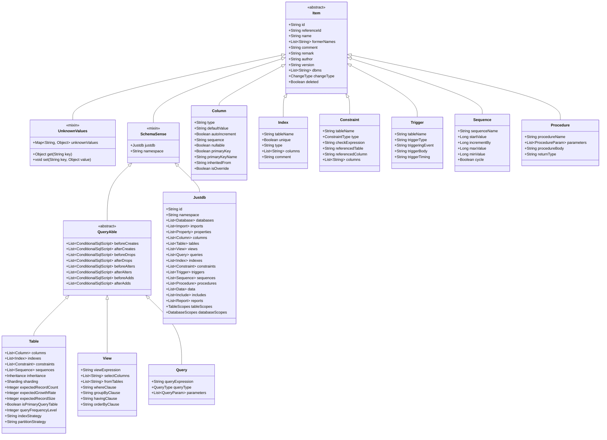

# Type Hierarchy

## Overview

JustDB Schema adopts a clear inheritance hierarchy. All Schema objects inherit from the `Item` base class, achieving flexible Schema definitions through composition and inheritance.

## Inheritance Hierarchy Diagram



## Core Base Classes

### Item (Base Item)

Base class for all Schema objects, providing common properties.

| Field | Type | Description | Example |
|-------|------|-------------|---------|
| `id` | String | Unique identifier | `"col_users_id"` |
| `referenceId` | String | Reference to another item's id (reuse) | `"global_id"` |
| `name` | String | Display name | `"users"` |
| `formerNames` | List\<String\> | List of former names (change tracking) | `["user"]` |
| `comment` | String | Database comment (written to database) | `"User table"` |
| `remark` | String | JustDB note (not written to database) | `"Internal use"` |
| `author` | String | Author | `"wind"` |
| `version` | String | Version info | `"1.0"` |
| `dbms` | List\<String\> | Applicable databases | `["mysql", "postgresql"]` |
| `changeType` | ChangeType | Schema diff change type | `ADDED`, `REMOVED` |
| `deleted` | Boolean | Whether deleted | `false` |

### UnknownValues (Dynamic Extension)

Through `UnknownValues` base class, all Schema objects can support dynamic attributes for database-specific extensions.

```java
public class UnknownValues {
    private Map&lt;String, , Object> unknownValues = new HashMap<>();

    public Object get(String key) {
        return unknownValues.get(key);
    }

    public void set(String key, Object value) {
        unknownValues.put(key, value);
    }
}
```

**Usage example**:

```xml
<!-- MySQL table using engine attribute (stored in UnknownValues) -->
<Table name="users" engine="InnoDB" row_format="COMPRESSED">
    <columns>...</columns>
</Table>
```

### SchemaSense (Context Holder)

Holds reference to the root `Justdb` object, providing global context access.

### QueryAble (Queryable Object)

Provides lifecycle hook support for tables, views, queries, and other objects.

## Main Object Types

### Table (Table)

Table structure inherits from `QueryAble`, containing sub-objects like columns, indexes, and constraints.

```
Table extends QueryAble
├── columns: Column[]          - Column definitions
├── indexes: Index[]           - Index definitions
├── constraints: Constraint[]   - Constraint definitions
├── sequences: Sequence[]       - Associated sequences
├── inheritance: Inheritance     - Inheritance config
├── sharding: Sharding          - Sharding config
├── Lifecycle hooks
└── Performance optimization attributes:
    ├── expectedRecordCount     - Expected record count
    ├── expectedGrowthRate      - Expected growth rate (records/month)
    ├── expectedRecordSize      - Expected record size (bytes)
    ├── isPrimaryQueryTable     - Is primary query table
    ├── queryFrequencyLevel     - Query frequency level (1-5)
    ├── indexStrategy           - Recommended index strategy
    └── partitionStrategy       - Recommended partition strategy
```

### Column (Column)

Column definition, containing data type, constraints, default values, etc.

```
Column extends Item
├── type: String               - Data type
├── defaultValue: String       - Default value (including functions like CURRENT_TIMESTAMP)
├── autoIncrement: Boolean     - Whether auto-increment
├── sequence: String           - Associated sequence name
├── nullable: Boolean          - Whether nullable
├── primaryKey: Boolean        - Whether primary key
├── primaryKeyName: String     - Primary key name
├── inheritedFrom: String      - Inheritance source column
├── isOverride: Boolean        - Whether override parent definition
└── Lifecycle hooks
```

### Index (Index)

Index definition.

```
Index extends Item
├── tableName: String          - Owner table name
├── unique: Boolean            - Whether unique index
├── type: String               - Index type (BTREE, HASH, FULLTEXT, SPATIAL)
├── columns: String[]          - Index columns
└── comment: String            - Index comment
```

### Constraint (Constraint)

Constraint definition.

```
Constraint extends Item
├── tableName: String          - Owner table name
├── type: ConstraintType       - Constraint type
│   ├── PRIMARY_KEY
│   ├── FOREIGN_KEY
│   ├── UNIQUE
│   ├── CHECK
│   └── NOT_NULL
├── checkExpression: String    - CHECK constraint expression
├── referencedTable: String     - Foreign key referenced table
├── referencedColumn: String    - Foreign key referenced column
└── columns: String[]          - Constraint columns
```

## Composition Pattern

For collection types (like `columns`, `indexes`), use composition rather than inheritance to keep the type system clean.

```java
public class Table extends QueryAble {
    @XmlElementWrapper(name = "columns")
    @XmlElement(name = "Column")
    private Columns columns = new Columns();
}

public class Columns {
    @XmlElement(name = "Column")
    private List<Column&gt;> list = new ArrayList<>();
}
```

This design is due to Jackson/JAXB `@XmlElementWrapper` limitations in inheritance hierarchies.

## Related Documents

- [Schema System Overview](./overview.md)
- [Alias System](./alias-system.md)
- [Schema Evolution](./schema-evolution.md)
- [Extension Point System](./extension-points.md)
