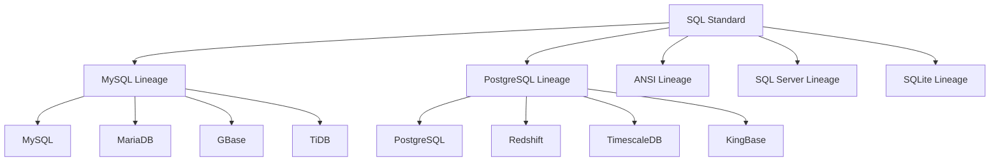

# Lineage Template System

## Overview

The Lineage template system is a core feature of the JustDB template system. It groups databases by SQL syntax similarity, defining shared lineage templates to achieve template reuse and simplify maintenance.

## Lineage Classification

### Lineage Types

| Lineage Suffix | Included Databases | Syntax Characteristics |
|----------------|-------------------|------------------------|
| `-mysql-lineage` | MySQL, MariaDB, GBase, TiDB | Backticks, AUTO_INCREMENT |
| `-postgres-lineage` | PostgreSQL, Redshift, TimescaleDB, KingBase | Double quotes, no inline auto-increment |
| `-ansi-lineage` | Oracle, DB2, Derby, HSQLDB, Dameng | ANSI SQL standard |
| `-sqlserver-lineage` | SQL Server | Square brackets, IDENTITY |
| `-sqlite-lineage` | SQLite | Lightweight, AUTOINCREMENT |

### Lineage Relationship Diagram



## Lineage Template Naming Convention

### Naming Format

```
{operation}-{object}-{lineage}-lineage
```

### Examples

| Template Name | Lineage | Description |
|--------------|---------|-------------|
| `create-table-mysql-lineage` | MySQL Lineage | CREATE TABLE template for MySQL family databases |
| `create-table-postgres-lineage` | PostgreSQL Lineage | CREATE TABLE template for PostgreSQL family databases |
| `drop-table-ansi-lineage` | ANSI Lineage | DROP TABLE template for ANSI SQL standard |

## Lineage Template Definition

### Define in sql-standard-root

```xml
<plugin id="sql-standard-root">
    <templates>
        <!-- MySQL Lineage: CREATE TABLE -->
        <template id="create-table-mysql-lineage" type="SQL" category="db">
            <content>
                CREATE TABLE {{#if @root.idempotent}}IF NOT EXISTS {{/if}}{{> table-name-spec}} (
                    {{> columns}}
                ){{#if this.engine}} ENGINE={{this.engine}}{{/if}};
            </content>
        </template>

        <!-- PostgreSQL Lineage: CREATE TABLE -->
        <template id="create-table-postgres-lineage" type="SQL" category="db">
            <content>
                CREATE TABLE{{#if @root.idempotent}} IF NOT EXISTS{{/if}} {{> table-name-spec}} (
                    {{> columns}}
                );
            </content>
        </template>

        <!-- ANSI Lineage: CREATE TABLE -->
        <template id="create-table-ansi-lineage" type="SQL" category="db">
            <content>
                CREATE TABLE {{> table-name-spec}} (
                    {{> columns}}
                );
            </content>
        </template>
    </templates>
</plugin>
```

## Lineage Template References

### Reference in Dialect Plugins

```xml
<!-- MySQL plugin -->
<plugin id="mysql" dialect="mysql" ref-id="sql-standard-root">
    <templates>
        <!-- Reference MySQL lineage template -->
        <template id="create-table" type="SQL" category="db">
            <content>{{> create-table-mysql-lineage}}</content>
        </template>
    </templates>
</plugin>

<!-- PostgreSQL plugin -->
<plugin id="postgresql" dialect="postgresql" ref-id="sql-standard-root">
    <templates>
        <!-- Reference PostgreSQL lineage template -->
        <template id="create-table" type="SQL" category="db">
            <content>{{> create-table-postgres-lineage}}</content>
        </template>
    </templates>
</plugin>
```

### Multi-Database Sharing

```xml
<!-- MariaDB plugin -->
<plugin id="mariadb" dialect="mariadb" ref-id="sql-standard-root">
    <templates>
        <!-- Also uses MySQL lineage -->
        <template id="create-table" type="SQL" category="db">
            <content>{{> create-table-mysql-lineage}}</content>
        </template>
    </templates>
</plugin>

<!-- TiDB plugin -->
<plugin id="tidb" dialect="tidb" ref-id="sql-standard-root">
    <templates>
        <!-- Also uses MySQL lineage -->
        <template id="create-table" type="SQL" category="db">
            <content>{{> create-table-mysql-lineage}}</content>
        </template>
    </templates>
</plugin>
```

## Lineage Template Differences

### Identifier Quoting

| Lineage | Identifier Quoting | Example |
|---------|-------------------|---------|
| `-mysql-lineage` | Backticks | `` `table` `` |
| `-postgres-lineage` | Double quotes | `"table"` |
| `-ansi-lineage` | Uppercase or no quotes | `TABLE` or `table` |
| `-sqlserver-lineage` | Square brackets | `[table]` |
| `-sqlite-lineage` | No quotes or double quotes | `table` or `"table"` |

### Auto-Increment Columns

| Lineage | Auto-Increment Syntax | Example |
|---------|----------------------|---------|
| `-mysql-lineage` | `AUTO_INCREMENT` | `id BIGINT AUTO_INCREMENT` |
| `-postgres-lineage` | Uses SEQUENCE | `id BIGINT DEFAULT nextval('seq')` |
| `-ansi-lineage` | No inline auto-increment | Uses SEQUENCE or triggers |
| `-sqlserver-lineage` | `IDENTITY` | `id BIGINT IDENTITY(1,1)` |
| `-sqlite-lineage` | `AUTOINCREMENT` | `id INTEGER AUTOINCREMENT` |

### Index Creation

```handlebars
<!-- MySQL Lineage -->
CREATE INDEX {{> index-name}} ON {{> table-name-spec}}({{> columns}});

<!-- PostgreSQL Lineage -->
CREATE INDEX{{#if @root.concurrent}} CONCURRENTLY{{/if}} {{> index-name}} ON {{> table-name-spec}}({{> columns}});

<!-- ANSI Lineage -->
CREATE INDEX {{> index-name}} ON {{> table-name-spec}}({{> columns}});
```

## Lineage Template Extensions

### Adding New Lineage

```xml
<!-- 1. Define new lineage template -->
<template id="create-table-newdb-lineage" type="SQL" category="db">
    <content>
        -- New database's CREATE TABLE syntax
        CREATE TABLE {{> table-name-spec}} (
            {{> columns}}
        );
    </content>
</template>

<!-- 2. Reference in new plugin -->
<plugin id="newdb" dialect="newdb" ref-id="sql-standard-root">
    <templates>
        <template id="create-table" type="SQL" category="db">
            <content>{{> create-table-newdb-lineage}}</content>
        </template>
    </templates>
</plugin>
```

### Lineage Variants

```xml
<!-- MySQL Lineage Variant -->
<template id="create-table-mysql-8.0-lineage" type="SQL" category="db">
    <content>
        CREATE TABLE {{#if @root.idempotent}}IF NOT EXISTS {{/if}}{{> table-name-spec}} (
            {{> columns}}
        ) ENGINE=InnoDB;
    </content>
</template>

<!-- MySQL 8.0 plugin -->
<plugin id="mysql-8.0" dialect="mysql" ref-id="sql-standard-root">
    <templates>
        <template id="create-table" type="SQL" category="db">
            <content>{{> create-table-mysql-8.0-lineage}}</content>
        </template>
    </templates>
</plugin>
```

## Lineage Mapping

### Automatic Detection

```java
public class LineageDetector {
    private static final Map&lt;String, String&gt; DIALECT_TO_LINEAGE = Map.of(
        "mysql", "mysql-lineage",
        "mariadb", "mysql-lineage",
        "tidb", "mysql-lineage",
        "gbase", "mysql-lineage",
        "postgresql", "postgres-lineage",
        "redshift", "postgres-lineage",
        "timescaledb", "postgres-lineage",
        "kingbase", "postgres-lineage",
        "oracle", "ansi-lineage",
        "db2", "ansi-lineage",
        "derby", "ansi-lineage",
        "hsqldb", "ansi-lineage",
        "dameng", "ansi-lineage",
        "sqlserver", "sqlserver-lineage",
        "sqlite", "sqlite-lineage"
    );

    public static String getLineage(String dialect) {
        return DIALECT_TO_LINEAGE.getOrDefault(dialect, "ansi-lineage");
    }
}
```

## Best Practices

### 1. Prioritize Using Lineage Templates

```xml
<!-- Good practice: Define lineage templates -->
<template id="create-table-mysql-lineage">...</template>
<template id="create-table-postgres-lineage">...</template>

<!-- Reference in plugins -->
<template id="create-table">{{> create-table-mysql-lineage}}</template>
```

### 2. Keep Lineage Independence

```xml
<!-- Good practice: Each lineage defined independently -->
<template id="drop-table-mysql-lineage">DROP TABLE `table`;</template>
<template id="drop-table-postgres-lineage">DROP TABLE "table";</template>

<!-- Avoid: Handling multiple dialects in one template -->
<template id="drop-table">
    {{#if (eq @root.dbType 'mysql')}}DROP TABLE `table`;{{/if}}
    {{#if (eq @root.dbType 'postgresql')}}DROP TABLE "table";{{/if}}
</template>
```

### 3. Reasonable Classification

```xml
<!-- Good practice: Classify by SQL syntax similarity -->
-mysql-lineage: MySQL, MariaDB, TiDB
-postgres-lineage: PostgreSQL, Redshift, TimescaleDB

<!-- Avoid: Classify by brand -->
```

### 4. Document Lineage Features

```xml
<!-- Good practice: Add comments explaining lineage features -->
<!--
  MySQL Lineage Characteristics:
  - Identifiers use backticks
  - Supports AUTO_INCREMENT
  - Supports ENGINE clause
  - Supports IF NOT EXISTS
-->
<template id="create-table-mysql-lineage">...</template>
```

## Related Documentation

- [Template System Overview](./overview.md)
- [Template Inheritance Mechanism](./template-inheritance.md)
- [Safe Drop Templates](./safe-drop-templates.md)
