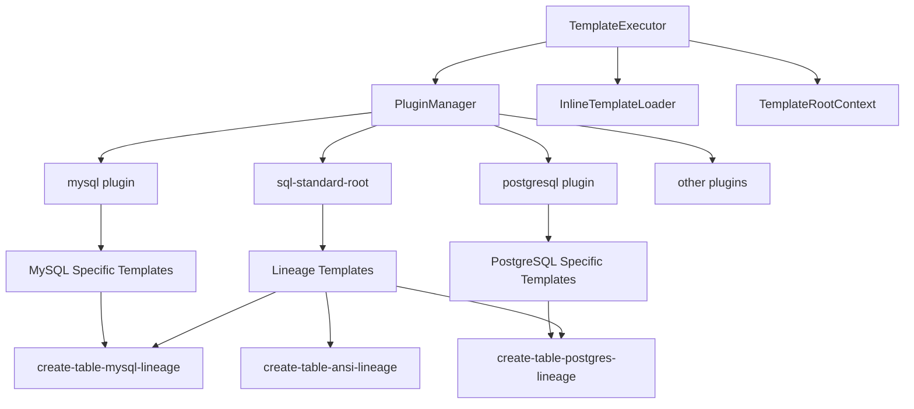

# Template System Overview

## Document Overview

JustDB Template system is a Handlebars-based multi-level template inheritance and override mechanism, supporting name-based template references, plugin-specific template overrides, and a most-specific-match-first lookup strategy.

**Version**: 1.0
**Last Updated**: 2026-02-09
**Maintainer**: Wind Li

## Core Features

- **Handlebars-based**: Uses mature Handlebars template engine
- **Multi-level inheritance**: Supports template inheritance and overrides
- **Lineage templates**: Database dialect family shared templates
- **Dynamic references**: Reference other templates by name
- **Priority lookup**: Most specific match has priority

## System Architecture



## Core Components

### TemplateExecutor

Template executor responsible for template loading, compilation, and execution.

| Method | Description |
|--------|-------------|
| `execute(String name, TemplateRootContext context)` | Execute specified template |
| `mergeTemplates(String name, String category, String type, String dialect)` | Merge templates (by priority) |

### InlineTemplateLoader

Inline template loader supporting direct template definition in code.

### PluginManager

Plugin manager managing all plugins and their template definitions.

### TemplateRootContext

Template root context providing global variables and configuration.

## Template Structure

### default-plugins.xml Structure

```
default-plugins.xml
├── <plugin id="sql-standard-root">
│   └── <templates>
│       ├── Common base templates (e.g., name-spec, table-name)
│       └── Lineage shared templates (e.g., create-table-mysql-lineage)
│
├── <plugin id="mysql" dialect="mysql" ref-id="sql-standard-root">
│   └── <templates>
│       └── Reference lineage templates (e.g., create-table = {{> create-table-mysql-lineage}})
│
├── <plugin id="postgresql" dialect="postgresql" ref-id="sql-standard-root">
│   └── <templates>
│       └── Reference lineage templates
│
└── ...
```

### GenericTemplate Structure

Each template (`GenericTemplate`) contains the following properties:

| Property | Description | Example |
|----------|-------------|---------|
| `id` | Unique template identifier | `drop-table` |
| `name` | Template name (entry identifier) | `drop-table` |
| `type` | Template type (optional) | `MYBATIS_BEAN`, `JPA_ENTITY` |
| `category` | Template category | `db`, `java` |
| `description` | Template description | `DROP TABLE statement` |
| `content` | Template content (Handlebars) | `DROP TABLE {{> table-name}}` |
| `pluginId` | Owner plugin ID | `mysql`, `postgresql` |
| `ref-id` | Parent plugin reference | `sql-standard-root` |
| `dialect` | Database dialect | `mysql`, `postgresql` |

## Template Lookup Priority

`mergeTemplates()` method searches templates in the following priority (high to low):

```
1. (name + category + type + dialect)     - Most specific match
2. (name + category + type)               - Type-level template
3. (name + category, type='')             - Category general template
4. (name, type='' + category='')          - Global general template
```

### Matching Rules

- When `dialect` is specified, dialect-specific template has priority over general template
- When `dialect` is not specified, general template has priority over dialect template
- Later loaded templates with same name override earlier loaded ones

### Lookup Example

```java
// Search for create-table template (MySQL dialect)
// Priority:
// 1. create-table + db + SQL + mysql
// 2. create-table + db + SQL
// 3. create-table + db
// 4. create-table

String sql = templateExecutor.execute(
    "create-table",
    TemplateRootContext.builder()
        .dbType("mysql")
        .put("table", table)
        .build()
);
```

## Template Reference Mechanism

Templates can reference other templates via `{{> template-name}}` syntax.

### Reference Syntax

```handlebars
<!-- Reference base template -->
<template id="drop-table" name="drop-table" type="SQL" category="db">
  <content>DROP TABLE {{> table-name}}</content>
</template>

<!-- Reference template with parent context -->
<template id="drop-column" name="drop-column" type="SQL" category="db">
  <content>ALTER TABLE {{> table-name ..}} {{> drop-column-clause}};</content>
</template>
```

- `{{> table-name}}` - Use current context
- `{{> table-name ..}}` - Use parent context (`..` means up one level)

### Context Passing

```handlebars
{{!-- Current context: table --}}
{{> table-name}}        {{!-- Use table context --}}

{{!-- Pass specified object --}}
{{> table-name @root.newtable}}

{{!-- Use parent context --}}
{{> table-name ..}}
```

## TemplateRootContext

### Standard Context Variables

| Variable | Type | Description |
|----------|------|-------------|
| `@root.justdbManager` | JustdbManager | JustDB manager instance |
| `@root.dbType` | String | Database type (e.g., `mysql`, `postgresql`) |
| `@root.idempotent` | Boolean | Whether idempotent mode |
| `@root.idempotentType` | String | Idempotent type (`ignore`, `replace`, `merge`) |
| `@root.safeDrop` | Boolean | Whether safe drop enabled |
| `@root.newtable` | Table | New table object (for safe drop) |

### Extended Variables

Custom variables can be added via `put()` method:

```java
TemplateRootContext context = TemplateRootContext.builder()
    .dbType("mysql")
    .idempotent(true)
    .put("customVar", customValue)
    .build();
```

## Lineage Template System

### Lineage Concept

Lineage templates define shared SQL syntax for a group of databases:

| Lineage Suffix | Databases Included | Description |
|----------------|-------------------|-------------|
| `-mysql-lineage` | MySQL, MariaDB, GBase, TiDB | Backticks, AUTO_INCREMENT |
| `-postgres-lineage` | PostgreSQL, Redshift, TimescaleDB, KingBase | Double quotes, no inline auto-increment |
| `-ansi-lineage` | Oracle, DB2, Derby, HSQLDB, Dameng | ANSI SQL standard |
| `-sqlserver-lineage` | SQL Server | Brackets, IDENTITY |
| `-sqlite-lineage` | SQLite | Lightweight, AUTOINCREMENT |

### Lineage Template Definition

```xml
<!-- Defined in sql-standard-root -->
<template id="create-table-mysql-lineage" name="create-table-mysql-lineage" type="SQL" category="db">
  <content>CREATE TABLE {{#if @root.idempotent}}IF NOT EXISTS {{/if}}{{> table-name}} ({{> columns}});</content>
</template>

<!-- Referenced in mysql plugin -->
<template id="create-table" name="create-table" type="SQL" category="db">
  <content>{{> create-table-mysql-lineage}}</content>
</template>
```

## Template Override Rules

Plugins can override templates at any level:

```xml
<!-- Base template defined in sql-standard-root -->
<template id="modify-column" name="modify-column" type="SQL" category="db">
  <content>ALTER TABLE {{> table-name ..}} ALTER COLUMN ...;</content>
</template>

<!-- Overridden in mysql plugin -->
<template id="modify-column" name="modify-column" type="SQL" category="db">
  <content>ALTER TABLE {{> table-name ..}} MODIFY COLUMN ...;</content>
</template>
```

## Naming Convention

### Verb-First

Template names follow SQL statement natural order, operation verb first, object second.

| Type | Naming Format | Example |
|------|---------------|---------|
| Main entry template | `{operation}-{object}` | `drop-table`, `drop-column` |
| Raw operation template | `{operation}-{object}-raw` | `drop-table-raw` |
| Lineage template | `{operation}-{object}-{lineage}-lineage` | `drop-table-mysql-lineage` |
| Plugin specific template | `{operation}-{object}-{plugin}` | `drop-table-mysql` |

### Operation Verbs

| Verb | Description | Example Templates |
|------|-------------|-------------------|
| `drop` | Drop object | `drop-table`, `drop-column` |
| `create` | Create object | `create-table`, `create-index` |
| `alter` | Alter object | `alter-table`, `alter-column` |
| `rename` | Rename object | `rename-table`, `rename-column` |
| `add` | Add | `add-column`, `add-constraint` |
| `modify` | Modify | `modify-column` |

## Related Documents

- [Handlebars Template Syntax](./handlebars-templates.md)
- [Template Inheritance Mechanism](./template-inheritance.md)
- [Lineage Template System](./lineage-templates.md)
- [Safe Drop Templates](./safe-drop-templates.md)
