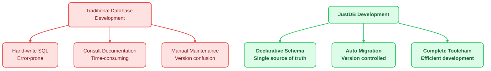
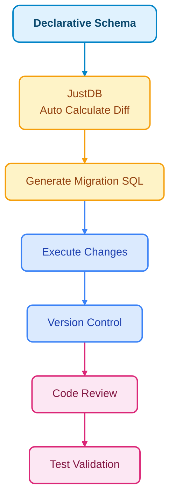

# AI-Assisted Development

JustDB provides an AI-assisted development experience that makes database development simpler and more efficient through declarative Schema definitions and intelligent toolchain integration.

## Core Philosophy: Declarative Development for Efficiency



## Daily Developer Use Cases

### Scenario 1: Quickly Create New Tables

**Traditional approach:**
```bash
# 1. Hand-write CREATE TABLE statement
# 2. Check field types, constraints
# 3. Consider index design
# 4. Write migration script
```

**JustDB approach:**

```yaml
# Use declarative YAML to define table structure
Table:
  - name: orders
    comment: Order table
    Column:
      - name: id
        type: BIGINT
        primaryKey: true
        autoIncrement: true
      - name: order_no
        type: VARCHAR(32)
        nullable: false
        unique: true
      - name: user_id
        type: BIGINT
        nullable: false
      - name: total_amount
        type: DECIMAL(10,2)
        nullable: false
        defaultValue: "0.00"
      - name: status
        type: VARCHAR(20)
        nullable: false
        defaultValue: pending
      - name: created_at
        type: TIMESTAMP
        nullable: false
        defaultValueComputed: CURRENT_TIMESTAMP
    Index:
      - name: idx_user_id
        columns: [user_id]
      - name: idx_status
        columns: [status]
      - name: idx_created_at
        columns: [created_at]
```

**Development workflow:**
```bash
# 1. Edit schema.yaml file
vim schema.yaml

# 2. Apply changes to database
justdb migrate

# 3. Verify table structure
justdb inspect --table orders
```

### Scenario 2: Direct Development with MySQL Client

JustDB provides MySQL protocol compatibility layer, allowing direct use of familiar MySQL client tools:

```bash
# Start JustDB MySQL server (port 33206)
java -jar justdb-mysql-protocol.jar --port 33206 --schema ./schema.yaml

# Connect with any MySQL client!
mysql -h 127.0.0.1 -P 33206 -u root -p

# Or use GUI tools like MySQL Workbench, DBeaver, Navicat, etc.
```

**Connect from code:**
```java
// Use standard MySQL JDBC Driver - no dedicated driver needed!
String url = "jdbc:mysql://localhost:33206/justdb";
Connection conn = DriverManager.getConnection(url, "user", "password");

// Execute SQL normally
ResultSet rs = conn.createStatement().executeQuery("SELECT * FROM orders");
```

**Advantages:**
- No need to learn new APIs
- Reuse existing MySQL toolchain
- Zero learning curve for team members
- Multi-language support (any language with MySQL support)

### Scenario 3: Schema Analysis and Optimization

```yaml
# Complete Schema definition for easy analysis
Table:
  - name: users
    Column:
      - name: id
        type: BIGINT
        primaryKey: true
      - name: email
        type: VARCHAR(100)
      - name: nickname
        type: VARCHAR(50)
        nullable: true
```

**Use JustDB tools for analysis:**
```bash
# Analyze Schema quality
justdb analyze --schema schema.yaml

# Output example:
# Primary key design reasonable - BIGINT auto-increment
# email field suggests adding unique index
# nickname is nullable, may require NULL checks in queries
# Suggestion: Add unique constraint for email
# Suggestion: Set default value or NOT NULL for nickname
```

### Scenario 4: Virtual Column Advanced Features

JustDB supports virtual columns for dynamically computing values based on other columns:

```yaml
Table:
  - name: products
    Column:
      - name: id
        type: BIGINT
        primaryKey: true
      - name: name
        type: VARCHAR(100)
      - name: price
        type: DECIMAL(10,2)
      # Virtual column: automatically calculate discounted price
      - name: discounted_price
        type: DECIMAL(10,2)
        virtual: true
        expression: "price * 0.9"
      # Virtual column: stock status
      - name: stock_status
        type: VARCHAR(20)
        virtual: true
        expression: "CASE WHEN stock > 100 THEN '充足' WHEN stock > 0 THEN '紧张' ELSE '缺货' END"
```

### Scenario 5: Monitoring Database Changes

JustDB's history service provides monitoring capabilities:

```java
// Monitor changes to specific table
JustdbManager manager = JustdbManager.getInstance();
manager.addWatchListener("orders", (event) -> {
    switch (event.getType()) {
        case TABLE_ADDED:
            System.out.println("New table created: " + event.getTableName());
            break;
        case COLUMN_ADDED:
            System.out.println("New column added: " + event.getColumnName());
            break;
        case DATA_CHANGED:
            System.out.println("Data changed: " + event.getSql());
            break;
    }
});
```

**Use cases:**
- Real-time sync to other systems
- Trigger cache updates
- Send notifications
- Log audit trails

### Scenario 6: Offline Development and Testing

JustDB JDBC driver provides in-memory database functionality:

```java
// 1. Load Schema (no real database connection needed)
Justdb justdb = SchemaLoader.load("schema.yaml");

// 2. Create in-memory data source
JustdbDataSource dataSource = new JustdbDataSource(justdb);

// 3. Execute SQL and business logic in memory
JustdbConnection conn = new JustdbConnection(dataSource);
// ... development and testing ...

// 4. For production deployment, just change connection string
```

**Advantages:**
- No need to start database server
- Faster unit tests
- Lighter local development
- Safer data isolation

## Development Best Practices

### 1. Schema as Code, Schema as Documentation

```yaml
# Schema file is both code and documentation
Table:
  - name: orders
    comment: Order table - stores user order information
    Column:
      - name: id
        type: BIGINT
        primaryKey: true
        autoIncrement: true
        comment: Order ID, primary key auto-increment
```

**Tool support:**
- Generate API documentation
- Check design flaws
- Recommend optimization suggestions

### 2. Version Control Friendly Diff

```diff
# Add new field
Column:
  - name: order_no
    type: VARCHAR(32)
+   - name: payment_method
+     type: VARCHAR(20)
```

Git diff is clear, Code Review is more efficient!

### 3. Declarative + Toolchain Double Guarantee



## Typical Workflows

### Workflow 1: New Feature Development

```bash
# 1. Define Schema
vim schema.yaml  # Edit table structure

# 2. Generate migration script
justdb diff --output migration.sql

# 3. Code Review team review
git add schema.yaml migration.sql
git commit -m "feat: add user points system"

# 4. Test in in-memory database
justdb test --schema schema.yaml

# 5. Deploy to production
justdb migrate --database production
```

### Workflow 2: Emergency Fix

```bash
# 1. Quickly identify problem
justdb analyze --database production --schema schema.yaml

# Output: Found orders table missing index on user_id

# 2. Update Schema
vim schema.yaml  # Add index

# 3. Generate safe ALTER TABLE statement
justdb diff --safe-mode

# 4. Code Review + merge
git add . && git commit -m "fix: add index on orders.user_id"

# 5. Apply changes
justdb migrate --auto-apply
```

### Workflow 3: Database Refactoring

```bash
# 1. Analyze existing database
justdb analyze --database production --schema schema.yaml

# Output analysis report:
#    - Found 5 unused tables
#    - Found 12 missing indexes
#    - Found 3 inconsistently named columns

# 2. Create refactoring plan
vim refactor-plan.md

# 3. Execute refactoring step by step
justdb migrate --step-1 --safe-mode
justdb migrate --step-2 --safe-mode
justdb migrate --step-3 --safe-mode
```

## Advanced Features in Practice

### 1. Use Monitoring for Data Sync

```java
// Listen to order table changes, sync to Redis in real-time
manager.addWatchListener("orders", (event) -> {
    if (event.getType() == WatchType.DATA_CHANGED) {
        // Query changed data
        String orderId = extractOrderId(event.getSql());

        // Sync to Redis
        redisTemplate.opsForValue().set("order:" + orderId,
            fetchOrder(orderId),
            Duration.ofHours(1));
    }
});
```

### 2. Use JDBC Driver for Offline Development

```java
// Configuration file (development environment)
spring:
  datasource:
    url: jdbc:justdb:memory:schema.yaml  # In-memory mode
    # url: jdbc:mysql://localhost:33206/production  # Production

// Business code unchanged
@Autowired
private JdbcTemplate jdbcTemplate;

public Order createOrder(Order order) {
    jdbcTemplate.update("INSERT INTO orders ...");
    return order;
}
```

### 3. Use MySQL Protocol to Connect BI Tools

```bash
# Run JustDB as MySQL server
java -jar justdb-mysql-protocol.jar --port 33206

# Configure MySQL connection in BI tool
# Host: localhost
# Port: 33206
# Database: justdb
# User: root
# Password: ****

# Now PowerBI, Tableau, Superset and other tools can connect directly!
```

## Tool Integration

### IDE Plugins (Recommended)

| IDE | Plugin | Features |
|-----|--------|----------|
| IntelliJ IDEA | JustDB Plugin | Schema syntax highlighting, auto-completion |
| VS Code | JustDB Extension | YAML support, intelligent hints |
| Vim | vim-justdb | Syntax highlighting |

### CI/CD Integration

```yaml
# .gitlab-ci.yml
test:
  script:
    # Run tests in in-memory database
    - mvn test -Djustdb.schema=schema.yaml

    # Check Schema quality
    - justdb validate --schema schema.yaml

    # Generate documentation
    - justdb docs:generate --schema schema.yaml
```

## FAQ

### Q1: How to ensure data safety after Schema definition?

A: JustDB provides multiple guarantees:
- Generate SQL preview before each change
- Support dry-run mode
- Auto-generate rollback scripts
- Complete change history tracking

### Q2: How to promote JustDB in the team?

A: Recommended steps:
1. **Training**: Organize JustDB training
2. **Templates**: Build Schema template library
3. **Standards**: Create Code Review checklist
4. **Tools**: Configure IDE plugins and CI integration

### Q3: Compatibility with existing database toolchain?

A: JustDB fully considers compatibility:
- MySQL protocol fully compatible
- Standard JDBC driver support
- Mainstream BI tools can connect directly
- Seamless integration with existing ORM frameworks

## Next Steps

<VPCard title="Quick Start" desc="Get started with JustDB in 5 minutes" link="/en/getting-started/quick-start.html" />

<VPCard title="Design Philosophy" desc="Learn about JustDB's design philosophy" link="/en/guide/design-philosophy.html" />

<VPCard title="MySQL Protocol" desc="Learn about MySQL protocol compatibility layer" link="/en/design/jdbc-driver/mysql-protocol.html" />

<VPCard title="Virtual Columns" desc="Explore virtual column advanced features" link="/en/design/schema-system/virtual-columns.html" />
