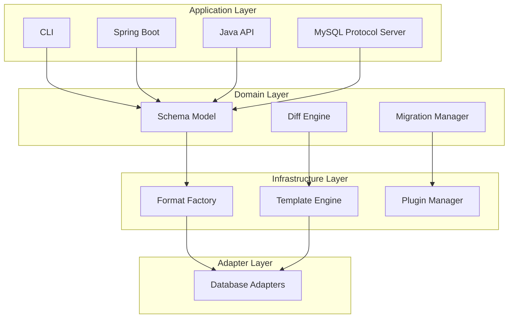

# Design Philosophy

JustDB follows a set of core principles that guide the framework's architectural decisions and API design.

## Core Design Principles

### 1. Simplicity

> "Simplicity is the ultimate sophistication." - Leonardo da Vinci

JustDB pursues the simplest expression:

**Minimal Configuration**

```yaml
# Only define what's necessary
Table:
  - name: users
    Column:
      - name: id
        type: BIGINT
        primaryKey: true
```

**Reasonable Defaults**

- Auto-infer primary key names
- Auto-set default constraints
- Auto-generate index names
- Auto-handle type mapping

**Avoid Over-Engineering**

```yaml
# Good practice - simple
Table:
  - name: users
    Column: [...]

# Avoid - over-configuration
Table:
  - name: users
    engine: InnoDB      # If default, no need to configure
    charset: utf8mb4    # If default, no need to configure
    collation: ...      # Unnecessary configuration
    # ...more redundant configuration
```

### 2. Consistency

Consistency makes systems easier to understand and predict:

**Unified Naming Conventions**

::: tip Standard Naming
- Schema fields use `camelCase`
- Collection fields use plural form `formerNames`
- SQL terminology preferred: `beforeDrops` uses DROP not Remove, `beforeAlters` uses ALTER not Modify
- Lifecycle hooks have unified prefix `beforeCreates`, `afterCreates`
:::

**Unified Type System**

```java
// All Schema objects inherit from Item
Item
├── Table
├── Column
├── Index
├── Constraint
└── ...

// Share common properties
- id: Unique identifier
- name: Name
- comment: Comment
```

**Unified Lifecycle Hooks**

```yaml
Table:
  - name: users
    beforeCreates:
      - sql: "CREATE SEQUENCE seq_users START WITH 1"
    afterCreates:
      - sql: "ALTER TABLE users ADD UNIQUE (username)"
    beforeDrops:
      - sql: "DROP SEQUENCE seq_users"
```

### 3. Declarative First

Describe "what you want", not "how to do it":

```yaml
# Declarative - describe desired state
Table:
  - name: users
    Column:
      - name: email
        type: VARCHAR(100)
        unique: true

# Imperative - describe how to execute (avoid)
# CREATE TABLE users (...);
# ALTER TABLE users ADD CONSTRAINT ... UNIQUE (email);
```

**Advantages:**
- Easier to understand and maintain
- Tool automatically optimizes execution path
- Avoids human errors
- Supports multiple database dialects

### 4. Convention Over Configuration

Follow reasonable conventions, reduce configuration burden:

**File Search Conventions**

```
Default search paths (by priority):
1. ./justdb/
2. ./db/
3. ./
4. classpath:justdb/
```

**Naming Conventions**

```yaml
# Table name auto-plural (optional)
Table:
  - name: user    # Auto-recognized as users table

# Primary key auto-inferred
Column:
  - name: id
    type: BIGINT
    # Auto-recognized as primary key (if name contains "id")

# Association auto-inferred
Column:
  - name: user_id
    type: BIGINT
    # Auto-inferred as foreign key to users.id
```

### 5. Extensibility

Provide multiple extension mechanisms:

**Plugin System**

```java
// Custom database adapter
public class MyDatabaseAdapter extends DatabaseAdapter {
    @Override
    public String getIdentifier() {
        return "mydb";
    }

    @Override
    public boolean supports(String url) {
        return url.startsWith("jdbc:mydb:");
    }
}
```

**Template System**

```xml
<!-- Custom SQL template -->
<template id="create-table" type="SQL" category="db">
  <content>
    CREATE TABLE {{name}} (
      {{#each columns}}
      {{name}} {{type}}{{#unless @last}},{{/unless}}
      {{/each}}
    );
  </content>
</template>
```

**Extension Point System**

```java
// Define extension point
ExtensionPoint point = ExtensionPoint.builder()
    .targetType(Table.class)
    .addAttribute(ExtensionAttribute.builder()
        .name("engine")
        .type(String.class)
        .defaultValue("InnoDB")
        .build())
    .build();
```

### 6. Broad Compatibility

**Formats Are Not Tools to Limit Users, Formats Are Doors to User Convenience**

The alias system makes it convenient for users from different backgrounds:

- **Backward Compatibility**: Protect user investment, old version schemas continue to work
- **AI Compatibility**: Any AI, blind writing, all compatible
- **Human Compatibility**: Developers with different programming backgrounds can use familiar formats

```java
@JsonAlias({"refId", "ref-id", "ref_id"})
private String referenceId;  // Canonical name
```

**Support Old Formats**

```yaml
# All these formats are supported
Column:
  - name: id
    ref-id: global_id      # Old format (kebab-case)
    referencedTable: users # Standard format (camelCase)
```

**Deprecation Strategy**

```java
/**
 * @deprecated Use {@link #referenceId} instead
 */
@Deprecated
public void setRefId(String refId) {
    setReferenceId(refId);  // Internal forwarding
}
```

## Architectural Design Philosophy

### Layered Architecture

JustDB uses a clear layered architecture:



### Separation of Concerns

**Schema Definition vs Database Operations**

```java
// Schema definition - describe data structure
Table table = new Table();
table.setName("users");

// Database operations - execute DDL
SchemaDeployer deployer = new SchemaDeployer(connection);
deployer.deploy(table);
```

**Format Parsing vs Business Logic**

```java
// Format-agnostic Schema model
Justdb schema = FormatFactory.loadFromFile("schema.yaml");

// Business logic processing
SchemaDiff diff = SchemaDiff.calculate(current, target);
```

### Open-Closed Principle

**Open for extension, closed for modification**

```xml
<!-- No need to modify core code, extend through plugins -->
<plugin id="mysql">
  <templates>
    <template id="create-table" ...>
      <!-- MySQL-specific CREATE TABLE template -->
    </template>
  </templates>
</plugin>
```

## User Experience Design

### Progressive Complexity

JustDB supports progressive use from simple to complex:

```yaml
# Entry level - simplest
Table:
  - name: users
    Column: []

# Intermediate - add constraints
Table:
  - name: users
    Column:
      - name: id
        type: BIGINT
        primaryKey: true
      - name: email
        type: VARCHAR(100)
        nullable: false

# Advanced - complete configuration
Table:
  - name: users
    comment: User table
    engine: InnoDB
    charset: utf8mb4
    Column:
      - name: id
        type: BIGINT
        primaryKey: true
        autoIncrement: true
        comment: User ID
    Index:
      - name: idx_email
        columns: [email]
        unique: true
        comment: Unique email index
    beforeCreates:
      - dbms: mysql
        sql: "SET sql_mode='STRICT_TRANS_TABLES'"
```

### Error Handling

Provide clear error messages:

```bash
# Traditional approach - vague error message
ERROR: SQL syntax error near 'CREATE TABEL'

# JustDB - clear error location
ERROR: Invalid table definition in users.yaml
  Line 15, Column 8:
    Unknown attribute 'engin' (did you mean 'engine'?)

  Schema:
    Table:
      - name: users
        engin: InnoDB    <-- typo here
```

### Developer Friendly

**Rich Feedback**

```bash
$ justdb migrate --dry-run

[INFO] Current database schema:
[INFO]   - 5 tables, 12 indexes, 8 constraints

[INFO] Target schema:
[INFO]   - 6 tables, 14 indexes, 10 constraints

[INFO] Changes to apply:
[INFO]   + Add table: orders
[INFO]   + Add column: users.phone
[INFO]   ~ Modify column: orders.status VARCHAR(20) -> VARCHAR(50)
[INFO]   - Drop index: users.idx_old_email

[INFO] Generated SQL:
[INFO]   CREATE TABLE orders (...)
[INFO]   ALTER TABLE users ADD COLUMN phone VARCHAR(20)
[INFO]   ALTER TABLE orders MODIFY COLUMN status VARCHAR(50)
[INFO]   ALTER TABLE users DROP INDEX idx_old_email

[DRY RUN] No changes applied. Use --execute to apply.
```

## Technology Selection Principles

### Mature Technology Stack

- **Java 8+**: Widely supported stable version
- **Maven**: Standard build tool
- **Jackson**: Mature JSON/YAML processing
- **Handlebars**: Powerful template engine
- **JDBC**: Standard database interface

### Avoid Over-Dependency

JustDB core module maintains minimal dependencies:

```xml
<!-- Core module has minimal dependencies -->
<dependencies>
    <dependency>
        <groupId>com.fasterxml.jackson.core</groupId>
        <artifactId>jackson-databind</artifactId>
    </dependency>
    <dependency>
        <groupId>com.github.jknack</groupId>
        <artifactId>handlebars</artifactId>
    </dependency>
    <!-- Minimal core dependencies -->
</dependencies>
```

### Optional Modularity

```xml
<!-- Core functionality -->
<dependency>
    <artifactId>justdb-core</artifactId>
</dependency>

<!-- Optional: AI integration -->
<dependency>
    <artifactId>justdb-ai</artifactId>
</dependency>

<!-- Optional: Excel support -->
<dependency>
    <artifactId>justdb-excel</artifactId>
</dependency>
```

## Testing Philosophy

### Testing Pyramid

```
     /\
    /  \        E2E tests (few)
   /____\
  /      \      Integration tests (moderate)
 /________\
/          \   Unit tests (many)
```

- **Unit tests**: Fast, independent, cover core logic
- **Integration tests**: Real database, Testcontainers
- **E2E tests**: Complete workflow validation

### Testability Design

```java
// Dependency injection, easy to test
public class SchemaDeployer {
    private final Connection connection;
    private final TemplateEngine templateEngine;

    public SchemaDeployer(Connection connection,
                          TemplateEngine templateEngine) {
        this.connection = connection;
        this.templateEngine = templateEngine;
    }
}

// Can inject Mock objects during testing
@Test
void testDeploy() {
    Connection mockConn = mock(Connection.class);
    TemplateEngine mockEngine = mock(TemplateEngine.class);
    SchemaDeployer deployer = new SchemaDeployer(mockConn, mockEngine);
    // ...
}
```

## Documentation as Code

JustDB believes documentation should stay in sync with code:

```yaml
# Schema file is the best documentation
Table:
  - id: users
    name: 用户表           # Chinese table name
    comment: 存储系统用户信息  # Detailed description
    Column:
      - name: id
        comment: 用户ID，主键自增  # Every field has comments
```

Support exporting multiple documentation formats:

```bash
# Export as Markdown
justdb doc -f markdown -o schema.md

# Export as HTML
justdb doc -f html -o schema.html

# Export as PDF (requires additional tools)
justdb doc -f pdf -o schema.pdf
```

## Community Driven

JustDB welcomes community contributions:

- **Plugin contributions**: Share custom database adapters
- **Template contributions**: Share optimized SQL templates
- **Documentation contributions**: Improve documentation and examples
- **Issue reporting**: Report bugs and feature requests

## Next Steps

<VPCard
  title="Use Cases"
  desc="View typical JustDB use cases"
  link="/en/guide/use-cases.html"
/>

<VPCard
  title="Quick Start"
  desc="Get started with JustDB in 5 minutes"
  link="/en/getting-started/quick-start.html"
/>
