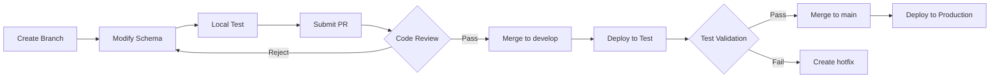

# Team Collaboration

Learn how to effectively use JustDB in a team environment, ensuring traceability and consistency of schema changes.

## Schema Version Control

### Git Workflow

#### Branch Strategy

```bash
# Main branch
main (production)
├── develop (development)
    ├── feature/add-user-phone
    ├── feature/add-order-status
    └── feature/refactor-payment-table
```

#### Commit Conventions

```bash
# Good commit messages
git commit -m "feat(users): add phone field for SMS verification"
git commit -m "fix(orders): correct payment_amount type to DECIMAL"
git commit -m "refactor(orders): rename status to order_status"

# Commit messages to avoid
git commit -m "update schema"
git commit -m "fix bug"
```

#### Schema File Organization

```
justdb/
├── core/
│   ├── users.yaml
│   ├── roles.yaml
│   └── permissions.yaml
├── business/
│   ├── orders.yaml
│   ├── products.yaml
│   └── payments.yaml
└── config/
    ├── dev.yaml
    ├── test.yaml
    └── prod.yaml
```

### Code Review

#### PR Template

```markdown
## Schema Change Description

### Change Type
- [ ] Add table
- [ ] Modify table
- [ ] Drop table
- [ ] Rename

### Impact Scope
- Modified tables: users, orders
- New indexes: idx_users_phone
- Data migration: None

### Test Plan
- [ ] Development environment test passed
- [ ] Test environment test passed
- [ ] Performance test passed

### Checklist
- [ ] Used formerNames (if renaming)
- [ ] Added complete comments
- [ ] Considered rollback plan
- [ ] Updated related documentation
```

#### Review Points

**Schema Review**:
```yaml
# Check 1: Field types
Column:
  - name: amount
    type: DECIMAL(10, 2)  # Correct: Use DECIMAL for amounts
    # type: FLOAT         # Wrong: Imprecise

# Check 2: Constraints
Column:
  - name: email
    type: VARCHAR(100)
    nullable: false      # Correct: Required field set to not null
    unique: true         # Correct: Unique field set to unique constraint

# Check 3: Index strategy
Index:
  - name: idx_user_id
    columns: [user_id]   # Correct: Add index for foreign key
  - name: idx_status
    columns: [status]    # Consider: Is status selective enough?

# Check 4: Rename handling
Column:
  - name: user_name
    formerNames: [username]  # Correct: Use formerNames
    type: VARCHAR(50)
```

## Collaboration Workflow

### Development Process



### Branch Naming Conventions

```bash
# Feature branches
feature/add-phone-field
feature/order-status-enum

# Fix branches
fix/user-email-length
fix/payment-decimal-type

# Refactor branches
refactor/normalize-table-names
refactor/index-optimization

# Hotfix branches
hotfix/critical-user-data
hotfix/production-deployment
```

### Conflict Resolution

#### Schema Conflicts

**Scenario**: Two developers modify the same table simultaneously

```yaml
# Developer A's changes
Table:
  - name: users
    Column:
      - name: phone
        type: VARCHAR(20)

# Developer B's changes
Table:
  - name: users
    Column:
      - name: address
        type: VARCHAR(200)
```

**After merge**:
```yaml
Table:
  - name: users
    Column:
      - name: phone      # A's change
        type: VARCHAR(20)
      - name: address    # B's change
        type: VARCHAR(200)
```

#### Resolution Steps

```bash
# 1. Pull latest code
git pull origin develop

# 2. Resolve conflicts
vim justdb/users.yaml

# 3. Validate schema
justdb validate

# 4. Test migration
justdb migrate --dry-run

# 5. Commit merge
git add justdb/users.yaml
git commit -m "Merge remote-tracking branch 'origin/feature/xxx'"
```

## Environment Management

### Multi-Environment Configuration

```yaml
# justdb/config/dev.yaml
database:
  url: jdbc:mysql://dev-db.internal:3306/myapp_dev
  username: ${DEV_DB_USER}
  password: ${DEV_DB_PASS}

schema:
  locations:
    - ./justdb/core
    - ./justdb/business

# justdb/config/test.yaml
database:
  url: jdbc:mysql://test-db.internal:3306/myapp_test
  username: ${TEST_DB_USER}
  password: ${TEST_DB_PASS}

# justdb/config/prod.yaml
database:
  url: jdbc:mysql://prod-db.internal:3306/myapp
  username: ${PROD_DB_USER}
  password: ${PROD_DB_PASS}
  options:
    - ssl=true
    - useSSL=true
```

### Environment Synchronization

```bash
# Extract schema from production
justdb db2schema \
  -u jdbc:mysql://prod-db:3306/myapp \
  -o prod-schema.yaml

# Compare differences
justdb diff -s prod-schema.yaml

# Sync to development environment
justdb migrate -c config/dev.yaml
```

## CI/CD Integration

### GitLab CI Example

```yaml
# .gitlab-ci.yml
stages:
  - validate
  - test
  - deploy

variables:
  MAVEN_OPTS: "-Dmaven.repo.local=$CI_PROJECT_DIR/.m2/repository"

# Validate schema
validate:schema:
  stage: validate
  image: maven:3.8-openjdk-11
  script:
    - mvn validate
    - justdb validate
  artifacts:
    paths:
      - justdb/

# Test migration
test:migration:
  stage: test
  image: maven:3.8-openjdk-11
  services:
    - mysql:8.0
  variables:
    MYSQL_DATABASE: test_db
    MYSQL_ROOT_PASSWORD: test_pass
  script:
    - justdb migrate -c config/test.yaml --dry-run
    - justdb migrate -c config/test.yaml
    - mvn test

# Deploy to development
deploy:dev:
  stage: deploy
  image: justdb:latest
  script:
    - justdb migrate -c config/dev.yaml
  only:
    - develop

# Deploy to production
deploy:prod:
  stage: deploy
  image: justdb:latest
  script:
    - justdb validate
    - justdb migrate -c config/prod.yaml --dry-run
    - justdb backup -o backup.sql
    - justdb migrate -c config/prod.yaml
  only:
    - main
  when: manual
```

### GitHub Actions Example

```yaml
# .github/workflows/ci.yml
name: JustDB CI/CD

on:
  push:
    branches: [ main, develop ]
  pull_request:
    branches: [ main ]

jobs:
  validate:
    runs-on: ubuntu-latest
    steps:
      - uses: actions/checkout@v3
      - name: Set up JDK 11
        uses: actions/setup-java@v3
        with:
          java-version: '11'
          distribution: 'temurin'
      - name: Validate Schema
        run: |
          mvn validate
          justdb validate

  test:
    runs-on: ubuntu-latest
    services:
      mysql:
        image: mysql:8.0
        env:
          MYSQL_ROOT_PASSWORD: test
          MYSQL_DATABASE: test_db
        ports:
          - 3306:3306
    steps:
      - uses: actions/checkout@v3
      - name: Test Migration
        run: |
          justdb migrate -c config/test.yaml
          mvn test

  deploy-dev:
    needs: [validate, test]
    runs-on: ubuntu-latest
    if: github.ref == 'refs/heads/develop'
    steps:
      - name: Deploy to Dev
        run: |
          justdb migrate -c config/dev.yaml

  deploy-prod:
    needs: [validate, test]
    runs-on: ubuntu-latest
    if: github.ref == 'refs/heads/main'
    environment:
      name: production
      url: https://api.example.com
    steps:
      - name: Deploy to Production
        run: |
          justdb migrate -c config/prod.yaml --dry-run
          justdb backup -o backup.sql
          justdb migrate -c config/prod.yaml
```

## Documentation Management

### Schema Documentation

```yaml
# justdb/README.md
# MyApp Schema Documentation

## Database Structure

### Core Tables
- `users` - User table
- `roles` - Role table
- `permissions` - Permission table

### Business Tables
- `orders` - Order table
- `products` - Product table
- `payments` - Payment table

## Recent Changes

### 2024-01-15
- Added user phone field (feature/add-user-phone)
- Modified order status enum (feature/order-status-enum)

## Migration History

Run `justdb history` to view complete migration history.
```

### Changelog

```bash
# Auto-generate changelog
justdb changelog > CHANGELOG.md

# CHANGELOG.md
# # Changelog
#
# ## [1.2.0] - 2024-01-15
#
# ### Added
# - users.phone field
# - orders.status enum
#
# ### Changed
# - payments.amount type to DECIMAL(12,2)
#
# ### Fixed
# - users.email length constraint
```

## Best Practices

### 1. Schema Design Principles

```yaml
# Good practice: Single responsibility
Table:
  - name: users           # Only store user information
    Column:
      - name: id
        type: BIGINT
      - name: username
        type: VARCHAR(50)

# Avoid: Mixed responsibilities
Table:
  - name: users
    Column:
      - name: id
        type: BIGINT
      - name: order_id    # Shouldn't be here
        type: BIGINT
```

### 2. Naming Conventions

```yaml
# Good practice: Consistent naming
Table:
  - name: users           # Lowercase plural table names
    Column:
      - name: user_id     # Foreign key: table_name_id
        type: BIGINT
      - name: created_at  # Timestamp: _at suffix
        type: TIMESTAMP
      - name: is_active   # Boolean: is_ prefix
        type: BOOLEAN

# Avoid: Inconsistent naming
Table:
  - name: User            # Avoid: Uppercase
    Column:
      - name: UserID      # Avoid: CamelCase
        type: BigInt      # Avoid: Uppercase types
```

### 3. Comment Completeness

```yaml
# Good practice: Complete comments
Table:
  - name: orders
    comment: Order table, stores all order information
    Column:
      - name: order_no
        type: VARCHAR(50)
        comment: Order number, format: YYYYMMDD + 6-digit sequence
      - name: total_amount
        type: DECIMAL(12, 2)
        comment: Order total amount, unit: cents

# Avoid: Missing comments
Table:
  - name: orders
    Column:
      - name: order_no
        type: VARCHAR(50)
```

### 4. Review Checklist

**Pre-commit checks**:
- [ ] Schema syntax is correct
- [ ] Used formerNames (if renaming)
- [ ] Added complete comments
- [ ] Index configuration is reasonable
- [ ] Considered data migration
- [ ] Local tests passed

**Pre-merge checks**:
- [ ] Code review passed
- [ ] Test environment validation passed
- [ ] Updated related documentation
- [ ] Notified team members

### 5. Communication Mechanism

```markdown
## Schema Change Notification

@all Database migration即将进行:

**Impact Scope**:
- Modified tables: users, orders
- Expected downtime: None (online migration)
- Migration time: 2024-01-15 22:00

**Notes**:
- Adding phone field to users table
- Modifying status field type in orders table

**Rollback Plan**:
If issues arise, contact @dbadmin
```

## Next Steps

<VPCard
  title="Performance"
  desc="Optimize schema and migration performance"
  link="/en/guide/performance.html"
/>

<VPCard
  title="CI/CD Integration"
  desc="Detailed CI/CD configuration guide"
  link="/en/guide/cicd.html"
/>

<VPCard
  title="Configuration Reference"
  desc="Complete configuration options documentation"
  link="/en/guide/config-reference.html"
/>
