# What is JustDB

JustDB is an innovative **multi-language database development platform** that revolutionizes traditional database development. Through declarative Schema definition and intelligent diff calculation, database development becomes simple, efficient, and reliable.

## Multi-Language Ecosystem

JustDB supports a wide range of programming languages through multiple access methods:

| Access Method | Supported Languages | Status |
|--------------|-------------------|--------|
| **CLI** | All languages | ✅ Implemented |
| **JDBC Driver** | Java, Kotlin, Scala, Groovy | ✅ Implemented |
| **ORM Model Generation** | Java, Python, TypeScript, Go | ✅ Implemented |
| **Remote Service** | All HTTP-supported languages | ✅ Implemented |
| **MySQL Protocol Service** | All MySQL-supported languages | ✅ Implemented |
| **MCP Service** | AI Apps (Claude, Cursor, etc.) | ✅ Implemented |

### Command Line Interface (CLI)

JustDB CLI can be called from scripts or build tools in any language:

```bash
# Shell script
justdb migrate

# Python script
subprocess.run(["justdb", "migrate"])

# Node.js
child_process.exec("justdb migrate")

# Go
exec.Command("justdb", "migrate").Run()
```

### JDBC Driver

JVM languages can use JustDB JDBC driver directly:

```java
// Java
Connection conn = DriverManager.getConnection("jdbc:justdb:schema.yaml");

// Kotlin
val conn = DriverManager.getConnection("jdbc:justdb:schema.yaml")

// Scala
val conn = DriverManager.getConnection("jdbc:justdb:schema.yaml")

// Groovy
def conn = DriverManager.getConnection("jdbc:justdb:schema.yaml")
```

### ORM Model Generation

JustDB can generate ORM models for multiple languages:

- **Java**: JPA/Hibernate, MyBatis
- **Python**: SQLAlchemy, Django
- **TypeScript**: Prisma, TypeORM
- **Go**: GORM, sqlx

::: tip Multi-Language Teams
For multi-language teams, JustDB provides a unified Schema definition, then generates corresponding ORM models for each language, ensuring database structure consistency.
:::

## Core Philosophy

### Pain Points of Traditional Database Development

Traditional database development workflow looks like this:

```mermaid
flowchart TB
    A[📋 Design Table Structure]
    B1[❌ CREATE TABLE<br/>Hand-write SQL]
    B2[⚠️ ALTER TABLE<br/>Worry about data loss]
    B3[🔧 INSERT/UPDATE<br/>Manual data migration]
    B4[💣 DROP TABLE<br/>Fear of dropping wrong table]

    C[😰 Script execution order?<br/>Error handling?<br/>Rollback plan?]

    classDef problemNode fill:#fee2e2,stroke:#ef4444,stroke-width:2px,color:#991b1b,rx:0,font-weight:bold
    classDef painNode fill:#fef3c7,stroke:#f59e0b,stroke-width:3px,color:#92400e,rx:0,stroke-dasharray: 5 5,font-weight:bold

    class A,B1,B2,B3,B4 problemNode
    class C painNode

    A -.->|scattered| B1
    A -.->|scattered| B2
    A -.->|scattered| B3
    A -.->|scattered| B4

    B1 -->|uncertain| C
    B2 -->|uncertain| C
    B3 -->|uncertain| C
    B4 -->|high risk| C
```



This approach has the following problems:

- **Error-prone SQL** - Syntax errors, type errors, missing constraints
- **Difficult change management** - Manually maintaining migration scripts is error-prone
- **Complex multi-environment sync** - Dev, test, and production environments easily become inconsistent
- **Separated docs and code** - Schema design documentation may be out of sync with actual database
- **Difficult team collaboration** - Need to coordinate execution order of SQL scripts written by multiple people

### JustDB's Solution

JustDB simplifies database development to:

```mermaid
flowchart LR
    A[✨ Declare Desired State<br/>XML/YAML/JSON/SQL/TOML]
    B[🤖 Auto Calculate Diff<br/>Smart comparison]
    C[🚀 Auto Execute Changes<br/>Safe and reliable]
    D[🔄 One-click Rollback<br/>Revert anytime]

    classDef smoothNode fill:#dbeafe,stroke:#3b82f6,stroke-width:2px,color:#1e40af,rx:10,font-weight:bold
    classDef happyNode fill:#dcfce7,stroke:#22c55e,stroke-width:2px,color:#166534,rx:10,font-weight:bold

    class A,B smoothNode
    class C,D happyNode

    A ==>|smooth flow| B
    B ==>|auto complete| C
    B -.->|optional| D
```



**Focus on "what you want", not "how to do it"**

## Key Features

### 1. Declarative Schema Definition

Declare your desired database structure using XML, YAML, JSON, SQL, TOML and other formats:

::: code-tabs
@tab XML
```xml
<!-- users.xml - This is exactly what your database should look like -->
<?xml version="1.0" encoding="UTF-8"?>
<Justdb namespace="com.example">
    <Table id="users" name="User Table" comment="Store system user information">
        <Column name="id" type="BIGINT" primaryKey="true" autoIncrement="true"
                comment="User ID, primary key auto-increment"/>
        <Column name="username" type="VARCHAR(50)" nullable="false"
                comment="Username, cannot be null"/>
        <Column name="email" type="VARCHAR(100)" comment="Email address"/>
        <Column name="created_at" type="TIMESTAMP" nullable="false"
                defaultValueComputed="CURRENT_TIMESTAMP" comment="Creation time"/>
    </Table>
</Justdb>
```

@tab YAML
```yaml
# users.yaml - This is exactly what your database should look like
namespace: com.example
Table:
  - id: users
    name: User Table
    comment: Store system user information
    Column:
      - name: id
        type: BIGINT
        primaryKey: true
        autoIncrement: true
        comment: User ID, primary key auto-increment
      - name: username
        type: VARCHAR(50)
        nullable: false
        comment: Username, cannot be null
      - name: email
        type: VARCHAR(100)
        comment: Email address
      - name: created_at
        type: TIMESTAMP
        nullable: false
        defaultValueComputed: CURRENT_TIMESTAMP
        comment: Creation time
```

@tab JSON
```json
{
  "namespace": "com.example",
  "Table": [
    {
      "id": "users",
      "name": "User Table",
      "comment": "Store system user information",
      "Column": [
        {
          "name": "id",
          "type": "BIGINT",
          "primaryKey": true,
          "autoIncrement": true,
          "comment": "User ID, primary key auto-increment"
        },
        {
          "name": "username",
          "type": "VARCHAR(50)",
          "nullable": false,
          "comment": "Username, cannot be null"
        },
        {
          "name": "email",
          "type": "VARCHAR(100)",
          "comment": "Email address"
        },
        {
          "name": "created_at",
          "type": "TIMESTAMP",
          "nullable": false,
          "defaultValueComputed": "CURRENT_TIMESTAMP",
          "comment": "Creation time"
        }
      ]
    }
  ]
}
```

@tab SQL
```sql
-- schema.sql
-- JustDB also supports SQL format for Schema definition

CREATE TABLE users (
    id BIGINT PRIMARY KEY AUTO_INCREMENT COMMENT 'User ID, primary key auto-increment',
    username VARCHAR(50) NOT NULL COMMENT 'Username, cannot be null',
    email VARCHAR(100) COMMENT 'Email address',
    created_at TIMESTAMP NOT NULL DEFAULT CURRENT_TIMESTAMP COMMENT 'Creation time'
) COMMENT 'User Table';

-- Or use standard SQL comments
ALTER TABLE users COMMENT 'Store system user information';
```

@tab TOML
```toml
namespace = "com.example"

[[Table]]
id = "users"
name = "User Table"
comment = "Store system user information"

[[Table.Column]]
name = "id"
type = "BIGINT"
primaryKey = true
autoIncrement = true
comment = "User ID, primary key auto-increment"

[[Table.Column]]
name = "username"
type = "VARCHAR(50)"
nullable = false
comment = "Username, cannot be null"

[[Table.Column]]
name = "email"
type = "VARCHAR(100)"
comment = "Email address"

[[Table.Column]]
name = "created_at"
type = "TIMESTAMP"
nullable = true
defaultValueComputed = "CURRENT_TIMESTAMP"
comment = "Creation time"
```

@tab Properties
```properties
namespace=com.example

table.users.id=users
table.users.name=User Table
table.users.comment=Store system user information

table.users.column.id.name=id
table.users.column.id.type=BIGINT
table.users.column.id.primaryKey=true
table.users.column.id.autoIncrement=true
table.users.column.id.comment=User ID, primary key auto-increment

table.users.column.username.name=username
table.users.column.username.type=VARCHAR(50)
table.users.column.username.nullable=false
table.users.column.username.comment=Username, cannot be null

table.users.column.email.name=email
table.users.column.email.type=VARCHAR(100)
table.users.column.email.comment=Email address

table.users.column.created_at.name=created_at
table.users.column.created_at.type=TIMESTAMP
table.users.column.created_at.nullable=false
table.users.column.created_at.defaultValueComputed=CURRENT_TIMESTAMP
table.users.column.created_at.comment=Creation time
```
:::

### 2. Intelligent Diff Calculation

When you modify your Schema, JustDB automatically calculates changes and only executes necessary SQL:

::: code-tabs
@tab XML
```xml
<!-- Modified - added avatar field -->
<Table id="users">
    <Column name="id" type="BIGINT" primaryKey="true"/>
    <Column name="username" type="VARCHAR(50)"/>
    <Column name="email" type="VARCHAR(100)"/>
    <Column name="avatar" type="VARCHAR(500)"/> <!-- New -->
    <Column name="created_at" type="TIMESTAMP"/>
</Table>
```

@tab YAML
```yaml
# Modified - added avatar field
Column:
  - name: id
    type: BIGINT
    primaryKey: true
  - name: username
    type: VARCHAR(50)
  - name: email
    type: VARCHAR(100)
  - name: avatar      # New
    type: VARCHAR(500) # New
  - name: created_at
    type: TIMESTAMP
```

@tab JSON
```json
{
  "Column": [
    {"name": "id", "type": "BIGINT", "primaryKey": true},
    {"name": "username", "type": "VARCHAR(50)"},
    {"name": "email", "type": "VARCHAR(100)"},
    {"name": "avatar", "type": "VARCHAR(500)"},
    {"name": "created_at", "type": "TIMESTAMP"}
  ]
}
```

@tab TOML
```toml
# Modified - added avatar field
[[Table.Column]]
name = "id"
type = "BIGINT"
primaryKey = true

[[Table.Column]]
name = "username"
type = "VARCHAR(50)"

[[Table.Column]]
name = "email"
type = "VARCHAR(100)"

[[Table.Column]]
name = "avatar"      # New
type = "VARCHAR(500)"

[[Table.Column]]
name = "created_at"
type = "TIMESTAMP"
```

@tab SQL
```sql
-- Modified - added avatar field
-- JustDB parses SQL format Schema definition and calculates diff

ALTER TABLE users ADD COLUMN avatar VARCHAR(500) COMMENT 'User avatar';
```

@tab Properties
```properties
# Modified - added avatar field
table.users.column.id.name=id
table.users.column.id.type=BIGINT
table.users.column.id.primaryKey=true
table.users.column.username.name=username
table.users.column.username.type=VARCHAR(50)
table.users.column.email.name=email
table.users.column.email.type=VARCHAR(100)
table.users.column.avatar.name=avatar      # New
table.users.column.avatar.type=VARCHAR(500) # New
table.users.column.created_at.name=created_at
table.users.column.created_at.type=TIMESTAMP
```
:::

JustDB automatically generates and executes:

```sql
ALTER TABLE users ADD COLUMN avatar VARCHAR(500);
```

### 3. Multi-Format Support

JustDB supports almost all common data formats. You can choose the one that best fits your team:

::: code-tabs
@tab XML
```xml
<Justdb>
  <Table name="users">
    <Column name="id" type="BIGINT" primaryKey="true"/>
  </Table>
</Justdb>
```

@tab YAML
```yaml
Table:
  - name: users
    Column:
      - name: id
        type: BIGINT
        primaryKey: true
```

@tab JSON
```json
{
  "Table": [
    {
      "name": "users",
      "Column": [
        {
          "name": "id",
          "type": "BIGINT",
          "primaryKey": true
        }
      ]
    }
  ]
}
```

@tab TOML
```toml
[[Table]]
name = "users"

[[Table.Column]]
name = "id"
type = "BIGINT"
primaryKey = true
```

@tab SQL
```sql
CREATE TABLE users (
    id BIGINT PRIMARY KEY
);
```

@tab Properties
```properties
table.users.name=users
table.users.column.id.name=id
table.users.column.id.type=BIGINT
table.users.column.id.primaryKey=true
```
:::

### 4. AI Integration

Directly operate database Schema through natural language:

```bash
justdb ai "Add an order table with order number, customer ID, amount and status"
```

AI automatically generates Schema definition. You just need to confirm and deploy.

### 5. Complete JDBC Driver

JustDB provides a complete JDBC 4.2 driver implementation supporting:

- Standard SQL queries (SELECT, INSERT, UPDATE, DELETE)
- JOIN queries
- Aggregate functions (COUNT, SUM, AVG, MIN, MAX)
- Transaction management
- Batch operations

```java
// Using JustDB JDBC driver
try (Connection conn = DriverManager.getConnection(
        "jdbc:justdb:schema.yaml", null, null);
     Statement stmt = conn.createStatement();
     ResultSet rs = stmt.executeQuery("SELECT * FROM users")) {
    while (rs.next()) {
        System.out.println(rs.getString("username"));
    }
}
```

### 6. Spring Boot Integration

Out-of-the-box Spring Boot Starter. Automatically executes database migration when application starts:

```yaml
# application.yml
justdb:
  enabled: true
  locations: classpath:justdb
  dry-run: false
```

```java
@SpringBootApplication
public class Application {
    public static void main(String[] args) {
        SpringApplication.run(Application.class, args);
        // Database is automatically migrated to the latest state!
    }
}
```

### 7. Multi-Language ORM Model Generation

JustDB supports generating ORM models for multiple programming languages and frameworks:

::: code-tabs
@tab Java
```bash
# Generate JPA/Hibernate entities
justdb schema2orm --input schema.xml --type jpa-entity --output src/main/java/

# Generate MyBatis beans
justdb schema2orm --input schema.xml --type mybatis-bean --output src/main/java/
```

@tab Python
```bash
# Generate SQLAlchemy models
justdb schema2orm --input schema.xml --type sqlalchemy --output models.py

# Generate Django models
justdb schema2orm --input schema.xml --type django --output models.py
```

@tab TypeScript
```bash
# Generate Prisma schema
justdb schema2orm --input schema.xml --type prisma --output schema.prisma

# Generate TypeORM entities
justdb schema2orm --input schema.xml --type typeorm --output entities/
```

@tab Go
```bash
# Generate GORM models
justdb schema2orm --input schema.xml --type gorm --output models.go

# Generate sqlx models
justdb schema2orm --input schema.xml --type sqlx --output models.go
```
:::

**Supported ORM Frameworks:**

| Language | Frameworks |
|----------|-----------|
| Java | JPA/Hibernate, MyBatis |
| Python | SQLAlchemy, Django |
| TypeScript | Prisma, TypeORM |
| Go | GORM, sqlx |

### 8. ORM Import

JustDB not only generates ORM models, but also supports importing Schema from existing ORM projects:

```bash
# Import from Prisma
justdb orm2schema --input prisma/schema.prisma --orm prisma --output schema.yaml

# Import from SQLAlchemy
justdb orm2schema --input models/ --orm sqlalchemy --output schema.yaml

# Import from GORM
justdb orm2schema --input models.go --orm gorm --output schema.yaml
```

### 9. Atlas Integration

JustDB can work with Atlas ORM import tools:

```bash
# 1. Use Atlas to generate DDL
atlas schema diff --from "ent://schema" --to "mysql://localhost/db" --format '{{ sql . }}' > schema.sql

# 2. Create temporary database and import DDL
mysql -u root -p temp_db < schema.sql

# 3. Use JustDB to extract schema
justdb db2schema --db-url "jdbc:mysql://localhost:3306/temp_db" --output schema.yaml
```

## Use Cases

### 1. Agile Development

Quickly iterate database Schema without writing SQL:

```bash
# Modify Schema
vim users.yaml

# Apply changes
justdb migrate

# Done!
```

### 2. Database Documentation

Schema is documentation, documentation is Schema. The Schema file itself is the best database documentation:

```yaml
Table:
  - id: orders
    name: Order Table
    comment: Store all order information
    Column:
      - name: order_no
        comment: Order number, unique identifier
```

### 3. Multi-Environment Consistency

Ensure dev, test, and production environments remain completely consistent:

```bash
# Development environment
justdb migrate -c dev-config.yaml

# Test environment
justdb migrate -c test-config.yaml

# Production environment
justdb migrate -c prod-config.yaml
```

### 4. Version Control Friendly

Put Schema under Git version control to easily track change history:

```bash
git add users.yaml
git commit -m "Add user avatar field"
git push

# Team members execute
justdb migrate
```

### 5. CI/CD Integration

Automatically manage database in continuous integration workflow:

```yaml
# .github/workflows/ci.yml
- name: Migrate Database
  run: |
    justdb migrate --dry-run  # Preview changes first
    justdb migrate            # Execute migration
```

## Technical Architecture

JustDB adopts a layered architecture design:


## Supported Databases

JustDB supports 30+ databases, including but not limited to:

::: tip Database Support
- **MySQL** - 5.6, 5.7, 8.0+
- **PostgreSQL** - 9.x, 10.x, 11.x, 12.x, 13.x, 14.x
- **Oracle** - 11g, 12c, 19c, 21c
- **SQL Server** - 2012, 2014, 2016, 2019
- **H2** - 1.x, 2.x
- **SQLite** - 3.x
- **MariaDB** - 10.x, 11.x
- **TiDB** - 3.x, 4.x, 5.x
- **Dameng** - DM7, DM8
- **KingBase** - KingBase
- **GBase** - 8s
- **OceanBase** - 2.x, 3.x, 4.x
:::

## Design Principles

### 1. Declarative First

Tell the tool **what you want**, not **how to do it**:

```yaml
# Good - Declarative
Table:
  - name: users
    Column: [...]

# Avoid - Imperative
CREATE TABLE users (...);
ALTER TABLE users ADD COLUMN ...;
```

### 2. Convention Over Configuration

Follow conventions, reduce configuration. Default search paths:

```
./justdb/
./db/
./
classpath:justdb/
```

### 3. Extensibility

Support new databases and custom extensions through plugin system:

```java
// Custom database adapter
public class MyDatabaseAdapter extends DatabaseAdapter {
    // Implement specific database adaptation logic
}
```

### 4. Human-AI Friendly Formats

JustDB's Schema format design considers readability for both humans and AI:

**Human-Friendly:**
- YAML format is concise and intuitive, easy to read and write
- XML format has clear structure, suitable for enterprise projects
- JSON format fits APIs and automation tools
- Comments and documentation are inline in Schema

**AI-Friendly:**
- Structured data is easy for LLMs to parse and understand
- Explicit types and constraints reduce ambiguity
- Relationship definitions are clear (foreign keys, indexes, etc.)
- Can be directly provided to AI tools via MCP service

**Example: AI can directly understand this YAML**

```yaml
Table:
  - name: users
    comment: User table
    Column:
      - name: id
        type: BIGINT
        primaryKey: true
        autoIncrement: true
        comment: User ID
      - name: orders
        type: BIGINT
        nullable: false
        comment: Order ID (foreign key)
```

AI can accurately understand:
- Table name is `users`
- Has two fields: `id` (primary key) and `orders` (foreign key)
- The `orders` field relates to another table (relationship needs to be defined)

### 5. Broad Compatibility

**Alias System: Formats Are Doors to Convenience, Not Limitations**

JustDB's alias system supports multiple naming formats, making it convenient for users from different backgrounds:

- **Backward Compatibility**: Protect your investment, old version schemas continue to work
- **AI Compatibility**: Any AI, blind writing, all compatible
- **Human Compatibility**: Developers with different programming backgrounds can use familiar formats
- **Canonical Output**: Unified canonical naming ensures consistency

## Next Steps

<VPCard
  title="Quick Start"
  desc="Get started with JustDB in 5 minutes"
  link="/getting-started/quick-start.html"
/>

<VPCard
  title="Why JustDB"
  desc="Learn about JustDB's advantages over other tools"
  link="/guide/why-justdb.html"
/>

<VPCard
  title="Installation Guide"
  desc="Install and configure JustDB"
  link="/getting-started/installation.html"
/>
