# Why JustDB

## Comparison with Other Tools

### Traditional Database Migration Tools vs JustDB

Traditional database migration tools (like Flyway, Liquibase) use an **imperative** approach to manage database changes, requiring developers to write SQL scripts describing the change process. JustDB uses a **declarative** approach - you simply describe the desired database state, and the tool automatically calculates and executes changes.

| Feature | JustDB | Flyway | Liquibase |
|:---|:---:|:---:|:---:|
| **Declarative Schema** | ✅ | ❌ | ❌ |
| **Auto Diff Calculation** | ✅ | ❌ | ❌ |
| **Multi-Format Support** | ✅ | ❌ | ❌ |
| **AI Integration** | ✅ | ❌ | ❌ |
| **JDBC Driver** | ✅ | ❌ | ❌ |
| **Rollback Support** | ✅ | ✅ | ✅ |
| **Incremental Migration** | ✅ | ✅ | ✅ |
| **Multi-Database Support** | 30+ | Various | Various |
| **Schema Documentation** | ✅ | ❌ | Partial |
| **Natural Language Operations** | ✅ | ❌ | ❌ |

### Core Advantages

#### 1. Declarative vs Imperative

::: code-tabs
@tab JustDB (Declarative)
```yaml
# Just describe the desired state
Table:
  - name: users
    Column:
      - name: id
        type: BIGINT
        primaryKey: true
      - name: username
        type: VARCHAR(50)
      - name: email
        type: VARCHAR(100)
```

**Advantages**:
- Concise and intuitive, easy to understand
- Automatically handles change calculation
- Avoids human errors

@tab Flyway (Imperative)
```sql
-- V1__create_users_table.sql
CREATE TABLE users (
    id BIGINT PRIMARY KEY,
    username VARCHAR(50),
    email VARCHAR(100)
);

-- V2__add_phone_column.sql
ALTER TABLE users ADD COLUMN phone VARCHAR(20);
```

**Disadvantages**:
- Need to write SQL scripts manually
- Need to manage script versions and order
- Prone to syntax errors
- Difficult to modify existing changes

@tab Liquibase (Imperative)
```xml
<changeSet id="1" author="john">
    <createTable tableName="users">
        <column name="id" type="BIGINT">
            <constraints primaryKey="true"/>
        </column>
        <column name="username" type="VARCHAR(50)"/>
        <column name="email" type="VARCHAR(100)"/>
    </createTable>
</changeSet>

<changeSet id="2" author="john">
    <addColumn tableName="users">
        <column name="phone" type="VARCHAR(20)"/>
    </addColumn>
</changeSet>
```

**Disadvantages**:
- Verbose XML configuration
- Need to manage changeSet IDs
- Modifying existing changeSet causes errors
:::

#### 2. Intelligent Diff Calculation

JustDB automatically calculates Schema changes without writing ALTER TABLE statements:

```mermaid
flowchart TB
    A[📝 Modify Schema File]
    B[🔍 JustDB Calculates Diff]
    C{📋 Change Type}
    D[➕ Add Table/Column/Index]
    E[✏️ Modify Table/Column/Index]
    F[➖ Drop Table/Column/Index]
    G[🔄 Rename Table/Column]
    H[📄 Generate CREATE SQL]
    I[📝 Generate ALTER SQL]
    J[🗑️ Generate DROP SQL]
    K[✍️ Generate RENAME SQL]
    L[✅ Execute Changes]

    A --> B
    B --> C
    C --> D
    C --> E
    C --> F
    C --> G
    D --> H
    E --> I
    F --> J
    G --> K
    H --> L
    I --> L
    J --> L
    K --> L

    classDef startNode fill:#e0f2fe,stroke:#0284c7,stroke-width:2px,color:#0c4a6e,rx:10,font-weight:bold
    classDef processNode fill:#fef3c7,stroke:#f59e0b,stroke-width:2px,color:#92400e,rx:8
    classDef changeNode fill:#fce7f3,stroke:#db2777,stroke-width:2px,color:#831843,rx:8
    classDef sqlNode fill:#dbeafe,stroke:#3b82f6,stroke-width:2px,color:#1e40af,rx:8
    classDef endNode fill:#dcfce7,stroke:#22c55e,stroke-width:2px,color:#166534,rx:10,font-weight:bold

    class A startNode
    class B,C processNode
    class D,E,F,G changeNode
    class H,I,J,K sqlNode
    class L endNode
```



#### 3. Schema as Documentation

::: code-tabs
@tab JustDB
```yaml
# Schema file itself is the best documentation
Table:
  - id: users
    name: User Table
    comment: Store system user information
    Column:
      - name: id
        type: BIGINT
        primaryKey: true
        comment: User ID, primary key auto-increment
      - name: username
        type: VARCHAR(50)
        nullable: false
        comment: Username, cannot be null
```

**Advantages**:
- Schema and documentation always stay in sync
- Supports Markdown format export
- Can generate visual ER diagrams

@tab Traditional Approach
```sql
-- SQL scripts
CREATE TABLE users (
    id BIGINT PRIMARY KEY,
    username VARCHAR(50) NOT NULL
);

-- Need to maintain separate documentation (e.g., Confluence, Wiki)
-- Documentation easily becomes out of sync with actual database
```

**Disadvantages**:
- Need to maintain separate database documentation
- Documentation easily becomes out of sync with database
- Need to switch to other tools to view documentation
:::

#### 4. Multi-Format Support

JustDB supports multiple data formats to adapt to different team needs:

| Format | Use Case | Advantages |
|:---|:---|:---|
| **XML** | Enterprise applications | Type-safe, good tool support, clear structure |
| **YAML** | Configuration files | Human-friendly, good comment support |
| **JSON** | API interaction | Machine-readable, rich ecosystem |
| **TOML** | Modern applications | Concise syntax |
| **Properties** | Java applications | Simple configuration |
| **SQL** | Traditional databases | Compatible with existing scripts |
| **Markdown** | Documentation-driven | Documentation as code |
| **Excel** | Business users | Business-friendly, easy to edit |

#### 5. AI Integration

Operate database directly through natural language:

```bash
# Traditional: Need to write YAML/SQL manually
vim users.yaml
# Learn JustDB Schema syntax
# Write table definitions, column definitions...
justdb migrate

# JustDB AI: Natural language is enough
justdb ai "Create an order table with order number, customer ID, amount and status"
# AI automatically generates Schema, deploy directly
```

**AI Assistant Features**:
- Generate Schema from natural language
- Intelligent Schema optimization suggestions
- Automatically generate database documentation
- Schema change impact analysis

#### 6. JDBC Driver

JustDB provides a complete JDBC 4.2 driver that can be used directly in Java applications:

```java
// Traditional: Need to connect to real database
Connection conn = DriverManager.getConnection(
    "jdbc:mysql://localhost:3306/myapp", "user", "pass");

// JustDB: Schema file is the database
Connection conn = DriverManager.getConnection(
    "jdbc:justdb:schema.yaml", null, null);

// Support standard SQL queries
try (Statement stmt = conn.createStatement();
     ResultSet rs = stmt.executeQuery("SELECT * FROM users")) {
    while (rs.next()) {
        System.out.println(rs.getString("username"));
    }
}
```

**Advantages**:
- Develop and test without starting a real database
- Schema-driven query optimization
- Support for multiple database dialect switching

#### 7. Spring Boot Integration

Out-of-the-box Spring Boot Starter:

```yaml
# application.yml
justdb:
  enabled: true
  locations: classpath:justdb
  dry-run: false
  baseline-on-migrate: true
```

```java
@SpringBootApplication
public class Application {
    public static void main(String[] args) {
        SpringApplication.run(Application.class, args);
        // Database is automatically migrated to the latest state!
    }
}
```

**Advantages**:
- Zero configuration startup
- Automatic version management
- Integrated with Spring DataSource
- Support for transaction management

## Real Benefits

### Development Efficiency Improvement

| Task | Traditional | JustDB | Efficiency Gain |
|:---|:---|:---|---:|
| **Create New Table** | 10 min | 2 min | **5x** |
| **Add Column** | 5 min | 1 min | **5x** |
| **Modify Column Type** | 15 min | 2 min | **7.5x** |
| **Multi-Environment Sync** | 30 min | 5 min | **6x** |
| **Schema Documentation Update** | 20 min | 0 min | **∞** |

### Error Rate Reduction

::: tip Error Rate Comparison
- **SQL Syntax Errors**: Reduced by 90%
- **Data Type Mismatches**: Reduced by 85%
- **Missing Constraints**: Reduced by 80%
- **Migration Script Errors**: Reduced by 95%
:::

### Team Collaboration Improvement

::: info Collaboration Improvements
- **Code Review**: Schema changes at a glance
- **Conflict Resolution**: Git merge tools resolve directly
- **New Member Onboarding**: No need to learn SQL, just read YAML
- **Cross-team Collaboration**: Unified Schema definition language
:::

## Use Cases

### Recommended Scenarios for JustDB

<VPCard
  title="Agile Development Teams"
  desc="Rapidly iterate database Schema with frequent changes"
/>

<VPCard
  title="Microservices Architecture"
  desc="Each service manages database independently with version control"
/>

<VPCard
  title="Multi-Environment Deployment"
  desc="Keep development, test, and production environments consistent"
/>

<VPCard
  title="Documentation-Driven Development"
  desc="Want Schema as documentation, documentation as Schema"
/>

<VPCard
  title="CI/CD Integration"
  desc="Need to automatically manage database in continuous integration workflow"
/>

<VPCard
  title="Cross-Database Platform"
  desc="Need to support multiple database types"
/>

### Scenarios Requiring Consideration

::: warning Scenarios Needing Evaluation
- **Highly Customized Stored Procedures**: JustDB mainly focuses on Schema management, complex stored procedures may need additional handling
- **Existing Large Migration Scripts**: If the project already has many Flyway/Liquibase scripts, migration cost needs consideration
- **Very Special Database Features**: Some special database features may need support through plugin extensions
:::

## Migration Cost

### Migrating from Flyway

JustDB supports extracting Schema from existing databases:

```bash
# Extract Schema from existing database
justdb db2schema \
    -u jdbc:mysql://localhost:3306/myapp \
    -o schema.yaml

# View differences
justdb diff -c database-current -s schema.yaml

# Start managing with JustDB
justdb migrate
```

### Migrating from Liquibase

Similar process - JustDB can read existing database state and generate corresponding Schema definitions.

## Next Steps

<VPCard
  title="Design Philosophy"
  desc="Deep dive into JustDB's design philosophy"
  link="/guide/design-philosophy.html"
/>

<VPCard
  title="Use Cases"
  desc="View typical JustDB use cases"
  link="/guide/use-cases.html"
/>

<VPCard
  title="Quick Start"
  desc="Get started with JustDB in 5 minutes"
  link="/getting-started/quick-start.html"
/>
