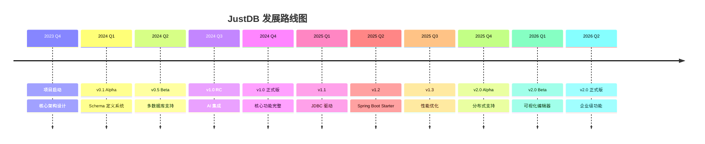

---------------------------
title: 产品路线图
icon: 🗺️
description: JustDB 产品发展路线图，展示已完成、进行中和计划中的功能
---------------------------

# 产品路线图

本文档展示 JustDB 项目的完整发展路线图，包括已完成功能、当前正在开发的功能以及未来规划。

## 时间线概览

## v1.0 已完成 ✅

**发布时间**: 2024 Q4

### 核心功能

#### Schema 定义系统
- ✅ 多格式支持：JSON、XML、YAML、Properties、TOML
- ✅ 声明式 Schema 定义
- ✅ 组件继承和复用 (referenceId)
- ✅ Schema 演进追踪 (formerNames)
- ✅ 生命周期钩子 (before/after Creates/Alters/Drops)

#### 多数据库支持
- ✅ 支持 30+ 数据库类型
  - MySQL, MariaDB, Percona
  - PostgreSQL, Redshift, TimescaleDB
  - Oracle, DB2, Derby, HSQLDB
  - SQL Server, SQLite, H2
  - 达梦、人大金仓、GBase、TiDB
- ✅ 统一的类型映射系统
- ✅ 数据库特定的扩展点

#### 模板系统
- ✅ Handlebars 模板引擎
- ✅ 多级继承和覆盖机制
- ✅ Lineage 模板 (mysql/postgres/ansi/sqlserver/sqlite)
- ✅ 模板注入 (injectBefore/injectAfter/injectReplace)

#### CLI 工具
- ✅ 交互式命令行模式
- ✅ Schema 加载和验证
- ✅ 数据库迁移命令
- ✅ Schema 导出 (db2schema)
- ✅ 批处理模式

#### AI 集成
- ✅ OpenAI GPT 集成
- ✅ 阿里云通义千问支持
- ✅ 百度文心一言支持
- ✅ 本地 Ollama 模型支持
- ✅ 自然语言 Schema 生成

#### 差异迁移
- ✅ Schema Diff 算法
- ✅ 智能增量 SQL 生成
- ✅ History 表追踪机制
- ✅ 幂等性支持
- ✅ 安全模式 (Safe Drop)

## v1.x 进行中 🚧

### v1.1 - JDBC 驱动 (预计 2025 Q1)

#### 核心功能
- 🔄 完整的 JDBC 4.2 驱动实现
- 🔄 基于 Apache Calcite 的 SQL 解析
- 🔄 Schema 作为数据源
- 🔄 支持标准 SQL 查询
- 🔄 连接 URL: `jdbc:justdb:schema-file-path`

#### 计划功能
- ⏳ 多 Schema 加载支持
- ⏳ Merge Migrate 模式
- ⏳ 数据条件过滤 (condition)
- ⏳ 原生函数支持 (150+ SQL 函数)

### v1.2 - Spring Boot 集成 (预计 2025 Q2)

#### 核心功能
- ⏳ Spring Boot Starter
- ⏳ 自动配置机制
- ⏳ Spring 事务集成
- ⏳ Actuator 健康检查
- ⏳ 配置属性绑定

#### 计划功能
- ⏳ MyBatis Plus 集成
- ⏳ Spring Data JPA 兼容
- ⏳ 多数据源支持

### v1.3 - 功能增强 (预计 2025 Q3)

#### 核心功能
- ⏳ CLI init 命令
- ⏳ 自动发现 Schema 文件
- ⏳ 默认加载机制（justdb/justdb.*）
- ⏳ Testcontainers 标准化

#### 架构改进
- ⏳ SchemaLoader 依赖注入（移除 getInstance）
- ⏳ JustdbManager/PluginManager 实例统一
- ⏳ Schema 内置 Plugin 支持
- ⏳ 模板系统独立化
- ⏳ 运行时引擎（justdb-runtime）

#### 性能优化
- ⏳ 内存优化（大型项目支持）
- ⏳ 流式加载 Schema
- ⏳ Hash 计算优化（忽略 remark）
- ⏳ Data 条件 SQL 更改

## v2.0 计划中 📋

### v2.0 - 分布式与企业级 (预计 2025 Q4 - 2026)

#### 分布式支持
- ⏳ 分库分表支持
- ⏳ 表继承和字段继承
- ⏳ Column Group 引用
- ⏳ 分布式事务
- ⏳ 跨库查询

#### 可视化编辑器
- ⏳ Web 版 Schema 编辑器
- ⏳ 实时预览
- ⏳ 拖拽式设计
- ⏳ 版本对比
- ⏳ 团队协作

#### 高级功能
- ⏳ Raw SQL 支持 (类似 MyBatis)
- ⏳ 版本兼容机制 (类似 Protobuf)
- ⏳ 关联表数据维护方案（用户-角色关系）
- ⏳ 报表分析功能
- ⏳ 外部 ORM 集成 (MCP 配置/Atlas provider)
- ⏳ Import/Include/Ref-id 支持
- ⏳ Schema 嵌套创建（类 Builder 模型）
- ⏳ ER 图生成（justdb erd）

#### Plugin 系统
- ⏳ Adapter 集成 Driver 属性（版本号、Maven 坐标）
- ⏳ 动态 Plugin 加载（Maven URL、文件 URL）
- ⏳ 扩展下载支持（git、oss、minio、s3）
- ⏳ Pre-init Schema 支持
- ⏳ Script 插件扩展（text、list、json、xml、yaml、toml、properties）

#### 导出工具
- ⏳ Web 版导出工具
- ⏳ 命令行导出工具
- ⏳ 脚本版导出工具
- ⏳ Excel 文件导出
- ⏳ 一键导出 SQL

#### 跨语言支持
- ⏳ JavaScript/TypeScript 版本
- ⏳ Node.js 工具
- ⏳ 浏览器版工具
- ⏳ 完全兼容 Java 版的 Plugin 和 Schema 系统

## 长期愿景 🔭

### AI 数据库助手

- 🤖 智能 Schema 设计建议
- 🤖 自动索引优化
- 🤖 性能问题诊断
- 🤖 自然语言查询转换
- 🤖 自动数据迁移

### 多云管理

- ☁️ 跨云数据库管理
- ☁️ 统一的多云视图
- ☁️ 云原生部署支持
- ☁️ 成本优化建议

### 生态系统

- 🔌 插件市场
- 🔌 模板库
- 🔌 社区贡献的数据库适配器
- 🔌 第三方工具集成
- 🔌 官网（justdb.ai）
- 🔌 Logo 设计
- 🔌 多语言支持（中英双语）

### 企业级功能

- 🔐 审计日志
- 🔐 权限管理
- 🔐 数据脱敏
- 🔐 合规性报告

## 技术债务

### 已知限制

- 大型项目的内存占用
- 复杂查询的性能优化
- 并发迁移的锁机制
- 错误处理的完善

### 改进计划

- 引入流式处理支持大型 Schema
- 优化 SQL 生成性能
- 实现更细粒度的锁机制
- 完善错误信息和恢复建议

## 发布策略

### 版本规范

- **主版本 (Major)**: 重大架构变更或 API 不兼容
- **次版本 (Minor)**: 新功能向后兼容
- **修订版本 (Patch)**: Bug 修复和小改进

### 发布周期

- **主版本**: 每年 1-2 次
- **次版本**: 每季度 1 次
- **修订版本**: 按需发布

### 长期支持 (LTS)

计划每年选择一个次版本作为 LTS 版本，提供 2 年支持。

## 反馈与建议

我们欢迎社区反馈！如果您有任何建议或想法，请：

1. 在 [GitHub Issues](https://github.com/justdb/justdb/issues) 提交
2. 参与讨论现有功能请求
3. 投票影响优先级

---------------------------

**相关文档**:
- [当前 TODO](./current-todos.md)
- [历史计划](./historical-plans/)
- [贡献指南](/development/contributing/overview.md)
