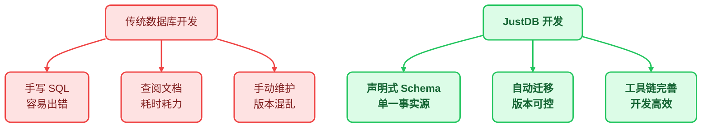
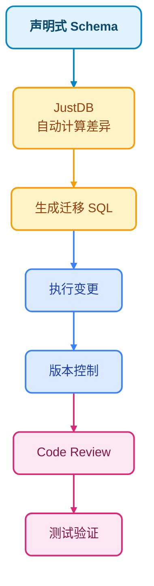
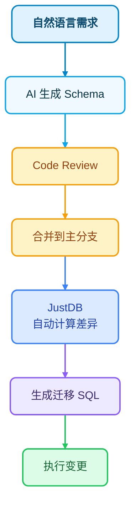

# JustDB 数据库开发指南

JustDB 为开发人员提供了现代化的数据库开发体验，通过声明式 Schema 定义和智能工具链，让数据库开发变得更简单、更高效。本文介绍如何使用 JustDB 进行日常数据库开发工作。

## 核心理念：声明式开发提升效率



## 开发人员日常使用场景

### 场景 1：快速创建新表

**传统方式**：
```bash
# 1. 手写 CREATE TABLE 语句
# 2. 检查字段类型、约束
# 3. 考虑索引设计
# 4. 编写迁移脚本
```

**JustDB 方式**：

```yaml
# 使用声明式 YAML 定义表结构
Table:
  - name: orders
    comment: 订单表
    Column:
      - name: id
        type: BIGINT
        primaryKey: true
        autoIncrement: true
      - name: order_no
        type: VARCHAR(32)
        nullable: false
        unique: true
      - name: user_id
        type: BIGINT
        nullable: false
      - name: total_amount
        type: DECIMAL(10,2)
        nullable: false
        defaultValue: "0.00"
      - name: status
        type: VARCHAR(20)
        nullable: false
        defaultValue: pending
      - name: created_at
        type: TIMESTAMP
        nullable: false
        defaultValueComputed: CURRENT_TIMESTAMP
    Index:
      - name: idx_user_id
        columns: [user_id]
      - name: idx_status
        columns: [status]
      - name: idx_created_at
        columns: [created_at]
```

**开发流程**：
```bash
# 1. 编辑 schema.yaml 文件
vim schema.yaml

# 2. 应用变更到数据库
justdb migrate

# 3. 验证表结构
justdb inspect --table orders
```

### 场景 2：使用 MySQL 客户端直接开发

JustDB 提供 MySQL 协议兼容层，可以直接使用熟悉的 MySQL 客户端工具：

```bash
# 启动 JustDB MySQL 服务器（端口 33206）
java -jar justdb-mysql-protocol.jar --port 33206 --schema ./schema.yaml

# 使用任何 MySQL 客户端连接！
mysql -h 127.0.0.1 -P 33206 -u root -p

# 或使用 MySQL Workbench、DBeaver、Navicat 等 GUI 工具
```

**代码中连接**：
```java
// 使用标准 MySQL JDBC Driver - 无需专用驱动！
String url = "jdbc:mysql://localhost:33206/justdb";
Connection conn = DriverManager.getConnection(url, "user", "password");

// 正常执行 SQL
ResultSet rs = conn.createStatement().executeQuery("SELECT * FROM orders");
```

**优势**：
- ✅ 无需学习新的 API
- ✅ 复用现有 MySQL 工具链
- ✅ 团队成员无学习成本
- ✅ 支持多语言（任何支持 MySQL 的语言）

### 场景 3：Schema 分析与优化

```yaml
# 完整的 Schema 定义便于分析
Table:
  - name: users
    Column:
      - name: id
        type: BIGINT
        primaryKey: true
      - name: email
        type: VARCHAR(100)
      - name: nickname
        type: VARCHAR(50)
        nullable: true
```

**使用 JustDB 工具分析**：
```bash
# 分析 Schema 质量
justdb analyze --schema schema.yaml

# 输出示例：
# ✓ 主键设计合理 - BIGINT 自增
# ✓ email 字段建议添加唯一索引
# ⚠ nickname 为可空，可能导致查询时需要 NULL 判断
# ⚚ 建议：添加 email 唯一约束
# ⚚ 建议：为 nickname 设置默认值或 NOT NULL
```

### 场景 4：虚拟列（Virtual Column）高级功能

JustDB 支持虚拟列，可以根据其他列动态计算值：

```yaml
Table:
  - name: products
    Column:
      - name: id
        type: BIGINT
        primaryKey: true
      - name: name
        type: VARCHAR(100)
      - name: price
        type: DECIMAL(10,2)
      # 虚拟列：自动计算折扣价
      - name: discounted_price
        type: DECIMAL(10,2)
        virtual: true
        expression: "price * 0.9"
      # 虚拟列：库存状态
      - name: stock_status
        type: VARCHAR(20)
        virtual: true
        expression: "CASE WHEN stock > 100 THEN '充足' WHEN stock > 0 THEN '紧张' ELSE '缺货' END"
```

### 场景 5：监控数据库变化

JustDB 的历史服务提供监控功能：

```java
// 监控特定表的变化
JustdbManager manager = JustdbManager.getInstance();
manager.addWatchListener("orders", (event) -> {
    switch (event.getType()) {
        case TABLE_ADDED:
            System.out.println("新表创建: " + event.getTableName());
            break;
        case COLUMN_ADDED:
            System.out.println("新列添加: " + event.getColumnName());
            break;
        case DATA_CHANGED:
            System.out.println("数据变化: " + event.getSql());
            break;
    }
});
```

**使用场景**：
- 🔄 实时同步到其他系统
- 📊 触发缓存更新
- 🔔 发送通知
- 📝 记录审计日志

### 场景 6：离线开发与测试

JustDB JDBC 驱动提供内存数据库功能：

```java
// 1. 加载 Schema（无需连接真实数据库）
Justdb justdb = SchemaLoader.load("schema.yaml");

// 2. 创建内存数据源
JustdbDataSource dataSource = new JustdbDataSource(justdb);

// 3. 在内存中执行 SQL 和业务逻辑
JustdbConnection conn = new JustdbConnection(dataSource);
// ... 开发和测试 ...

// 4. 真实环境部署时，只需要更改连接字符串
```

**优势**：
- ⚡ 无需启动数据库服务器
- 🧪 单元测试更快速
- 💻 本地开发更轻量
- 🔒 数据隔离更安全

## 开发最佳实践

### 1. Schema 即代码，Schema 即文档

```yaml
# Schema 文件既是代码，也是文档
Table:
  - name: orders
    comment: 订单表 - 存储用户订单信息
    Column:
      - name: id
        type: BIGINT
        primaryKey: true
        autoIncrement: true
        comment: 订单ID，主键自增
```

**工具支持**：
- 📖 生成 API 文档
- 🔍 检查设计缺陷
- 🎯 推荐优化建议

### 2. 版本控制友好的差异对比

```diff
# 添加新字段
Column:
  - name: order_no
    type: VARCHAR(32)
+   - name: payment_method
+     type: VARCHAR(20)
```

Git diff 清晰可见，Code Review 更高效！

### 3. 声明式 + 工具链双重保障



## 典型工作流程

### 工作流程 1：新功能开发

```bash
# 1. 定义 Schema
vim schema.yaml  # 编辑表结构

# 2. 生成迁移脚本
justdb diff --output migration.sql

# 3. Code Review 团队评审
git add schema.yaml migration.sql
git commit -m "feat: add user points system"

# 4. 在内存数据库中测试
justdb test --schema schema.yaml

# 5. 部署到生产环境
justdb migrate --database production
```

### 工作流程 2：紧急修复

```bash
# 1. 快速定位问题
justdb analyze --database production --schema schema.yaml

# 输出：发现 orders 表的 user_id 缺少索引

# 2. 更新 Schema
vim schema.yaml  # 添加索引

# 3. 生成安全的 ALTER TABLE 语句
justdb diff --safe-mode

# 4. Code Review + 合并
git add . && git commit -m "fix: add index on orders.user_id"

# 5. 应用变更
justdb migrate --auto-apply
```

### 工作流程 3：数据库重构

```bash
# 1. 分析现有数据库
justdb analyze --database production --schema schema.yaml

# 输出分析报告：
#    - 发现 5 个未使用的表
#    - 发现 12 个缺失的索引
#    - 发现 3 个命名不一致的列

# 2. 制定重构计划
vim refactor-plan.md

# 3. 分步骤执行重构
justdb migrate --step-1 --safe-mode
justdb migrate --step-2 --safe-mode
justdb migrate --step-3 --safe-mode
```

## 高级功能实战

### 1. 使用监控实现数据同步

```java
// 监听订单表变化，实时同步到 Redis
manager.addWatchListener("orders", (event) -> {
    if (event.getType() == WatchType.DATA_CHANGED) {
        // 查询变更的数据
        String orderId = extractOrderId(event.getSql());

        // 同步到 Redis
        redisTemplate.opsForValue().set("order:" + orderId,
            fetchOrder(orderId),
            Duration.ofHours(1));
    }
});
```

### 2. 使用 JDBC 驱动进行离线开发

```java
// 配置文件（开发环境）
spring:
  datasource:
    url: jdbc:justdb:memory:schema.yaml  # 内存模式
    # url: jdbc:mysql://localhost:33206/production  # 生产环境

// 业务代码无需修改
@Autowired
private JdbcTemplate jdbcTemplate;

public Order createOrder(Order order) {
    jdbcTemplate.update("INSERT INTO orders ...");
    return order;
}
```

### 3. 使用 MySQL 协议连接 BI 工具

```bash
# JustDB 作为 MySQL 服务器运行
java -jar justdb-mysql-protocol.jar --port 33206

# 在 BI 工具中配置 MySQL 连接
# Host: localhost
# Port: 33206
# Database: justdb
# User: root
# Password: ****

# 现在 PowerBI、Tableau、Superset 等工具都可以直接连接！
```

## 工具集成

### IDE 插件（推荐）

| IDE | 插件 | 功能 |
|-----|------|------|
| IntelliJ IDEA | JustDB Plugin | Schema 语法高亮、自动补全 |
| VS Code | JustDB Extension | YAML 支持、智能提示 |
| Vim | vim-justdb | 语法高亮 |

### CI/CD 集成

```yaml
# .gitlab-ci.yml
test:
  script:
    # 在内存数据库中运行测试
    - mvn test -Djustdb.schema=schema.yaml

    # 检查 Schema 质量
    - justdb validate --schema schema.yaml

    # 生成文档
    - justdb docs:generate --schema schema.yaml
```

## 常见问题

### Q1: Schema 定义后如何保证数据安全？

A: JustDB 提供多重保障：
- 每次变更前生成 SQL 预览
- 支持 dry-run 模式
- 自动生成回滚脚本
- 完整的变更历史记录

### Q2: 如何在团队中推广 JustDB？

A: 推荐步骤：
1. **培训**：组织 JustDB 培训
2. **模板**：建立 Schema 模板库
3. **规范**：制定 Code Review 检查清单
4. **工具**：配置 IDE 插件和 CI 集成

### Q3: 与现有数据库工具链兼容性如何？

A: JustDB 设计时充分考虑兼容性：
- MySQL 协议完全兼容
- 标准 JDBC 驱动支持
- 主流 BI 工具可直接连接
- 与现有 ORM 框架无缝集成

## 下一步

<VPCard title="快速开始" desc="5分钟快速上手 JustDB" link="/getting-started/quick-start.html" />

<VPCard title="设计哲学" desc="深入了解 JustDB 的设计思想" link="/guide/design-philosophy.html" />

<VPCard title="MySQL 协议" desc="了解 MySQL 协议兼容层" link="/design/jdbc-driver/mysql-protocol.html" />

<VPCard title="虚拟列" desc="探索虚拟列高级功能" link="/design/schema-system/virtual-columns.html" />
⚚ 建议：为 nickname 设置默认值或 NOT NULL
```

### 场景 4：虚拟列（Virtual Column）高级功能

JustDB 支持虚拟列，可以根据其他列动态计算值：

```yaml
Table:
  - name: products
    Column:
      - name: id
        type: BIGINT
        primaryKey: true
      - name: name
        type: VARCHAR(100)
      - name: price
        type: DECIMAL(10,2)
      # 虚拟列：自动计算折扣价
      - name: discounted_price
        type: DECIMAL(10,2)
        virtual: true
        expression: "price * 0.9"
      # 虚拟列：库存状态
      - name: stock_status
        type: VARCHAR(20)
        virtual: true
        expression: "CASE WHEN stock > 100 THEN '充足' WHEN stock > 0 THEN '紧张' ELSE '缺货' END"
```

**AI 对话**：
```markdown
你: 给商品表添加一个"库存状态"虚拟列，根据库存数量自动返回"充足/紧张/缺货"

AI: 建议添加虚拟列：
Column:
  - name: stock_status
    type: VARCHAR(20)
    virtual: true
    expression: "CASE WHEN stock > 100 THEN '充足' WHEN stock > 0 THEN '紧张' ELSE '缺货' END"
```

### 场景 5：Watch 功能 - 监控数据库变化

JustDB 的历史服务（History Service）提供 Watch 功能：

```java
// Watch 特定表的变化
JustdbManager manager = JustdbManager.getInstance();
manager.addWatchListener("orders", (event) -> {
    switch (event.getType()) {
        case TABLE_ADDED:
            System.out.println("新表创建: " + event.getTableName());
            break;
        case COLUMN_ADDED:
            System.out.println("新列添加: " + event.getColumnName());
            break;
        case DATA_CHANGED:
            System.out.println("数据变化: " + event.getSql());
            break;
    }
});
```

**使用场景**：
- 🔄 实时同步到其他系统
- 📊 触发缓存更新
- 🔔 发送通知
- 📝 记录审计日志

### 场景 6：离线开发与测试

JustDB JDBC 驱动提供内存数据库功能：

```java
// 1. 加载 Schema（无需连接真实数据库）
Justdb justdb = SchemaLoader.load("schema.yaml");

// 2. 创建内存数据源
JustdbDataSource dataSource = new JustdbDataSource(justdb);

// 3. 在内存中执行 SQL 和业务逻辑
JustdbConnection conn = new JustdbConnection(dataSource);
// ... 开发和测试 ...

// 4. 真实环境部署时，只需要更改连接字符串
```

**优势**：
- ⚡ 无需启动数据库服务器
- 🧪 单元测试更快速
- 💻 本地开发更轻量
- 🔒 数据隔离更安全

## AI 辅助开发的最佳实践

### 1. Schema 即代码，Schema 即文档

```yaml
# Schema 文件既是代码，也是文档
Table:
  - name: orders
    comment: 订单表 - 存储用户订单信息
    Column:
      - name: id
        type: BIGINT
        primaryKey: true
        autoIncrement: true
        comment: 订单ID，主键自增
```

**AI 可以**：
- 📖 理解业务逻辑
- 📝 生成 API 文档
- 🔍 检查设计缺陷
- 🎯 推荐优化建议

### 2. 版本控制友好的差异对比

```diff
# 添加新字段
Column:
  - name: order_no
    type: VARCHAR(32)
+   - name: payment_method
+     type: VARCHAR(20)
```

Git diff 清晰可见，Code Review 更高效！

### 3. 自然语言 + Code Review 双重保障



## 典型工作流程

### 工作流程 1：新功能开发

```bash
# 1. 与 AI 讨论需求
你: 我需要一个用户积分系统，包含积分表、等级表、积分记录表

AI: [生成 Schema 草稿]

# 2. Code Review 团队评审
git add schema.yaml
git commit -m "feat: add user points system"

# 3. JustDB 自动生成迁移 SQL
justdb migrate --schema schema.yaml --database production

# 4. 在内存数据库中测试
justdb test --schema schema.yaml
```

### 工作流程 2：紧急修复

```bash
# 1. AI 快速定位问题
你: orders 表的 user_id 缺少索引，导致查询慢

AI: 问题分析：
   - user_id 字段存在
   - 缺少索引
   - 建议添加：Index(name: idx_user_id, columns: [user_id])

# 2. 更新 Schema
vim schema.yaml  # 添加索引

# 3. Code Review + 合并
git add . && git commit -m "fix: add index on orders.user_id"

# 4. JustDB 自动生成 ALTER TABLE
justdb migrate --auto-apply
```

### 工作流程 3：数据库重构

```bash
# 1. AI 分析现有数据库
justdb analyze --database production --schema schema.yaml

# AI: 分析报告：
#    - 发现 5 个未使用的表
#    - 发现 12 个缺失的索引
#    - 发现 3 个命名不一致的列

# 2. AI 生成重构方案
AI: [生成重构后的 Schema]

# 3. 分步骤执行重构
justdb migrate --step-1 --safe-mode
justdb migrate --step-2 --safe-mode
justdb migrate --step-3 --safe-mode
```

## 高级功能实战

### 1. 使用 Watch 实现数据同步

```java
// 监听订单表变化，实时同步到 Redis
manager.addWatchListener("orders", (event) -> {
    if (event.getType() == WatchType.DATA_CHANGED) {
        // 查询变更的数据
        String orderId = extractOrderId(event.getSql());

        // 同步到 Redis
        redisTemplate.opsForValue().set("order:" + orderId,
            fetchOrder(orderId),
            Duration.ofHours(1));
    }
});
```

### 2. 使用 JDBC 驱动进行离线开发

```java
// 配置文件（开发环境）
spring:
  datasource:
    url: jdbc:justdb:memory:schema.yaml  # 内存模式
    # url: jdbc:mysql://localhost:33206/production  # 生产环境

// 业务代码无需修改
@Autowired
private JdbcTemplate jdbcTemplate;

public Order createOrder(Order order) {
    jdbcTemplate.update("INSERT INTO orders ...");
    return order;
}
```

### 3. 使用 MySQL 协议连接 BI 工具

```bash
# JustDB 作为 MySQL 服务器运行
java -jar justdb-mysql-protocol.jar --port 33206

# 在 BI 工具中配置 MySQL 连接
# Host: localhost
# Port: 33206
# Database: justdb
# User: root
# Password: ****

# 现在 PowerBI、Tableau、Superset 等工具都可以直接连接！
```

## AI 辅助开发提示词模板

### 新建表模板

```
请为 JustDB 创建一个 {表名} 的 Schema 定义，包含以下字段：
- {字段1}: {类型}，{约束}
- {字段2}: {类型}，{约束}
- ...

请包含：
1. 合理的主键设计
2. 必要的索引
3. 合适的注释
4. 常用查询场景的优化
```

### Schema 优化模板

```
请分析以下 JustDB Schema，并提供优化建议：

{Schema 内容}

请检查：
1. 是否有缺失的索引
2. 字段类型是否合理
3. 是否有冗余设计
4. 命名是否符合规范
5. 是否可以添加虚拟列优化
```

### 差异分析模板

```
对比以下两个版本的 JustDB Schema，分析变更影响：

{旧版本 Schema}
{新版本 Schema}

请说明：
1. 新增了哪些字段/表
2. 删除了哪些字段/表
3. 修改了哪些字段定义
4. 是否会影响现有数据
5. 是否需要数据迁移
```

## 工具集成

### IDE 插件（推荐）

| IDE | 插件 | 功能 |
|-----|------|------|
| IntelliJ IDEA | JustDB Plugin | Schema 语法高亮、自动补全 |
| VS Code | JustDB Extension | YAML 支持、AI 集成 |
| Vim | vim-justdb | 语法高亮 |

### CI/CD 集成

```yaml
# .gitlab-ci.yml
test:
  script:
    # 在内存数据库中运行测试
    - mvn test -Djustdb.schema=schema.yaml

    # AI 检查 Schema 质量
    - justdb ai:check --schema schema.yaml

    # 生成文档
    - justdb docs:generate --schema schema.yaml
```

## 常见问题

### Q1: AI 生成的 Schema 可以直接使用吗？

A: 建议先进行 Code Review，特别是：
- 检查字段类型是否合理
- 验证索引设计
- 确认约束完整性
- 评估性能影响

### Q2: 如何在团队中推广 AI 辅助开发？

A: 推荐步骤：
1. **培训**：组织 JustDB + AI 培训
2. **模板**：建立 Schema 模板库
3. **规范**：制定 Code Review 检查清单
4. **工具**：配置 IDE 插件和 CI 集成

### Q3: AI 会修改我的代码吗？

A: JustDB 的设计理念是 **AI 辅助，人工决策**：
- AI 提供建议和生成代码
- 人工审查和决策
- Git 版本控制提供审计追踪
- Code Review 作为最后保障

## 下一步

<VPCard title="快速开始" desc="5分钟快速上手 JustDB" link="/getting-started/quick-start.html" />

<VPCard title="设计哲学" desc="深入了解 JustDB 的设计思想" link="/guide/design-philosophy.html" />

<VPCard title="MySQL 协议" desc="了解 MySQL 协议兼容层" link="/design/jdbc-driver/mysql-protocol.html" />

<VPCard title="虚拟列" desc="探索虚拟列高级功能" link="/design/schema-system/virtual-columns.html" />
