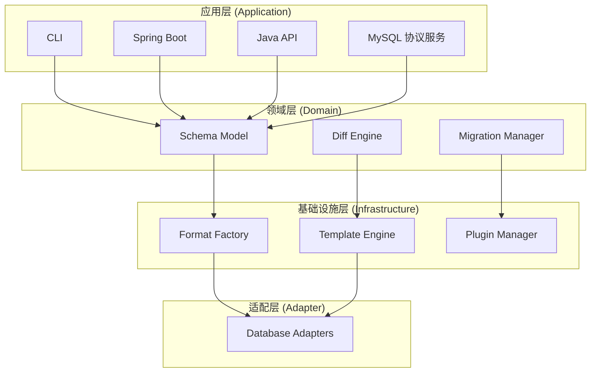

# 设计哲学

JustDB 的设计遵循一系列核心原则，这些原则指导着框架的架构决策和 API 设计。

## 核心设计原则

### 1. 简洁性 (Simplicity)

> "简单是复杂的终极形式。" - 达芬奇

JustDB 追求最简洁的表达方式：

**配置极简**

::: code-tabs
@tab YAML
```yaml
# 只需定义必要的内容
Table:
  - name: users
    Column:
      - name: id
        type: BIGINT
        primaryKey: true
```

@tab XML
```xml
<Justdb>
    <Table name="users">
        <Column name="id" type="BIGINT" primaryKey="true"/>
    </Table>
</Justdb>
```

@tab JSON
```json
{
  "Table": [
    {
      "name": "users",
      "Column": [
        {
          "name": "id",
          "type": "BIGINT",
          "primaryKey": true
        }
      ]
    }
  ]
}
```

@tab SQL
```sql
CREATE TABLE users (
    id BIGINT PRIMARY KEY
);
```

@tab TOML
```toml
[[Table]]
name = "users"

[[Table.Column]]
name = "id"
type = "BIGINT"
primaryKey = true
```
:::

**合理默认值**

- 自动推断主键名称
- 自动设置默认约束
- 自动生成索引名称
- 自动处理类型映射

**避免过度设计**

```yaml
# 好的做法 - 简洁
Table:
  - name: users
    Column: [...]

# 避免 - 过度配置
Table:
  - name: users
    engine: InnoDB      # 如果是默认值，无需配置
    charset: utf8mb4    # 如果是默认值，无需配置
    collation: ...      # 不必要的配置
    # ...更多冗余配置
```

### 2. 一致性 (Consistency)

一致性让系统更易理解和预测：

**统一的命名规范**

::: tip 规范命名
- Schema 字段使用 `camelCase`
- 集合字段使用复数形式 `formerNames`
- SQL 术语优先：`beforeDrops` 使用 DROP 而非 Remove，`beforeAlters` 使用 ALTER 而非 Modify
- 生命周期钩子统一前缀 `beforeCreates`, `afterCreates`
:::

**统一的类型系统**

```java
// 所有 Schema 对象继承自 Item
Item
├── Table
├── Column
├── Index
├── Constraint
└── ...

// 共享通用属性
- id: 唯一标识
- name: 名称
- comment: 注释
```

**统一的生命周期钩子**

::: code-tabs
@tab YAML
```yaml
Table:
  - name: users
    beforeCreates:
      - sql: "CREATE SEQUENCE seq_users START WITH 1"
    afterCreates:
      - sql: "ALTER TABLE users ADD UNIQUE (username)"
    beforeDrops:
      - sql: "DROP SEQUENCE seq_users"
```

@tab XML
```xml
<Table name="users">
    <beforeCreates>
        <ConditionalSqlScript sql="CREATE SEQUENCE seq_users START WITH 1"/>
    </beforeCreates>
    <afterCreates>
        <ConditionalSqlScript sql="ALTER TABLE users ADD UNIQUE (username)"/>
    </afterCreates>
    <beforeDrops>
        <ConditionalSqlScript sql="DROP SEQUENCE seq_users"/>
    </beforeDrops>
</Table>
```

@tab JSON
```json
{
  "Table": [
    {
      "name": "users",
      "beforeCreates": [
        {"sql": "CREATE SEQUENCE seq_users START WITH 1"}
      ],
      "afterCreates": [
        {"sql": "ALTER TABLE users ADD UNIQUE (username)"}
      ],
      "beforeDrops": [
        {"sql": "DROP SEQUENCE seq_users"}
      ]
    }
  ]
}
```

@tab TOML
```toml
[[Table]]
name = "users"

[[Table.beforeCreates]]
sql = "CREATE SEQUENCE seq_users START WITH 1"

[[Table.afterCreates]]
sql = "ALTER TABLE users ADD UNIQUE (username)"

[[Table.beforeDrops]]
sql = "DROP SEQUENCE seq_users"
```
:::

### 3. 声明式优先 (Declarative First)

描述"要什么"，而不是"怎么做"：

::: code-tabs
@tab YAML
```yaml
# 声明式 - 描述期望状态
Table:
  - name: users
    Column:
      - name: email
        type: VARCHAR(100)
        unique: true
```

@tab XML
```xml
<!-- 声明式 - 描述期望状态 -->
<Justdb>
    <Table name="users">
        <Column name="email" type="VARCHAR(100)" unique="true"/>
    </Table>
</Justdb>
```

@tab JSON
```json
{
  "Table": [
    {
      "name": "users",
      "Column": [
        {
          "name": "email",
          "type": "VARCHAR(100)",
          "unique": true
        }
      ]
    }
  ]
}
```

@tab SQL
```sql
-- 命令式 - 描述如何执行（避免）
CREATE TABLE users (
    email VARCHAR(100),
    UNIQUE (email)
);
```

@tab TOML
```toml
[[Table]]
name = "users"

[[Table.Column]]
name = "email"
type = "VARCHAR(100)"
unique = true
```
:::

**优势**：
- 更易理解和维护
- 工具自动优化执行路径
- 避免人为错误
- 支持多种数据库方言

**优势**：
- 更易理解和维护
- 工具自动优化执行路径
- 避免人为错误
- 支持多种数据库方言

### 4. 惯例优于配置 (Convention Over Configuration)

遵循合理惯例，减少配置负担：

**文件搜索惯例**

```
默认搜索路径（按优先级）：
1. ./justdb/
2. ./db/
3. ./
4. classpath:justdb/
```

**命名惯例**

::: code-tabs
@tab YAML
```yaml
# 表名自动复数（可选）
Table:
  - name: user    # 自动识别为 users 表

# 主键自动推断
Column:
  - name: id
    type: BIGINT
    # 自动识别为主键（如果名称包含 "id"）

# 关联自动推断
Column:
  - name: user_id
    type: BIGINT
    # 自动推断为外键关联到 users.id
```

@tab XML
```xml
<!-- 主键自动推断 -->
<Table name="users">
    <Column name="id" type="BIGINT">
        <!-- 自动识别为主键 -->
    </Column>
    <Column name="user_id" type="BIGINT">
        <!-- 自动推断为外键 -->
    </Column>
</Table>
```

@tab JSON
```json
{
  "Table": [
    {
      "name": "users",
      "Column": [
        {
          "name": "id",
          "type": "BIGINT"
        },
        {
          "name": "user_id",
          "type": "BIGINT"
        }
      ]
    }
  ]
}
```

@tab SQL
```sql
-- 主键和约束由约定推断
CREATE TABLE users (
    id BIGINT,
    user_id BIGINT
);
```

@tab TOML
```toml
[[Table]]
name = "users"

[[Table.Column]]
name = "id"
type = "BIGINT"

[[Table.Column]]
name = "user_id"
type = "BIGINT"
```
:::

### 5. 可扩展性 (Extensibility)

提供多种扩展机制：

**插件系统**

```java
// 自定义数据库适配器
public class MyDatabaseAdapter extends DatabaseAdapter {
    @Override
    public String getIdentifier() {
        return "mydb";
    }

    @Override
    public boolean supports(String url) {
        return url.startsWith("jdbc:mydb:");
    }
}
```

**模板系统**

```xml
<!-- 自定义 SQL 模板 -->
<template id="create-table" type="SQL" category="db">
  <content>
    CREATE TABLE {{name}} (
      {{#each columns}}
      {{name}} {{type}}{{#unless @last}},{{/unless}}
      {{/each}}
    );
  </content>
</template>
```

**扩展点系统**

```java
// 定义扩展点
ExtensionPoint point = ExtensionPoint.builder()
    .targetType(Table.class)
    .addAttribute(ExtensionAttribute.builder()
        .name("engine")
        .type(String.class)
        .defaultValue("InnoDB")
        .build())
    .build();
```

### 6. 广泛兼容 (Broad Compatibility)

**格式不是限制用户的工具，格式是用户方便之门**

别名系统让不同背景的用户都能方便使用：

- **向后兼容**：保护用户投资，旧版本 Schema 继续工作
- **向 AI 兼容**：任何 AI、盲写，都能兼容
- **向人类兼容**：不同编程背景的开发者都能用熟悉的格式

```java
@JsonAlias({"refId", "ref-id", "ref_id"})
private String referenceId;  // 规范名称
```

**支持旧格式**

```yaml
# 所有这些格式都支持
Column:
  - name: id
    ref-id: global_id      # 旧格式（kebab-case）
    referencedTable: users # 规范格式（camelCase）
```

**弃用策略**

```java
/**
 * @deprecated 使用 {@link #referenceId} 替代
 */
@Deprecated
public void setRefId(String refId) {
    setReferenceId(refId);  // 内部转发
}
```

## 架构设计思想

### 分层架构

JustDB 采用清晰的分层架构：



### 关注点分离

**Schema 定义 vs 数据库操作**

```java
// Schema 定义 - 描述数据结构
Table table = new Table();
table.setName("users");

// 数据库操作 - 执行 DDL
SchemaDeployer deployer = new SchemaDeployer(connection);
deployer.deploy(table);
```

**格式解析 vs 业务逻辑**

```java
// 格式无关的 Schema 模型
Justdb schema = FormatFactory.loadFromFile("schema.yaml");

// 业务逻辑处理
SchemaDiff diff = SchemaDiff.calculate(current, target);
```

### 开闭原则

**对扩展开放，对修改关闭**

```xml
<!-- 无需修改核心代码，通过插件扩展 -->
<plugin id="mysql">
  <templates>
    <template id="create-table" ...>
      <!-- MySQL 特定的 CREATE TABLE 模板 -->
    </template>
  </templates>
</plugin>
```

## 用户体验设计

### 渐进式复杂度

JustDB 支持从简单到复杂的渐进式使用：

**入门级 - 最简单**

::: code-tabs
@tab YAML
```yaml
Table:
  - name: users
    Column: []
```

@tab XML
```xml
<Justdb>
    <Table name="users"/>
</Justdb>
```

@tab SQL
```sql
CREATE TABLE users ();
```
:::

**进阶级 - 添加约束**

::: code-tabs
@tab YAML
```yaml
Table:
  - name: users
    Column:
      - name: id
        type: BIGINT
        primaryKey: true
      - name: email
        type: VARCHAR(100)
        nullable: false
```

@tab XML
```xml
<Table name="users">
    <Column name="id" type="BIGINT" primaryKey="true"/>
    <Column name="email" type="VARCHAR(100)" nullable="false"/>
</Table>
```

@tab JSON
```json
{
  "Table": [
    {
      "name": "users",
      "Column": [
        {
          "name": "id",
          "type": "BIGINT",
          "primaryKey": true
        },
        {
          "name": "email",
          "type": "VARCHAR(100)",
          "nullable": false
        }
      ]
    }
  ]
}
```

@tab SQL
```sql
CREATE TABLE users (
    id BIGINT PRIMARY KEY,
    email VARCHAR(100) NOT NULL
);
```
:::

**高级级 - 完整配置**

::: code-tabs
@tab YAML
```yaml
Table:
  - name: users
    comment: 用户表
    engine: InnoDB
    charset: utf8mb4
    Column:
      - name: id
        type: BIGINT
        primaryKey: true
        autoIncrement: true
        comment: 用户ID
      - name: email
        type: VARCHAR(100)
        nullable: false
      - name: username
        type: VARCHAR(50)
        nullable: false
      - name: created_at
        type: TIMESTAMP
        nullable: false
        defaultValueComputed: CURRENT_TIMESTAMP
    Index:
      - name: idx_email
        columns: [email]
        unique: true
        comment: 邮箱唯一索引
    beforeCreates:
      - dbms: mysql
        sql: "SET sql_mode='STRICT_TRANS_TABLES'"
```

@tab XML
```xml
<Table name="users" comment="用户表" engine="InnoDB" charset="utf8mb4">
    <Column name="id" type="BIGINT" primaryKey="true" autoIncrement="true"
            comment="用户ID"/>
    <Column name="email" type="VARCHAR(100)" nullable="false"/>
    <Column name="username" type="VARCHAR(50)" nullable="false"/>
    <Column name="created_at" type="TIMESTAMP" nullable="false"
            defaultValueComputed="CURRENT_TIMESTAMP"/>
    <Index name="idx_email" unique="true" comment="邮箱唯一索引">
        <IndexColumn name="email"/>
    </Index>
    <beforeCreates>
        <ConditionalSqlScript dbms="mysql" sql="SET sql_mode='STRICT_TRANS_TABLES'"/>
    </beforeCreates>
</Table>
```

@tab SQL
```sql
CREATE TABLE users (
    id BIGINT PRIMARY KEY AUTO_INCREMENT COMMENT '用户ID',
    email VARCHAR(100) NOT NULL,
    username VARCHAR(50) NOT NULL,
    created_at TIMESTAMP NOT NULL DEFAULT CURRENT_TIMESTAMP,
    UNIQUE KEY idx_email (email) COMMENT '邮箱唯一索引'
) ENGINE=InnoDB DEFAULT CHARSET=utf8mb4 COMMENT '用户表';

SET sql_mode='STRICT_TRANS_TABLES';
```
:::

### 错误处理

提供清晰的错误信息：

```bash
# 传统方式 - 错误信息模糊
ERROR: SQL syntax error near 'CREATE TABEL'

# JustDB - 清晰的错误定位
ERROR: Invalid table definition in users.yaml
  Line 15, Column 8:
    Unknown attribute 'engin' (did you mean 'engine'?)

  Schema:
    Table:
      - name: users
        engin: InnoDB    <-- typo here
```

### 开发者友好

**丰富的反馈信息**

```bash
$ justdb migrate --dry-run

[INFO] Current database schema:
[INFO]   - 5 tables, 12 indexes, 8 constraints

[INFO] Target schema:
[INFO]   - 6 tables, 14 indexes, 10 constraints

[INFO] Changes to apply:
[INFO]   + Add table: orders
[INFO]   + Add column: users.phone
[INFO]   ~ Modify column: orders.status VARCHAR(20) -> VARCHAR(50)
[INFO]   - Drop index: users.idx_old_email

[INFO] Generated SQL:
[INFO]   CREATE TABLE orders (...)
[INFO]   ALTER TABLE users ADD COLUMN phone VARCHAR(20)
[INFO]   ALTER TABLE orders MODIFY COLUMN status VARCHAR(50)
[INFO]   ALTER TABLE users DROP INDEX idx_old_email

[DRY RUN] No changes applied. Use --execute to apply.
```

## 技术选型原则

### 成熟技术栈

- **Java 8+**：广泛支持的稳定版本
- **Maven**：标准的构建工具
- **Jackson**：成熟的 JSON/YAML 处理
- **Handlebars**：强大的模板引擎
- **JDBC**：标准的数据库接口

### 避免过度依赖

JustDB 核心模块保持最小依赖：

```xml
<!-- 核心模块依赖最小 -->
<dependencies>
    <dependency>
        <groupId>com.fasterxml.jackson.core</groupId>
        <artifactId>jackson-databind</artifactId>
    </dependency>
    <dependency>
        <groupId>com.github.jknack</groupId>
        <artifactId>handlebars</artifactId>
    </dependency>
    <!-- 少量核心依赖 -->
</dependencies>
```

### 可选模块化

```xml
<!-- 核心功能 -->
<dependency>
    <artifactId>justdb-core</artifactId>
</dependency>

<!-- 可选：AI 集成 -->
<dependency>
    <artifactId>justdb-ai</artifactId>
</dependency>

<!-- 可选：Excel 支持 -->
<dependency>
    <artifactId>justdb-excel</artifactId>
</dependency>
```

## 测试哲学

### 测试金字塔

```
     /\
    /  \        E2E 测试 (少量)
   /____\
  /      \      集成测试 (适量)
 /________\
/          \   单元测试 (大量)
```

- **单元测试**：快速、独立、覆盖核心逻辑
- **集成测试**：真实数据库、Testcontainers
- **E2E 测试**：完整流程验证

### 可测试性设计

```java
// 依赖注入，便于测试
public class SchemaDeployer {
    private final Connection connection;
    private final TemplateEngine templateEngine;

    public SchemaDeployer(Connection connection,
                          TemplateEngine templateEngine) {
        this.connection = connection;
        this.templateEngine = templateEngine;
    }
}

// 测试时可以注入 Mock 对象
@Test
void testDeploy() {
    Connection mockConn = mock(Connection.class);
    TemplateEngine mockEngine = mock(TemplateEngine.class);
    SchemaDeployer deployer = new SchemaDeployer(mockConn, mockEngine);
    // ...
}
```

## 文档即代码

JustDB 相信文档应该与代码保持同步：

```yaml
# Schema 文件本身就是最好的文档
Table:
  - id: users
    name: 用户表           # 中文表名
    comment: 存储系统用户信息  # 详细说明
    Column:
      - name: id
        comment: 用户ID，主键自增  # 每个字段都有注释
```

支持导出多种文档格式：

```bash
# 导出为 Markdown
justdb doc -f markdown -o schema.md

# 导出为 HTML
justdb doc -f html -o schema.html

# 导出为 PDF（需要额外工具）
justdb doc -f pdf -o schema.pdf
```

## 社区驱动

JustDB 欢迎社区贡献：

- **插件贡献**：分享自定义数据库适配器
- **模板贡献**：分享优化的 SQL 模板
- **文档贡献**：改进文档和示例
- **问题反馈**：报告 bug 和功能请求

## 下一步

<VPCard
  title="应用场景"
  desc="查看 JustDB 的典型应用场景"
  link="/guide/use-cases.html"
/>

<VPCard
  title="快速开始"
  desc="5分钟快速上手 JustDB"
  link="/getting-started/quick-start.html"
/>
