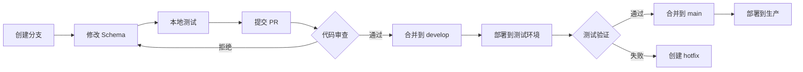

# 团队协作

学习如何在团队环境中有效使用 JustDB，确保 Schema 变更的可追溯性和一致性。

## Schema 版本控制

### Git 工作流

#### 分支策略

```bash
# 主分支
main (production)
├── develop (development)
    ├── feature/add-user-phone
    ├── feature/add-order-status
    └── feature/refactor-payment-table
```

#### 提交规范

```bash
# 好的提交信息
git commit -m "feat(users): add phone field for SMS verification"
git commit -m "fix(orders): correct payment_amount type to DECIMAL"
git commit -m "refactor(orders): rename status to order_status"

# 避免的提交信息
git commit -m "update schema"
git commit -m "fix bug"
```

#### Schema 文件组织

```
justdb/
├── core/
│   ├── users.yaml
│   ├── roles.yaml
│   └── permissions.yaml
├── business/
│   ├── orders.yaml
│   ├── products.yaml
│   └── payments.yaml
└── config/
    ├── dev.yaml
    ├── test.yaml
    └── prod.yaml
```

### 代码审查

#### PR 模板

```markdown
## Schema 变更说明

### 变更类型
- [ ] 新增表
- [ ] 修改表
- [ ] 删除表
- [ ] 重命名

### 影响范围
- 修改的表：users, orders
- 新增的索引：idx_users_phone
- 数据迁移：无

### 测试计划
- [ ] 开发环境测试通过
- [ ] 测试环境测试通过
- [ ] 性能测试通过

### 检查清单
- [ ] 使用了 formerNames（如果是重命名）
- [ ] 添加了完整的注释
- [ ] 考虑了回滚方案
- [ ] 更新了相关文档
```

#### 审查要点

**Schema 审查**：
```yaml
# 检查项 1：字段类型
Column:
  - name: amount
    type: DECIMAL(10, 2)  # 正确：使用 DECIMAL 处理金额
    # type: FLOAT         # 错误：不精确

# 检查项 2：约束设置
Column:
  - name: email
    type: VARCHAR(100)
    nullable: false      # 正确：必要字段设置非空
    unique: true         # 正确：唯一字段设置唯一约束

# 检查项 3：索引策略
Index:
  - name: idx_user_id
    columns: [user_id]   # 正确：外键添加索引
  - name: idx_status
    columns: [status]    # 考虑：status 区分度是否足够

# 检查项 4：重命名处理
Column:
  - name: user_name
    formerNames: [username]  # 正确：使用 formerNames
    type: VARCHAR(50)
```

## 协作流程

### 开发流程



### 分支命名规范

```bash
# 功能分支
feature/add-phone-field
feature/order-status-enum

# 修复分支
fix/user-email-length
fix/payment-decimal-type

# 重构分支
refactor/normalize-table-names
refactor/index-optimization

# 热修复分支
hotfix/critical-user-data
hotfix/production-deployment
```

### 冲突解决

#### Schema 冲突

**场景**：两个开发者同时修改同一个表

```yaml
# 开发者 A 的变更
Table:
  - name: users
    Column:
      - name: phone
        type: VARCHAR(20)

# 开发者 B 的变更
Table:
  - name: users
    Column:
      - name: address
        type: VARCHAR(200)
```

**合并后**：
```yaml
Table:
  - name: users
    Column:
      - name: phone      # A 的变更
        type: VARCHAR(20)
      - name: address    # B 的变更
        type: VARCHAR(200)
```

#### 解决步骤

```bash
# 1. 拉取最新代码
git pull origin develop

# 2. 解决冲突
vim justdb/users.yaml

# 3. 验证 Schema
justdb validate

# 4. 测试迁移
justdb migrate --dry-run

# 5. 提交合并
git add justdb/users.yaml
git commit -m "Merge remote-tracking branch 'origin/feature/xxx'"
```

## 环境管理

### 多环境配置

```yaml
# justdb/config/dev.yaml
database:
  url: jdbc:mysql://dev-db.internal:3306/myapp_dev
  username: ${DEV_DB_USER}
  password: ${DEV_DB_PASS}

schema:
  locations:
    - ./justdb/core
    - ./justdb/business

# justdb/config/test.yaml
database:
  url: jdbc:mysql://test-db.internal:3306/myapp_test
  username: ${TEST_DB_USER}
  password: ${TEST_DB_PASS}

# justdb/config/prod.yaml
database:
  url: jdbc:mysql://prod-db.internal:3306/myapp
  username: ${PROD_DB_USER}
  password: ${PROD_DB_PASS}
  options:
    - ssl=true
    - useSSL=true
```

### 环境同步

```bash
# 从生产环境提取 Schema
justdb db2schema \
  -u jdbc:mysql://prod-db:3306/myapp \
  -o prod-schema.yaml

# 比对差异
justdb diff -s prod-schema.yaml

# 同步到开发环境
justdb migrate -c config/dev.yaml
```

## CI/CD 集成

### GitLab CI 示例

```yaml
# .gitlab-ci.yml
stages:
  - validate
  - test
  - deploy

variables:
  MAVEN_OPTS: "-Dmaven.repo.local=$CI_PROJECT_DIR/.m2/repository"

# 验证 Schema
validate:schema:
  stage: validate
  image: maven:3.8-openjdk-11
  script:
    - mvn validate
    - justdb validate
  artifacts:
    paths:
      - justdb/

# 测试迁移
test:migration:
  stage: test
  image: maven:3.8-openjdk-11
  services:
    - mysql:8.0
  variables:
    MYSQL_DATABASE: test_db
    MYSQL_ROOT_PASSWORD: test_pass
  script:
    - justdb migrate -c config/test.yaml --dry-run
    - justdb migrate -c config/test.yaml
    - mvn test

# 部署到开发环境
deploy:dev:
  stage: deploy
  image: justdb:latest
  script:
    - justdb migrate -c config/dev.yaml
  only:
    - develop

# 部署到生产环境
deploy:prod:
  stage: deploy
  image: justdb:latest
  script:
    - justdb validate
    - justdb migrate -c config/prod.yaml --dry-run
    - justdb backup -o backup.sql
    - justdb migrate -c config/prod.yaml
  only:
    - main
  when: manual
```

### GitHub Actions 示例

```yaml
# .github/workflows/ci.yml
name: JustDB CI/CD

on:
  push:
    branches: [ main, develop ]
  pull_request:
    branches: [ main ]

jobs:
  validate:
    runs-on: ubuntu-latest
    steps:
      - uses: actions/checkout@v3
      - name: Set up JDK 11
        uses: actions/setup-java@v3
        with:
          java-version: '11'
          distribution: 'temurin'
      - name: Validate Schema
        run: |
          mvn validate
          justdb validate

  test:
    runs-on: ubuntu-latest
    services:
      mysql:
        image: mysql:8.0
        env:
          MYSQL_ROOT_PASSWORD: test
          MYSQL_DATABASE: test_db
        ports:
          - 3306:3306
    steps:
      - uses: actions/checkout@v3
      - name: Test Migration
        run: |
          justdb migrate -c config/test.yaml
          mvn test

  deploy-dev:
    needs: [validate, test]
    runs-on: ubuntu-latest
    if: github.ref == 'refs/heads/develop'
    steps:
      - name: Deploy to Dev
        run: |
          justdb migrate -c config/dev.yaml

  deploy-prod:
    needs: [validate, test]
    runs-on: ubuntu-latest
    if: github.ref == 'refs/heads/main'
    environment:
      name: production
      url: https://api.example.com
    steps:
      - name: Deploy to Production
        run: |
          justdb migrate -c config/prod.yaml --dry-run
          justdb backup -o backup.sql
          justdb migrate -c config/prod.yaml
```

## 文档管理

### Schema 文档

```yaml
# justdb/README.md
# MyApp Schema 文档

## 数据库结构

### 核心表
- `users` - 用户表
- `roles` - 角色表
- `permissions` - 权限表

### 业务表
- `orders` - 订单表
- `products` - 商品表
- `payments` - 支付表

## 最近变更

### 2024-01-15
- 添加用户手机号字段（feature/add-user-phone）
- 修改订单状态枚举（feature/order-status-enum）

## 迁移历史

运行 `justdb history` 查看完整迁移历史。
```

### 变更日志

```bash
# 自动生成变更日志
justdb changelog > CHANGELOG.md

# CHANGELOG.md
# # Changelog
#
# ## [1.2.0] - 2024-01-15
#
# ### Added
# - users.phone field
# - orders.status enum
#
# ### Changed
# - payments.amount type to DECIMAL(12,2)
#
# ### Fixed
# - users.email length constraint
```

## 最佳实践

### 1. Schema 设计原则

```yaml
# 好的做法：单一职责
Table:
  - name: users           # 只存储用户信息
    Column:
      - name: id
        type: BIGINT
      - name: username
        type: VARCHAR(50)

# 避免：职责混乱
Table:
  - name: users
    Column:
      - name: id
        type: BIGINT
      - name: order_id    # 不应该在这里
        type: BIGINT
```

### 2. 命名规范

```yaml
# 好的做法：统一命名
Table:
  - name: users           # 表名小写复数
    Column:
      - name: user_id     # 外键：表名_id
        type: BIGINT
      - name: created_at  # 时间戳：_at 后缀
        type: TIMESTAMP
      - name: is_active   # 布尔：is_ 前缀
        type: BOOLEAN

# 避免：不一致命名
Table:
  - name: User            # 避免：大写
    Column:
      - name: UserID      # 避免：驼峰
        type: BigInt      # 避免：大写类型
```

### 3. 注释完整性

```yaml
# 好的做法：完整注释
Table:
  - name: orders
    comment: 订单表，存储所有订单信息
    Column:
      - name: order_no
        type: VARCHAR(50)
        comment: 订单号，格式：YYYYMMDD + 6位序号
      - name: total_amount
        type: DECIMAL(12, 2)
        comment: 订单总金额，单位：分

# 避免：缺少注释
Table:
  - name: orders
    Column:
      - name: order_no
        type: VARCHAR(50)
```

### 4. 审查清单

**提交前检查**：
- [ ] Schema 语法正确
- [ ] 使用了 formerNames（如果是重命名）
- [ ] 添加了完整的注释
- [ ] 索引设置合理
- [ ] 考虑了数据迁移
- [ ] 本地测试通过

**合并前检查**：
- [ ] 代码审查通过
- [ ] 测试环境验证通过
- [ ] 更新了相关文档
- [ ] 通知了团队成员

### 5. 沟通机制

```markdown
## Schema 变更通知

@all 即将进行数据库迁移：

**影响范围**：
- 修改的表：users, orders
- 预计停机时间：无（在线迁移）
- 迁移时间：2024-01-15 22:00

**注意事项**：
- users 表添加 phone 字段
- orders 表修改 status 字段类型

**回滚方案**：
如遇问题，请联系 @dbadmin
```

## 下一步

<VPCard
  title="性能优化"
  desc="优化 Schema 和迁移性能"
  link="/guide/performance.html"
/>

<VPCard
  title="CI/CD 集成"
  desc="详细的 CI/CD 配置指南"
  link="/guide/cicd.html"
/>

<VPCard
  title="配置参考"
  desc="完整的配置选项说明"
  link="/guide/config-reference.html"
/>
