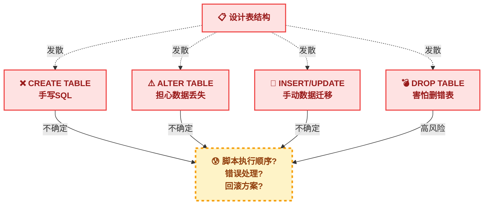
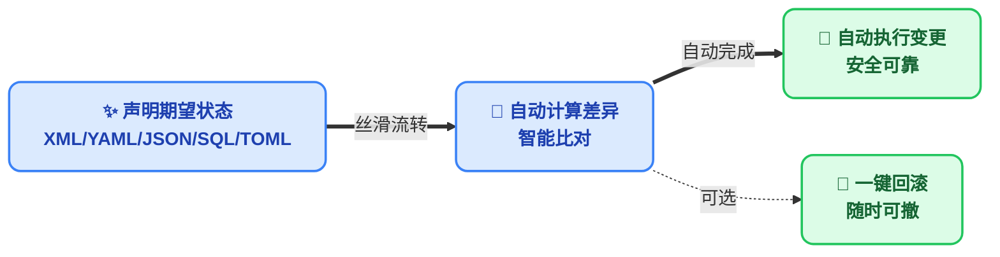
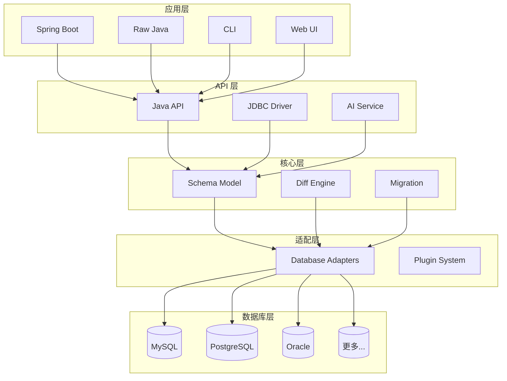

# 什么是 JustDB

JustDB 是一个创新的**多语言数据库开发平台**，它革命性地改变了传统数据库开发的方式。通过声明式 Schema 定义和智能差异计算，让数据库开发变得简单、高效、可靠。

## 多语言生态

JustDB 通过多种方式支持广泛的编程语言：

| 访问方式 | 支持的语言 | 状态 |
|---------|-----------|------|
| **CLI 命令行** | 所有语言 | ✅ 已实现 |
| **JDBC 驱动** | Java、Kotlin、Scala、Groovy | ✅ 已实现 |
| **ORM 模型生成** | Java、Python、TypeScript、Go | ✅ 已实现 |
| **远程服务** | 所有支持 HTTP 的语言 | ✅ 已实现 |
| **MySQL 协议服务** | 所有支持 MySQL 的语言 | ✅ 已实现 |
| **MCP 服务** | AI 应用（Claude、Cursor 等） | ✅ 已实现 |

### 命令行接口（CLI）

JustDB CLI 可从任何语言的脚本或构建工具调用：

```bash
# Shell 脚本
justdb migrate

# Python 脚本
subprocess.run(["justdb", "migrate"])

# Node.js
child_process.exec("justdb migrate")

# Go
exec.Command("justdb", "migrate").Run()
```

### JDBC 驱动

JVM 语言可直接使用 JustDB JDBC 驱动：

```java
// Java
Connection conn = DriverManager.getConnection("jdbc:justdb:schema.yaml");

// Kotlin
val conn = DriverManager.getConnection("jdbc:justdb:schema.yaml")

// Scala
val conn = DriverManager.getConnection("jdbc:justdb:schema.yaml")

// Groovy
def conn = DriverManager.getConnection("jdbc:justdb:schema.yaml")
```

### ORM 模型生成

JustDB 可以为多种语言生成 ORM 模型：

- **Java**: JPA/Hibernate、MyBatis
- **Python**: SQLAlchemy、Django
- **TypeScript**: Prisma、TypeORM
- **Go**: GORM、sqlx

::: tip 多语言团队
对于多语言团队，JustDB 提供统一的 Schema 定义，然后为每种语言生成对应的 ORM 模型，确保数据库结构的一致性。
:::

## 核心理念

### 传统数据库开发的痛点

传统的数据库开发流程是这样的：



这种方式存在以下问题：

- **手写 SQL 容易出错** - 语法错误、类型错误、约束遗漏
- **变更管理困难** - 需要手动维护迁移脚本，容易遗漏
- **多环境同步复杂** - 开发、测试、生产环境容易出现不一致
- **文档与代码分离** - Schema 设计文档与实际数据库可能不同步
- **团队协作困难** - 需要协调多人编写的 SQL 脚本执行顺序

### JustDB 的解决方案

JustDB 将数据库开发简化为：



**只需关注"要什么"，无需关心"怎么做"**

## 核心特性

### 1. 声明式 Schema 定义

使用 XML、YAML、JSON、SQL、TOML 等格式声明你期望的数据库结构：

::: code-tabs
@tab XML
```xml
<!-- users.xml - 这就是你想要的数据库样子 -->
<?xml version="1.0" encoding="UTF-8"?>
<Justdb namespace="com.example">
    <Table id="users" name="用户表" comment="存储系统用户信息">
        <Column name="id" type="BIGINT" primaryKey="true" autoIncrement="true"
                comment="用户ID，主键自增"/>
        <Column name="username" type="VARCHAR(50)" nullable="false"
                comment="用户名，不能为空"/>
        <Column name="email" type="VARCHAR(100)" comment="邮箱地址"/>
        <Column name="created_at" type="TIMESTAMP" nullable="false"
                defaultValueComputed="CURRENT_TIMESTAMP" comment="创建时间"/>
    </Table>
</Justdb>
```

@tab YAML
```yaml
# users.yaml - 这就是你想要的数据库样子
namespace: com.example
Table:
  - id: users
    name: 用户表
    comment: 存储系统用户信息
    Column:
      - name: id
        type: BIGINT
        primaryKey: true
        autoIncrement: true
        comment: 用户ID，主键自增
      - name: username
        type: VARCHAR(50)
        nullable: false
        comment: 用户名，不能为空
      - name: email
        type: VARCHAR(100)
        comment: 邮箱地址
      - name: created_at
        type: TIMESTAMP
        nullable: false
        defaultValueComputed: CURRENT_TIMESTAMP
        comment: 创建时间
```

@tab JSON
```json
{
  "namespace": "com.example",
  "Table": [
    {
      "id": "users",
      "name": "用户表",
      "comment": "存储系统用户信息",
      "Column": [
        {
          "name": "id",
          "type": "BIGINT",
          "primaryKey": true,
          "autoIncrement": true,
          "comment": "用户ID，主键自增"
        },
        {
          "name": "username",
          "type": "VARCHAR(50)",
          "nullable": false,
          "comment": "用户名，不能为空"
        },
        {
          "name": "email",
          "type": "VARCHAR(100)",
          "comment": "邮箱地址"
        },
        {
          "name": "created_at",
          "type": "TIMESTAMP",
          "nullable": false,
          "defaultValueComputed": "CURRENT_TIMESTAMP",
          "comment": "创建时间"
        }
      ]
    }
  ]
}
```

@tab SQL
```sql
-- schema.sql
-- JustDB 也支持 SQL 格式的 Schema 定义

CREATE TABLE users (
    id BIGINT PRIMARY KEY AUTO_INCREMENT COMMENT '用户ID，主键自增',
    username VARCHAR(50) NOT NULL COMMENT '用户名，不能为空',
    email VARCHAR(100) COMMENT '邮箱地址',
    created_at TIMESTAMP NOT NULL DEFAULT CURRENT_TIMESTAMP COMMENT '创建时间'
) COMMENT '用户表';

-- 或者使用标准 SQL 注释
ALTER TABLE users COMMENT '存储系统用户信息';
```

@tab TOML
```toml
namespace = "com.example"

[[Table]]
id = "users"
name = "用户表"
comment = "存储系统用户信息"

[[Table.Column]]
name = "id"
type = "BIGINT"
primaryKey = true
autoIncrement = true
comment = "用户ID，主键自增"

[[Table.Column]]
name = "username"
type = "VARCHAR(50)"
nullable = false
comment = "用户名，不能为空"

[[Table.Column]]
name = "email"
type = "VARCHAR(100)"
comment = "邮箱地址"

[[Table.Column]]
name = "created_at"
type = "TIMESTAMP"
nullable = true
defaultValueComputed = "CURRENT_TIMESTAMP"
comment = "创建时间"
```

@tab Properties
```properties
namespace=com.example

table.users.id=users
table.users.name=用户表
table.users.comment=存储系统用户信息

table.users.column.id.name=id
table.users.column.id.type=BIGINT
table.users.column.id.primaryKey=true
table.users.column.id.autoIncrement=true
table.users.column.id.comment=用户ID，主键自增

table.users.column.username.name=username
table.users.column.username.type=VARCHAR(50)
table.users.column.username.nullable=false
table.users.column.username.comment=用户名，不能为空

table.users.column.email.name=email
table.users.column.email.type=VARCHAR(100)
table.users.column.email.comment=邮箱地址

table.users.column.created_at.name=created_at
table.users.column.created_at.type=TIMESTAMP
table.users.column.created_at.nullable=false
table.users.column.created_at.defaultValueComputed=CURRENT_TIMESTAMP
table.users.column.created_at.comment=创建时间
```
:::

### 2. 智能差异计算

当你修改 Schema 时，JustDB 会自动计算变更并只执行必要的 SQL：

::: code-tabs
@tab XML
```xml
<!-- 修改后 - 添加了 avatar 字段 -->
<Table id="users">
    <Column name="id" type="BIGINT" primaryKey="true"/>
    <Column name="username" type="VARCHAR(50)"/>
    <Column name="email" type="VARCHAR(100)"/>
    <Column name="avatar" type="VARCHAR(500)"/> <!-- 新增 -->
    <Column name="created_at" type="TIMESTAMP"/>
</Table>
```

@tab YAML
```yaml
# 修改后 - 添加了 avatar 字段
Column:
  - name: id
    type: BIGINT
    primaryKey: true
  - name: username
    type: VARCHAR(50)
  - name: email
    type: VARCHAR(100)
  - name: avatar      # 新增
    type: VARCHAR(500) # 新增
  - name: created_at
    type: TIMESTAMP
```

@tab JSON
```json
{
  "Column": [
    {"name": "id", "type": "BIGINT", "primaryKey": true},
    {"name": "username", "type": "VARCHAR(50)"},
    {"name": "email", "type": "VARCHAR(100)"},
    {"name": "avatar", "type": "VARCHAR(500)"},
    {"name": "created_at", "type": "TIMESTAMP"}
  ]
}
```

@tab SQL
```sql
-- 修改后 - 添加了 avatar 字段
-- JustDB 解析 SQL 格式的 Schema 定义并计算差异

ALTER TABLE users ADD COLUMN avatar VARCHAR(500) COMMENT '用户头像';
```

@tab TOML
```toml
# 修改后 - 添加了 avatar 字段
[[Table.Column]]
name = "id"
type = "BIGINT"
primaryKey = true

[[Table.Column]]
name = "username"
type = "VARCHAR(50)"

[[Table.Column]]
name = "email"
type = "VARCHAR(100)"

[[Table.Column]]
name = "avatar"      # 新增
type = "VARCHAR(500)"

[[Table.Column]]
name = "created_at"
type = "TIMESTAMP"
```

@tab Properties
```properties
# 修改后 - 添加了 avatar 字段
table.users.column.id.name=id
table.users.column.id.type=BIGINT
table.users.column.id.primaryKey=true
table.users.column.username.name=username
table.users.column.username.type=VARCHAR(50)
table.users.column.email.name=email
table.users.column.email.type=VARCHAR(100)
table.users.column.avatar.name=avatar      # 新增
table.users.column.avatar.type=VARCHAR(500) # 新增
table.users.column.created_at.name=created_at
table.users.column.created_at.type=TIMESTAMP
```
:::

JustDB 自动生成并执行：

```sql
ALTER TABLE users ADD COLUMN avatar VARCHAR(500);
```

### 3. 多格式支持

JustDB 支持几乎所有常见的数据格式，你可以选择最适合团队的格式：

::: code-tabs
@tab XML
```xml
<Justdb>
  <Table name="users">
    <Column name="id" type="BIGINT" primaryKey="true"/>
  </Table>
</Justdb>
```

@tab YAML
```yaml
Table:
  - name: users
    Column:
      - name: id
        type: BIGINT
        primaryKey: true
```

@tab JSON
```json
{
  "Table": [
    {
      "name": "users",
      "Column": [
        {
          "name": "id",
          "type": "BIGINT",
          "primaryKey": true
        }
      ]
    }
  ]
}
```

@tab SQL
```sql
CREATE TABLE users (
    id BIGINT PRIMARY KEY
);
```

@tab TOML
```toml
[[Table]]
name = "users"

[[Table.Column]]
name = "id"
type = "BIGINT"
primaryKey = true
```

@tab Properties
```properties
table.users.name=users
table.users.column.id.name=id
table.users.column.id.type=BIGINT
table.users.column.id.primaryKey=true
```
:::

### 4. AI 集成

通过自然语言直接操作数据库 Schema：

```bash
justdb ai "添加一个订单表，包含订单号、客户ID、金额和状态"
```

AI 会自动生成 Schema 定义，你只需确认并部署即可。

### 5. 完整的 JDBC 驱动

JustDB 提供了完整的 JDBC 4.2 驱动实现，支持：

- 标准 SQL 查询（SELECT、INSERT、UPDATE、DELETE）
- JOIN 查询
- 聚合函数（COUNT、SUM、AVG、MIN、MAX）
- 事务管理
- 批量操作

```java
// 使用 JustDB JDBC 驱动
try (Connection conn = DriverManager.getConnection(
        "jdbc:justdb:schema.yaml", null, null);
     Statement stmt = conn.createStatement();
     ResultSet rs = stmt.executeQuery("SELECT * FROM users")) {
    while (rs.next()) {
        System.out.println(rs.getString("username"));
    }
}
```

### 6. Spring Boot 集成

开箱即用的 Spring Boot Starter，应用启动时自动执行数据库迁移：

```yaml
# application.yml
justdb:
  enabled: true
  locations: classpath:justdb
  dry-run: false
```

```java
@SpringBootApplication
public class Application {
    public static void main(String[] args) {
        SpringApplication.run(Application.class, args);
        // 数据库已自动迁移到最新状态！
    }
}
```

### 7. 多语言 ORM 模型生成

JustDB 支持为多种编程语言和框架生成 ORM 模型：

::: code-tabs
@tab Java
```bash
# 生成 JPA/Hibernate 实体
justdb schema2orm --input schema.xml --type jpa-entity --output src/main/java/

# 生成 MyBatis Bean
justdb schema2orm --input schema.xml --type mybatis-bean --output src/main/java/
```

@tab Python
```bash
# 生成 SQLAlchemy 模型
justdb schema2orm --input schema.xml --type sqlalchemy --output models.py

# 生成 Django 模型
justdb schema2orm --input schema.xml --type django --output models.py
```

@tab TypeScript
```bash
# 生成 Prisma Schema
justdb schema2orm --input schema.xml --type prisma --output schema.prisma

# 生成 TypeORM 实体
justdb schema2orm --input schema.xml --type typeorm --output entities/
```

@tab Go
```bash
# 生成 GORM 模型
justdb schema2orm --input schema.xml --type gorm --output models.go

# 生成 sqlx 模型
justdb schema2orm --input schema.xml --type sqlx --output models.go
```
:::

**支持的 ORM 框架：**

| 语言 | 框架 |
|------|------|
| Java | JPA/Hibernate、MyBatis |
| Python | SQLAlchemy、Django |
| TypeScript | Prisma、TypeORM |
| Go | GORM、sqlx |

### 8. ORM 导入

JustDB 不仅生成 ORM 模型，还支持从现有 ORM 项目导入 Schema：

```bash
# 从 Prisma 导入
justdb orm2schema --input prisma/schema.prisma --orm prisma --output schema.yaml

# 从 SQLAlchemy 导入
justdb orm2schema --input models/ --orm sqlalchemy --output schema.yaml

# 从 GORM 导入
justdb orm2schema --input models.go --orm gorm --output schema.yaml
```

### 9. Atlas 集成

JustDB 可与 Atlas ORM 导入工具配合使用：

```bash
# 1. 使用 Atlas 生成 DDL
atlas schema diff --from "ent://schema" --to "mysql://localhost/db" --format '{{ sql . }}' > schema.sql

# 2. 创建临时数据库并导入 DDL
mysql -u root -p temp_db < schema.sql

# 3. 使用 JustDB 提取 Schema
justdb db2schema --db-url "jdbc:mysql://localhost:3306/temp_db" --output schema.yaml
```

## 应用场景

### 1. 敏捷开发

快速迭代数据库 Schema，无需手写 SQL：

```bash
# 修改 Schema
vim users.yaml

# 应用变更
justdb migrate

# 完成！
```

### 2. 数据库文档化

Schema 即文档，文档即 Schema。Schema 文件本身就是最好的数据库文档：

```yaml
Table:
  - id: orders
    name: 订单表
    comment: 存储所有订单信息
    Column:
      - name: order_no
        comment: 订单号，唯一标识
```

### 3. 多环境一致性

确保开发、测试、生产环境保持完全一致：

```bash
# 开发环境
justdb migrate -c dev-config.yaml

# 测试环境
justdb migrate -c test-config.yaml

# 生产环境
justdb migrate -c prod-config.yaml
```

### 4. 版本控制友好

将 Schema 纳入 Git 版本控制，轻松追踪变更历史：

```bash
git add users.yaml
git commit -m "添加用户头像字段"
git push

# 团队成员执行
justdb migrate
```

### 5. CI/CD 集成

在持续集成流程中自动管理数据库：

```yaml
# .github/workflows/ci.yml
- name: Migrate Database
  run: |
    justdb migrate --dry-run  # 先预览变更
    justdb migrate            # 执行迁移
```

## 技术架构

JustDB 采用分层架构设计：



## 支持的数据库

JustDB 支持 30+ 种数据库，包括但不限于：

::: tip 数据库支持
- **MySQL** - 5.6, 5.7, 8.0+
- **PostgreSQL** - 9.x, 10.x, 11.x, 12.x, 13.x, 14.x
- **Oracle** - 11g, 12c, 19c, 21c
- **SQL Server** - 2012, 2014, 2016, 2019
- **H2** - 1.x, 2.x
- **SQLite** - 3.x
- **MariaDB** - 10.x, 11.x
- **TiDB** - 3.x, 4.x, 5.x
- **达梦** - DM7, DM8
- **人大金仓** - KingBase
- **GBase** - 8s
- **OceanBase** - 2.x, 3.x, 4.x
:::

## 设计原则

### 1. 声明式优先

告诉工具**你要什么**，而不是**怎么做**：

```yaml
# 好的做法 - 声明式
Table:
  - name: users
    Column: [...]

# 避免 - 命令式
CREATE TABLE users (...);
ALTER TABLE users ADD COLUMN ...;
```

### 2. 惯例优于配置

遵循惯例，减少配置。默认搜索路径：

```
./justdb/
./db/
./
classpath:justdb/
```

### 3. 可扩展性

通过插件系统支持新数据库和自定义扩展：

```java
// 自定义数据库适配器
public class MyDatabaseAdapter extends DatabaseAdapter {
    // 实现特定数据库的适配逻辑
}
```

### 4. 格式人机双友好

JustDB 的 Schema 格式设计同时考虑了人类和 AI 的可读性：

**对人类友好：**
- YAML 格式简洁直观，易于阅读和编写
- XML 格式结构清晰，适合企业级项目
- JSON 格式适合 API 和自动化工具
- 注释和文档内联在 Schema 中

**对 AI 友好：**
- 结构化数据易于 LLM 解析和理解
- 明确的类型和约束信息减少歧义
- 关系定义清晰（外键、索引等）
- 可以通过 MCP 服务直接提供给 AI 工具

**示例：AI 可以直接理解这段 YAML**

```yaml
Table:
  - name: users
    comment: 用户表
    Column:
      - name: id
        type: BIGINT
        primaryKey: true
        autoIncrement: true
        comment: 用户ID
      - name: orders
        type: BIGINT
        nullable: false
        comment: 订单ID（外键）
```

AI 可以准确理解：
- 表名是 `users`
- 有两个字段：`id`（主键）和 `orders`（外键）
- `orders` 字段关联到其他表（需要定义关系）

### 5. 广泛兼容

**别名系统：格式是方便之门，不是限制**

JustDB 的别名系统支持多种命名格式，让不同背景的用户都能方便使用：

- **向后兼容**：保护您的投资，旧版本 Schema 继续工作
- **向 AI 兼容**：任何 AI、盲写，都能兼容
- **向人类兼容**：不同编程背景的开发者都能用熟悉的格式
- **规范输出**：统一使用规范命名，保证一致性

## 下一步

<VPCard
  title="快速开始"
  desc="5分钟快速上手 JustDB"
  link="/getting-started/quick-start.html"
/>

<VPCard
  title="为什么选择 JustDB"
  desc="了解 JustDB 相比其他工具的优势"
  link="/guide/why-justdb.html"
/>

<VPCard
  title="安装指南"
  desc="安装和配置 JustDB"
  link="/getting-started/installation.html"
/>
