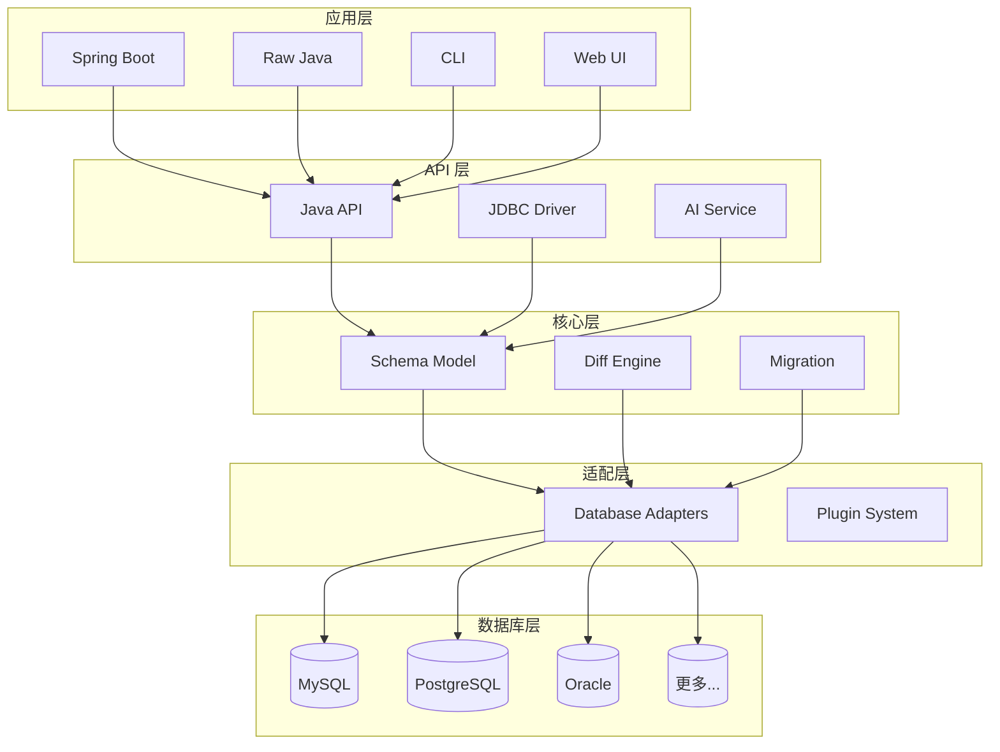

# 什么是 JustDB

JustDB 是一个创新的**所见即所得（WYSIWYG）数据库开发套件**，它革命性地改变了传统数据库开发的方式。通过声明式 Schema 定义和智能差异计算，让数据库开发变得简单、高效、可靠。

## 核心理念

### 传统数据库开发的痛点

传统的数据库开发流程是这样的：


这种方式存在以下问题：

- **手写 SQL 容易出错** - 语法错误、类型错误、约束遗漏
- **变更管理困难** - 需要手动维护迁移脚本，容易遗漏
- **多环境同步复杂** - 开发、测试、生产环境容易出现不一致
- **文档与代码分离** - Schema 设计文档与实际数据库可能不同步
- **团队协作困难** - 需要协调多人编写的 SQL 脚本执行顺序

### JustDB 的解决方案

JustDB 将数据库开发简化为：


**只需关注"要什么"，无需关心"怎么做"**

## 核心特性

### 1. 声明式 Schema 定义

使用 YAML、JSON、XML 等格式声明你期望的数据库结构：

```yaml
# users.yaml - 这就是你想要的数据库样子
id: myapp
namespace: com.example
Table:
  - id: users
    name: 用户表
    comment: 存储系统用户信息
    Column:
      - name: id
        type: BIGINT
        primaryKey: true
        autoIncrement: true
        comment: 用户ID，主键自增
      - name: username
        type: VARCHAR(50)
        nullable: false
        comment: 用户名，不能为空
      - name: email
        type: VARCHAR(100)
        comment: 邮箱地址
      - name: created_at
        type: TIMESTAMP
        nullable: false
        defaultValueComputed: CURRENT_TIMESTAMP
        comment: 创建时间
```

### 2. 智能差异计算

当你修改 Schema 时，JustDB 会自动计算变更并只执行必要的 SQL：

```yaml
# 修改后 - 添加了 avatar 字段
Column:
  - name: id
    type: BIGINT
    primaryKey: true
  - name: username
    type: VARCHAR(50)
  - name: email
    type: VARCHAR(100)
  - name: avatar      # 新增
    type: VARCHAR(500) # 新增
  - name: created_at
    type: TIMESTAMP
```

JustDB 自动生成并执行：

```sql
ALTER TABLE users ADD COLUMN avatar VARCHAR(500);
```

### 3. 多格式支持

JustDB 支持几乎所有常见的数据格式，你可以选择最适合团队的格式：

<CodeGroup>
<CodeGroupItem title="YAML">
```yaml
Table:
  - name: users
    Column:
      - name: id
        type: BIGINT
        primaryKey: true
```
</CodeGroupItem>

<CodeGroupItem title="JSON">
```json
{
  "Table": [
    {
      "name": "users",
      "Column": [
        {
          "name": "id",
          "type": "BIGINT",
          "primaryKey": true
        }
      ]
    }
  ]
}
```
</CodeGroupItem>

<CodeGroupItem title="XML">
```xml
<Justdb>
  <Table name="users">
    <Column name="id" type="BIGINT" primaryKey="true"/>
  </Table>
</Justdb>
```
</CodeGroupItem>
</CodeGroup>

### 4. AI 集成

通过自然语言直接操作数据库 Schema：

```bash
justdb ai "添加一个订单表，包含订单号、客户ID、金额和状态"
```

AI 会自动生成 Schema 定义，你只需确认并部署即可。

### 5. 完整的 JDBC 驱动

JustDB 提供了完整的 JDBC 4.2 驱动实现，支持：

- 标准 SQL 查询（SELECT、INSERT、UPDATE、DELETE）
- JOIN 查询
- 聚合函数（COUNT、SUM、AVG、MIN、MAX）
- 事务管理
- 批量操作

```java
// 使用 JustDB JDBC 驱动
try (Connection conn = DriverManager.getConnection(
        "jdbc:justdb:schema.yaml", null, null);
     Statement stmt = conn.createStatement();
     ResultSet rs = stmt.executeQuery("SELECT * FROM users")) {
    while (rs.next()) {
        System.out.println(rs.getString("username"));
    }
}
```

### 6. Spring Boot 集成

开箱即用的 Spring Boot Starter，应用启动时自动执行数据库迁移：

```yaml
# application.yml
justdb:
  enabled: true
  locations: classpath:justdb
  dry-run: false
```

```java
@SpringBootApplication
public class Application {
    public static void main(String[] args) {
        SpringApplication.run(Application.class, args);
        // 数据库已自动迁移到最新状态！
    }
}
```

## 应用场景

### 1. 敏捷开发

快速迭代数据库 Schema，无需手写 SQL：

```bash
# 修改 Schema
vim users.yaml

# 应用变更
justdb migrate

# 完成！
```

### 2. 数据库文档化

Schema 即文档，文档即 Schema。YAML 文件本身就是最好的数据库文档：

```yaml
Table:
  - id: orders
    name: 订单表
    comment: 存储所有订单信息
    Column:
      - name: order_no
        comment: 订单号，唯一标识
```

### 3. 多环境一致性

确保开发、测试、生产环境保持完全一致：

```bash
# 开发环境
justdb migrate -c dev-config.yaml

# 测试环境
justdb migrate -c test-config.yaml

# 生产环境
justdb migrate -c prod-config.yaml
```

### 4. 版本控制友好

将 Schema 纳入 Git 版本控制，轻松追踪变更历史：

```bash
git add users.yaml
git commit -m "添加用户头像字段"
git push

# 团队成员执行
justdb migrate
```

### 5. CI/CD 集成

在持续集成流程中自动管理数据库：

```yaml
# .github/workflows/ci.yml
- name: Migrate Database
  run: |
    justdb migrate --dry-run  # 先预览变更
    justdb migrate            # 执行迁移
```

## 技术架构

JustDB 采用分层架构设计：



## 支持的数据库

JustDB 支持 30+ 种数据库，包括但不限于：

::: tip 数据库支持
- **MySQL** - 5.6, 5.7, 8.0+
- **PostgreSQL** - 9.x, 10.x, 11.x, 12.x, 13.x, 14.x
- **Oracle** - 11g, 12c, 19c, 21c
- **SQL Server** - 2012, 2014, 2016, 2019
- **H2** - 1.x, 2.x
- **SQLite** - 3.x
- **MariaDB** - 10.x, 11.x
- **TiDB** - 3.x, 4.x, 5.x
- **达梦** - DM7, DM8
- **人大金仓** - KingBase
- **GBase** - 8s
- **OceanBase** - 2.x, 3.x, 4.x
:::

## 设计原则

### 1. 声明式优先

告诉工具**你要什么**，而不是**怎么做**：

```yaml
# 好的做法 - 声明式
Table:
  - name: users
    Column: [...]

# 避免 - 命令式
CREATE TABLE users (...);
ALTER TABLE users ADD COLUMN ...;
```

### 2. 惯例优于配置

遵循惯例，减少配置。默认搜索路径：

```
./justdb/
./db/
./
classpath:justdb/
```

### 3. 可扩展性

通过插件系统支持新数据库和自定义扩展：

```java
// 自定义数据库适配器
public class MyDatabaseAdapter extends DatabaseAdapter {
    // 实现特定数据库的适配逻辑
}
```

### 4. 向后兼容

JustDB 承诺保持 API 的向后兼容性，保护您的投资。

## 下一步

<VPCard
  title="快速开始"
  desc="5分钟快速上手 JustDB"
  link="/getting-started/quick-start.html"
/>

<VPCard
  title="为什么选择 JustDB"
  desc="了解 JustDB 相比其他工具的优势"
  link="/guide/why-justdb.html"
/>

<VPCard
  title="安装指南"
  desc="安装和配置 JustDB"
  link="/getting-started/installation.html"
/>
