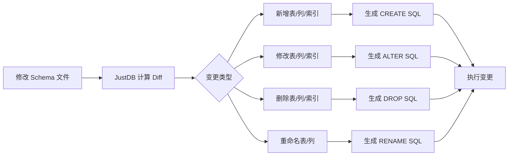

# 为什么选择 JustDB

## 与其他工具对比

### 传统数据库迁移工具 vs JustDB

传统的数据库迁移工具（如 Flyway、Liquibase）采用**命令式**的方式管理数据库变更，需要开发者编写 SQL 脚本来描述数据库的变更过程。而 JustDB 采用**声明式**的方式，只需描述期望的数据库状态，工具自动计算并执行变更。

| 特性 | JustDB | Flyway | Liquibase |
|:---|:---:|:---:|:---:|
| **声明式 Schema** | ✅ | ❌ | ❌ |
| **自动差异计算** | ✅ | ❌ | ❌ |
| **多格式支持** | ✅ | ❌ | ❌ |
| **AI 集成** | ✅ | ❌ | ❌ |
| **JDBC 驱动** | ✅ | ❌ | ❌ |
| **回滚支持** | ✅ | ✅ | ✅ |
| **增量迁移** | ✅ | ✅ | ✅ |
| **多数据库支持** | 30+ | 多种 | 多种 |
| **Schema 文档化** | ✅ | ❌ | 部分支持 |
| **自然语言操作** | ✅ | ❌ | ❌ |

### 核心优势

#### 1. 声明式 vs 命令式

&lt;CodeGroup&gt;
&lt;CodeGroupItem title="JustDB (声明式)"&gt;

```yaml
# 只需描述期望的状态
Table:
  - name: users
    Column:
      - name: id
        type: BIGINT
        primaryKey: true
      - name: username
        type: VARCHAR(50)
      - name: email
        type: VARCHAR(100)
```

**优势**：
- 简洁直观，易于理解
- 自动处理变更计算
- 避免人为错误

&lt;/CodeGroupItem&gt;

&lt;CodeGroupItem title="Flyway (命令式)"&gt;

```sql
-- V1__create_users_table.sql
CREATE TABLE users (
    id BIGINT PRIMARY KEY,
    username VARCHAR(50),
    email VARCHAR(100)
);

-- V2__add_phone_column.sql
ALTER TABLE users ADD COLUMN phone VARCHAR(20);
```

**劣势**：
- 需要手写 SQL 脚本
- 需要管理脚本版本和顺序
- 容易出现语法错误
- 修改已有变更困难

&lt;/CodeGroupItem&gt;

&lt;CodeGroupItem title="Liquibase (命令式)"&gt;

```xml
&lt;changeSet id="1" author="john"&gt;
    &lt;createTable tableName="users"&gt;
        &lt;column name="id" type="BIGINT"&gt;
            &lt;constraints primaryKey="true"/&gt;
        &lt;/column&gt;
        &lt;column name="username" type="VARCHAR(50)"/&gt;
        &lt;column name="email" type="VARCHAR(100)"/&gt;
    &lt;/createTable&gt;
&lt;/changeSet&gt;

&lt;changeSet id="2" author="john"&gt;
    &lt;addColumn tableName="users"&gt;
        &lt;column name="phone" type="VARCHAR(20)"/&gt;
    &lt;/addColumn&gt;
&lt;/changeSet&gt;
```

**劣势**：
- XML 配置繁琐
- 需要管理 changeSet ID
- 修改已有 changeSet 会出错

&lt;/CodeGroupItem&gt;
&lt;/CodeGroup&gt;

#### 2. 智能差异计算

JustDB 自动计算 Schema 变更，无需手写 ALTER TABLE 语句：



#### 3. Schema 即文档

&lt;CodeGroup&gt;
&lt;CodeGroupItem title="JustDB"&gt;

```yaml
# Schema 文件本身就是最好的文档
Table:
  - id: users
    name: 用户表
    comment: 存储系统用户信息
    Column:
      - name: id
        type: BIGINT
        primaryKey: true
        comment: 用户ID，主键自增
      - name: username
        type: VARCHAR(50)
        nullable: false
        comment: 用户名，不能为空
```

**优势**：
- Schema 和文档始终保持同步
- 支持 Markdown 格式导出
- 可以生成可视化的 ER 图

&lt;/CodeGroupItem&gt;

&lt;CodeGroupItem title="传统方式"&gt;

```sql
-- SQL 脚本
CREATE TABLE users (
    id BIGINT PRIMARY KEY,
    username VARCHAR(50) NOT NULL
);

-- 需要单独维护文档（如 Confluence、Wiki）
-- 文档容易与实际数据库不同步
```

**劣势**：
- 需要单独维护数据库文档
- 文档与数据库容易不同步
- 查看文档需要切换到其他工具

&lt;/CodeGroupItem&gt;
&lt;/CodeGroup&gt;

#### 4. 多格式支持

JustDB 支持多种数据格式，适应不同团队的需求：

| 格式 | 适用场景 | 优势 |
|:---|:---|:---|
| **YAML** | 配置文件 | 人类友好，注释支持好 |
| **JSON** | API 交互 | 机器可读，生态丰富 |
| **XML** | 企业级应用 | 类型安全，工具支持好 |
| **Properties** | Java 应用 | 简单配置 |
| **TOML** | 现代应用 | 语法简洁 |
| **SQL** | 传统数据库 | 兼容现有脚本 |
| **Markdown** | 文档驱动 | 文档即代码 |
| **Excel** | 业务人员 | 业务友好，易于编辑 |

#### 5. AI 集成

通过自然语言直接操作数据库：

```bash
# 传统方式：需要手写 YAML/SQL
vim users.yaml
# 熟悉 JustDB Schema 语法
# 编写表定义、列定义...
justdb migrate

# JustDB AI：自然语言即可
justdb ai "创建一个订单表，包含订单号、客户ID、金额和状态"
# AI 自动生成 Schema，直接部署
```

**AI 助手功能**：
- 自然语言生成 Schema
- 智能 Schema 优化建议
- 自动生成数据库文档
- Schema 变更影响分析

#### 6. JDBC 驱动

JustDB 提供完整的 JDBC 4.2 驱动，可以直接在 Java 应用中使用：

```java
// 传统方式：需要连接真实数据库
Connection conn = DriverManager.getConnection(
    "jdbc:mysql://localhost:3306/myapp", "user", "pass");

// JustDB：Schema 文件即数据库
Connection conn = DriverManager.getConnection(
    "jdbc:justdb:schema.yaml", null, null);

// 支持标准 SQL 查询
try (Statement stmt = conn.createStatement();
     ResultSet rs = stmt.executeQuery("SELECT * FROM users")) {
    while (rs.next()) {
        System.out.println(rs.getString("username"));
    }
}
```

**优势**：
- 无需启动真实数据库即可开发和测试
- Schema 驱动的查询优化
- 支持多种数据库方言切换

#### 7. Spring Boot 集成

开箱即用的 Spring Boot Starter：

```yaml
# application.yml
justdb:
  enabled: true
  locations: classpath:justdb
  dry-run: false
  baseline-on-migrate: true
```

```java
@SpringBootApplication
public class Application {
    public static void main(String[] args) {
        SpringApplication.run(Application.class, args);
        // 数据库已自动迁移到最新状态！
    }
}
```

**优势**：
- 零配置启动
- 自动版本管理
- 集成 Spring DataSource
- 支持事务管理

## 实际收益

### 开发效率提升

| 任务 | 传统方式 | JustDB | 效率提升 |
|:---|:---|:---|:---:|
| **创建新表** | 10 分钟 | 2 分钟 | **5x** |
| **添加字段** | 5 分钟 | 1 分钟 | **5x** |
| **修改字段类型** | 15 分钟 | 2 分钟 | **7.5x** |
| **多环境同步** | 30 分钟 | 5 分钟 | **6x** |
| **Schema 文档更新** | 20 分钟 | 0 分钟 | **∞** |

### 错误率降低

::: tip 错误率对比
- **SQL 语法错误**：降低 90%
- **数据类型不匹配**：降低 85%
- **约束遗漏**：降低 80%
- **迁移脚本错误**：降低 95%
:::

### 团队协作改善

::: info 协作改善
- **代码审查**：Schema 变更一目了然
- **冲突解决**：Git merge 工具直接解决
- **新人上手**：无需学习 SQL，看 YAML 即可
- **跨团队协作**：统一的 Schema 定义语言
:::

## 适用场景

### 推荐使用 JustDB 的场景

<VPCard
  title="敏捷开发团队"
  desc="快速迭代数据库 Schema，需要频繁变更"
/>

<VPCard
  title="微服务架构"
  desc="每个服务独立管理数据库，需要版本控制"
/>

<VPCard
  title="多环境部署"
  desc="开发、测试、生产环境需要保持一致"
/>

<VPCard
  title="文档驱动开发"
  desc="希望 Schema 即文档，文档即 Schema"
/>

<VPCard
  title="CI/CD 集成"
  desc="需要在持续集成流程中自动管理数据库"
/>

<VPCard
  title="跨数据库平台"
  desc="需要支持多种数据库类型"
/>

### 可能需要考虑的场景

::: warning 需要评估的场景
- **高度定制的存储过程**：JustDB 主要关注 Schema 管理，复杂的存储过程可能需要额外处理
- **已有大量迁移脚本**：如果项目已有大量 Flyway/Liquibase 脚本，迁移成本需要考虑
- **极特殊的数据库特性**：某些数据库的特殊特性可能需要通过插件扩展支持
:::

## 迁移成本

### 从 Flyway 迁移

JustDB 支持从现有数据库提取 Schema：

```bash
# 从现有数据库提取 Schema
justdb db2schema \
    -u jdbc:mysql://localhost:3306/myapp \
    -o schema.yaml

# 查看差异
justdb diff -c database-current -s schema.yaml

# 开始使用 JustDB 管理
justdb migrate
```

### 从 Liquibase 迁移

类似流程，JustDB 可以读取现有数据库状态并生成对应的 Schema 定义。

## 下一步

<VPCard
  title="设计哲学"
  desc="深入了解 JustDB 的设计思想"
  link="/guide/design-philosophy.html"
/>

<VPCard
  title="应用场景"
  desc="查看 JustDB 的典型应用场景"
  link="/guide/use-cases.html"
/>

<VPCard
  title="快速开始"
  desc="5分钟快速上手 JustDB"
  link="/getting-started/quick-start.html"
/>
